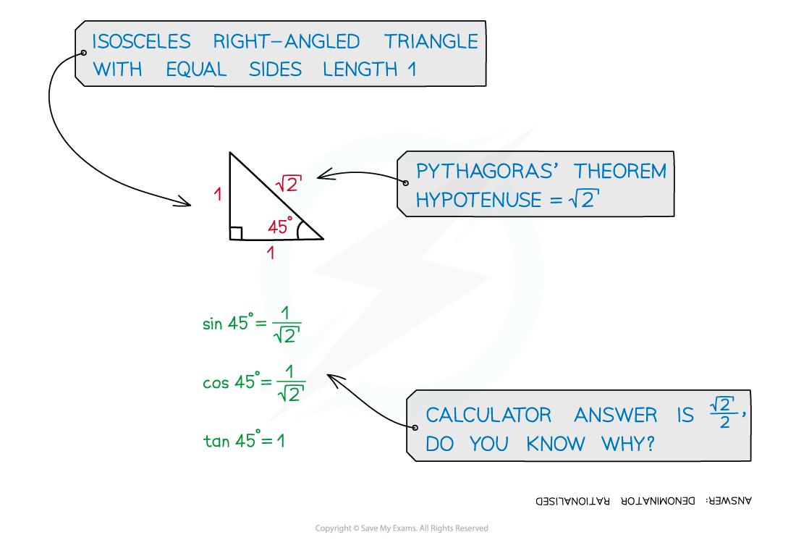
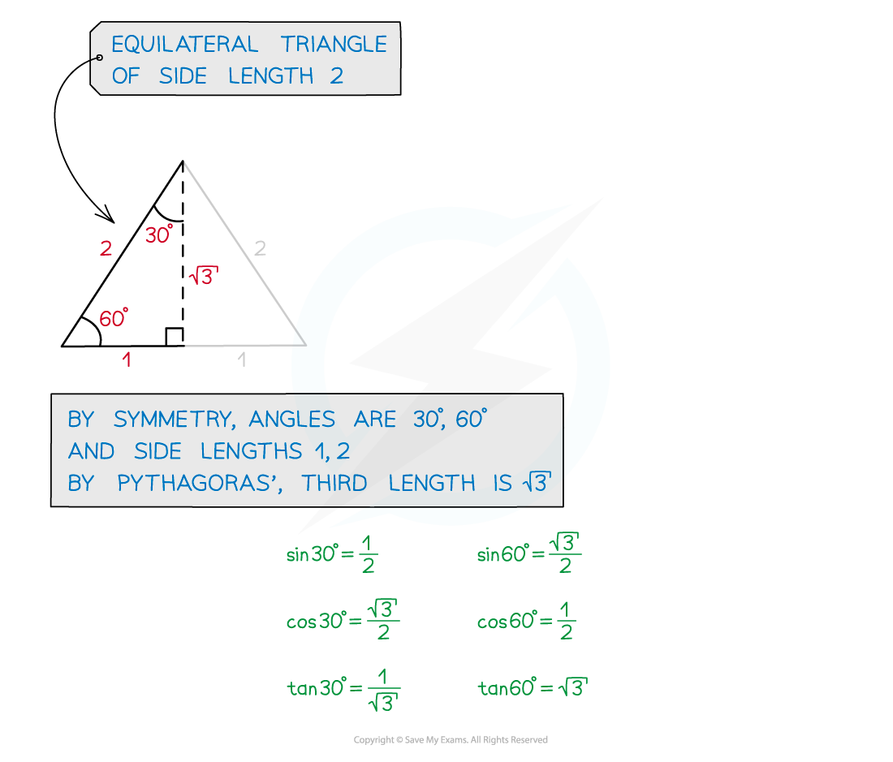
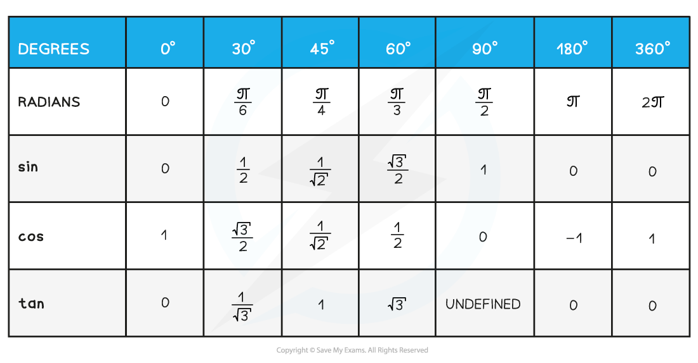
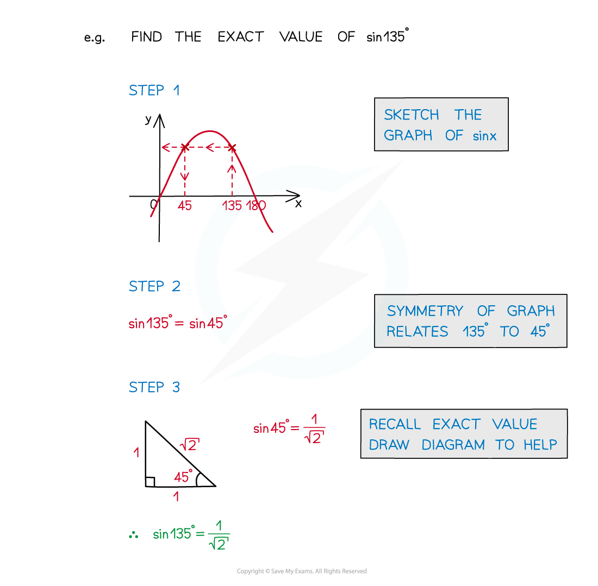

# Trigonometry Exact Values

## Trigonometry Exact Values

> **Spec point** — `spcpt_dHy8HxPY7KBdRM7G`

## Trigonometry exact values

### What are exact values in trigonometry?

- In trigonometry some values of sin, cos and tan are “nice”
- For example **sin 30° = ½**, **tan 45° = 1**
- We can find those associated with the angles **30°**, **45°** and **60°** using SOHCAHTOA on isosceles and equilateral triangles

** **

- **sin**, **cos** and **tan** values for **30°**, **45°** and **60°** should be recalled easily
- Memorise either the actual values or how to work them out from the triangle
- **sin**, **cos** and **tan** for **0°**, **90°**, **180°** should also be very familiar
- They can be recalled using the relevant **trigonometric** **graph** (see Graphs of Trigonometric Functions)

### What exact values do I need to know in trigonometry?

- All of the above applies to radians as well as degrees
- Here is a table of all exact values including **radians** (see Radian Measure)

### How do I find exact values of other angles?

- Exact **sin**, **cos** and **tan** values of **multiples** of **30°**, **45°**, **60°** can also be found
- This is a combination of recalling the basic values and using the graph

> **Exam Hint**
> - Draw the triangles for **sin**, **cos** and **tan** of **30°**, **45°** and **60°** on the exam paper so that you can then use them as many times as you need throughout the paper.

> **Worked Example**
> 
