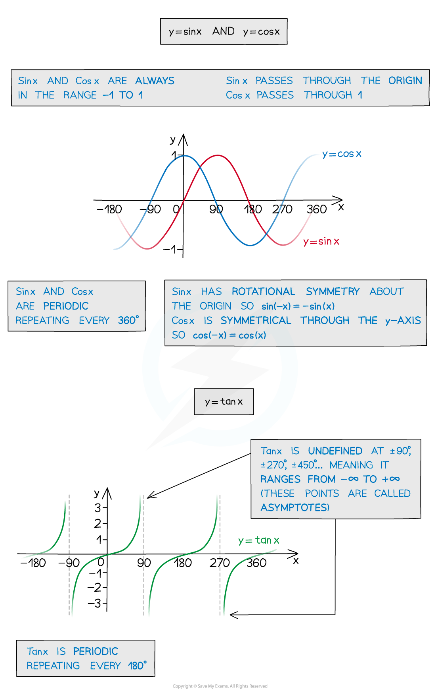
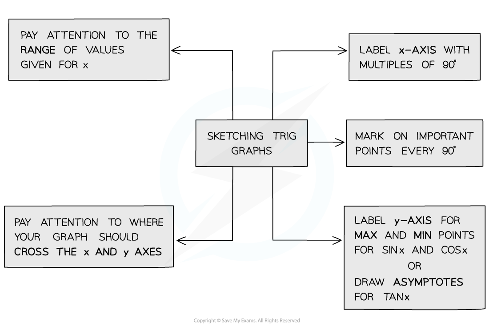
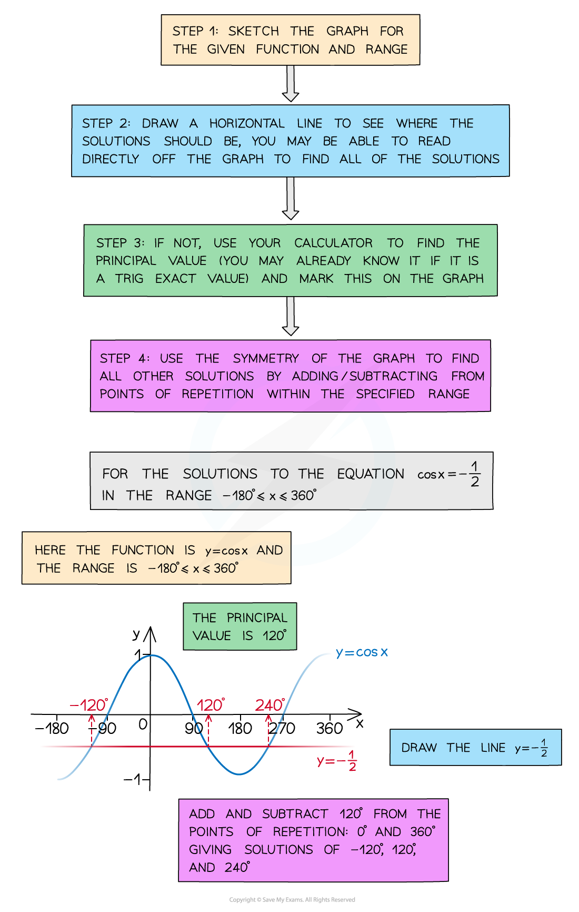

# Graphs of Trigonometric Functions

## Graphs of Trigonometric Functions

> **Spec point** — `spcpt_wK2zzwnftMmwZ73T`

## Graphs of trigonometric functions

### What are the graphs of trigonometric functions?

- The Trigonometric Functions Sin, Cos and Tan all have special *periodic graphs* that you need to be able to sketch and remember
- You’ll need to know their properties and how to sketch them to solve equations and for transforming trig functions

### How do I sketch trigonometric graphs?

### How do I use trigonometric graphs?

- By sketching the graph you can read off all the solutions in a given *range (or interval)*
- Your calculator will only give you the *principal value*
- You should recognise any values/angles associated with **exact values**
- You should be able to spot the pattern of solutions using the **symmetry** and **periodicity** of the graph

> **Exam Hint**
> - Always sketch with a pencil and draw a smooth curve and pay attention to the key features of each graph:
> - Where it crosses the x and y axes
> 
>   - How often it repeats
>   - Whether it is symmetrical
> - Remember, when answering exam questions that ask for solutions, a sketch will help ensure you give **all** the appropriate solutions for a given interval.

> **Worked Example**
> 
