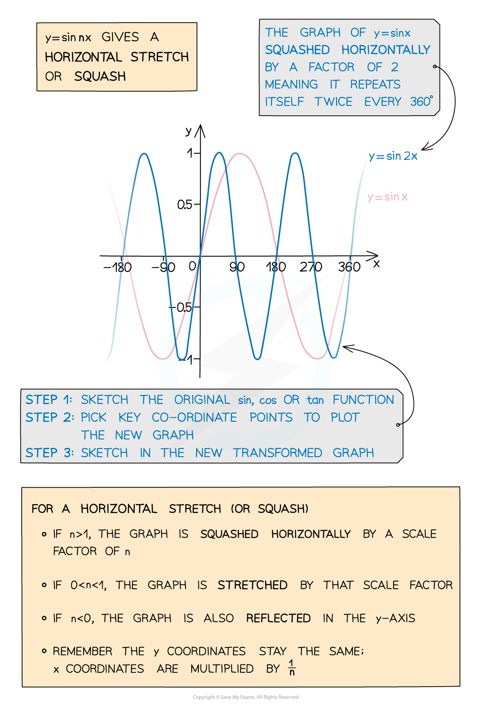
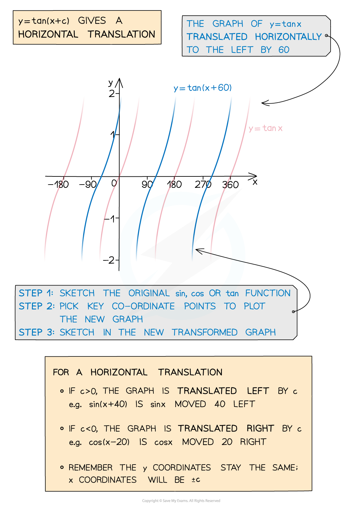

# Transformations of Trigonometric Functions

## Transformations of Trigonometric Functions

> **Spec point** — `spcpt_hxTxCtBkDZDzbshm`

## Transformations of trigonometric functions

### What are transformations of trigonometric functions?

- You should already have a good idea about **translating**, **stretching** and **reflecting** basic functions (see **Transformations of Functions**)
- The basic principles are exactly the same for transforming any trigonometric graph 

  - *y* = *n* cos *x* gives a **vertical stretch or squash**
  - *y* = sin n*x* gives a **horizontal stretch or squash**
  - *y* = tan (*x* + c) gives a **horizontal translation**

> **Exam Hint**
> - Always sketch with a pencil and draw a smooth curve.
> - When you sketch the transformation of a graph, be sure to indicate the new coordinates of any points that are marked on the original graph.
> - Try to indicate the coordinates of points where the new graph intersects the axes.

> **Worked Example**
> 
