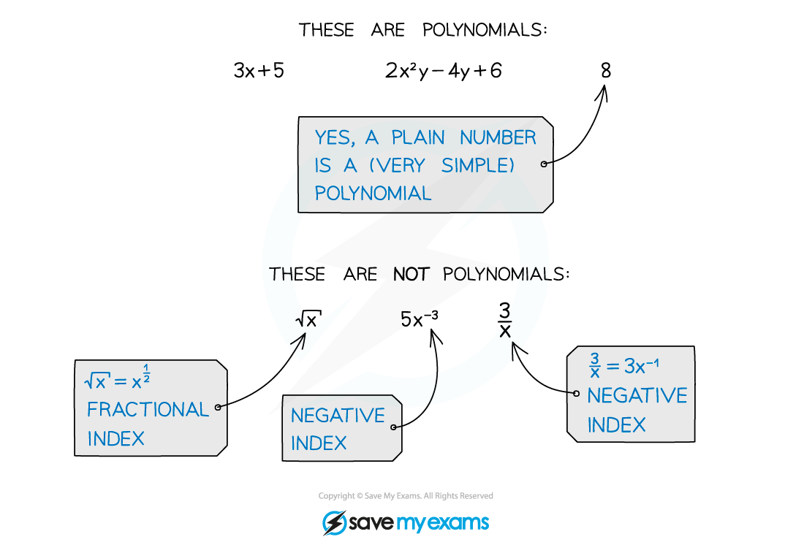
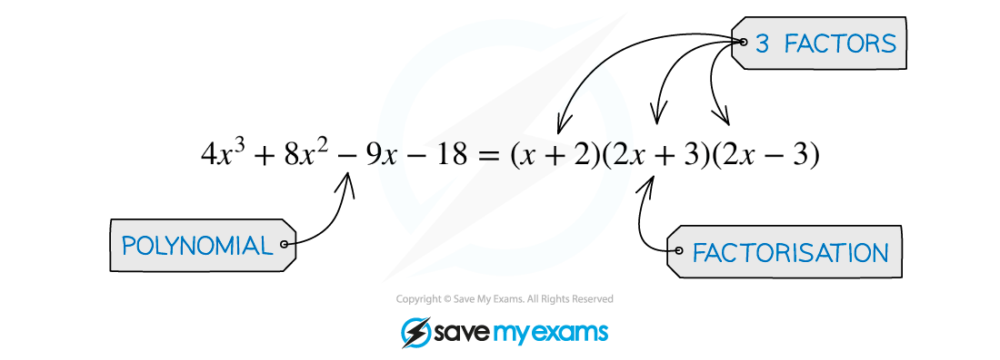
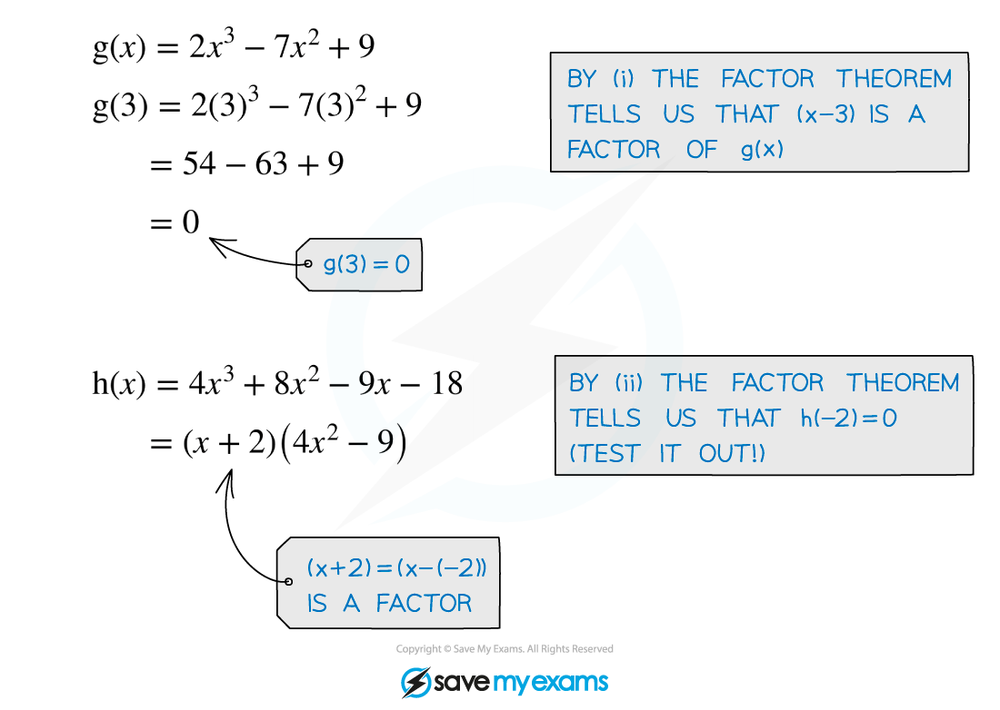

# Factor & Remainder Theorem

## Factor Theorem

> **Spec point** — `spcpt_KZmbYQ3Byg92VvrM`

## Factor theorem

### What is the factor theorem?

- The factor theorem is a very useful result about polynomials
- A **polynomial** is an algebraic expression consisting of a finite number of terms, with non-negative integer indices only

- At A level you will most frequently use the factor theorem as a way to simplify the process of factorising polynomials

### How do I apply the factor theorem?

- For a polynomial **f(*****x*****)** the factor theorem states that: **AND**

  - If **f(*****p*****) = 0**, then **(*****x *****- *****p*****)** is a factor of **f(*****x*****)**

  - If **(*****x *****- *****p*****)** is a factor of **f(*****x*****)**, then **f(*****p*****) = 0**

> **Exam Hint**
> - In an exam, the values of ***p*** you need to find that make **f(*****p*****) = 0** are going to be integers close to zero.
> 
>   - Try ***p***** = **1 and -1 first, then 2 and -2, then 3 and -3
>   - It is very unlikely that you'll have to go beyond that.

> **Worked Example**
> 

## Remainder Theorem

> **Spec point** — `spcpt_5C5R39cdnm53Ktnh`

## Remainder theorem

### What is the remainder theorem?

- The **factor** **theorem** is actually a special case of the more general **remainder** **theorem**
- The **remainder** **theorem** states that when the polynomial f(x) is divided by (x - a) the remainder is f(a)

  - You may see this written formally as f(x) = (x - a)Q(x) + f(a)
  - In **polynomial** **division**
  
    - *Q*(x) would be the **result** (at the top) of the division (the **quotient**)
    - f(a) would be the **remainder** (at the bottom)
    - (x - a) is called the **divisor**
  - In the case when f(a) = 0, f(x) = (x - a)Q(x) and hence (x - a) is a factor of  f(x)– the **factor** **theorem**!

### How do I apply the remainder theorem?

- If it is the **remainder** that is of particular interest, the remainder theorem saves the need to carry out polynomial division in full

  - e.g. The remainder from $(x^{2}-2x)\div(x-3)$ is $3^{2}-2\times3=3$
  - This is because if f(x) = x2- 2x and a = 3
- If the remainder from a polynomial division is known, the **remainder** **theorem **can be used to find unknown coefficients in polynomials

  - g. The remainder from $(x^{2}+px)\div(x-2)$ is 8 so the value of *p* can be found by solving `2 squared plus p open parentheses 2 close parentheses equals 8`, leading to $p=2$
  - In harder problems there may be more than one unknown in which case simultaneous equations would need setting up and solving
- The more general version of remainder theorem is if f(x) is divided by (ax - b) then the remainder is  $f(\frac{b}{a})$

  - The shortcut is still to evaluate the polynomial at the value of x that makes the divisor (ax - b) zero but it is not necessarily an integer

> **Worked Example**
> 

> **Exam Hint**
> - Exam questions will use formal mathematical language which can make factor and remainder theorem questions sound more complicated than they are.
> - Ensure you are familiar with the various terms from these revision notes
