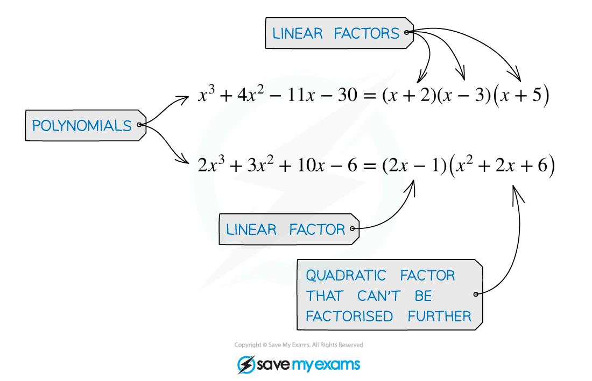
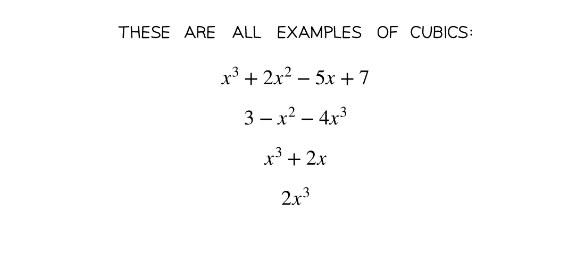
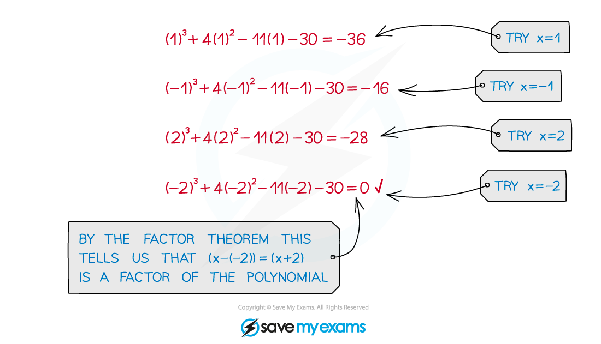

# Polynomial Factorisation

## Factorisation

> **Spec point** — `spcpt_yp7GmRfk46xyDjVJ`

## Polynomial factorisation

### What is polynomial factorisation?

- Factorising a polynomial combines the **factor theorem** with the method of **polynomial division**
- The goal is to break down a polynomial as far as possible into a product of** ***linear factors*

### How do I factorise a polynomial?

- At A level you will usually be asked to factorise a **cubic** – i.e. a polynomial where the highest power of ***x*** is 3

- To factorise a cubic polynomial **f(*****x*****)** follow the following steps:

- Step 1. Find a value*** p*** that makes **f(*****p*****) = **0

- Step 2. Use polynomial division to divide **f(*****x*****) **by **(*****x *****- *****p*****)**

- Step 3. Use the result of your division to write

**f(*****x*****) = (*****x *****- *****p*****) (*****ax*****2**** + *****bx***** + *****c*****)**

- Step 4. If the quadratic **(*****ax*****2**** + *****bx***** + *****c*****)** is factorisable, factorise it and write **f(*****x*****)** as a product of three linear factors (if the quadratic is not factorisable, then your result from Step 3 is the final factorisation) 

> **Exam Hint**
> - The method outlined above can be logically extended to factorise a polynomial of any *degree*.

> **Worked Example**
> 
