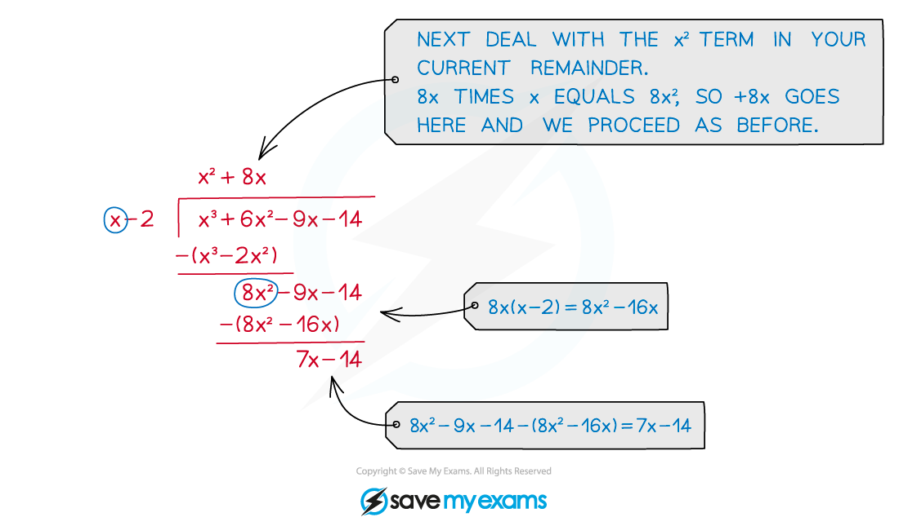
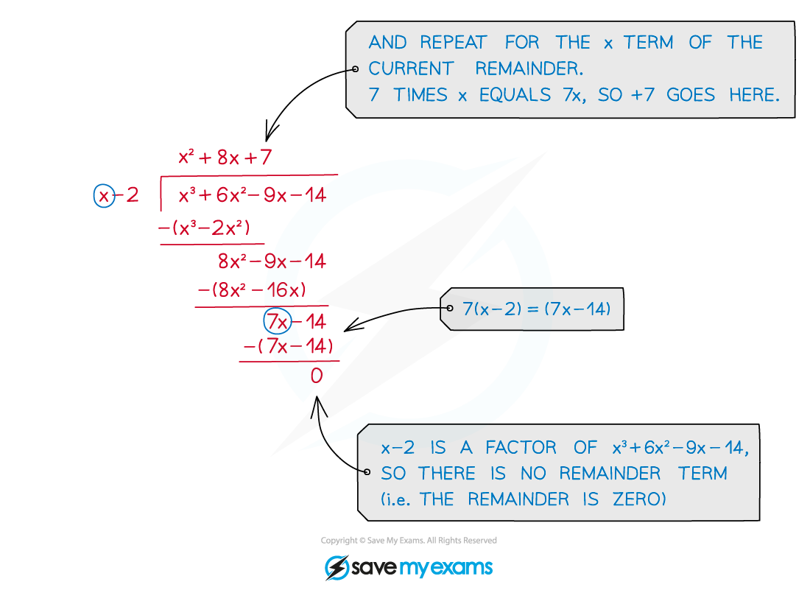

# Polynomial Division

## Polynomial Division

> **Spec point** — `spcpt_fQZDB6JHQrnsnHQH`

## Polynomial division

### What is a polynomial?

- A **polynomial** is an algebraic expression consisting of a finite number of terms, with non-negative integer indices only

### What is polynomial division?

- Polynomial division is a method for splitting polynomials into factor pairs (with or without an accompanying remainder term)

- At A level you will most frequently use it to factorise polynomials, or when dealing with improper (ie 'top-heavy') algebraic fractions

### How do I divide polynomials?

- The method used for polynomial division is just like the long division method (sometimes called 'bus stop division') used to divide regular numbers:

- At A level you will normally be dividing a polynomial dividend of degree 3 or 4 by a divisor in the form **(*****x***** ± *****p*****)**
- The answer to a polynomial division question is built up term by term, working downwards in powers of the variable (usually ***x***)

- Start by dividing by the highest power term
- Write out this multiplied by the divisor and subtract

- Continue to divide by each reducing power term and subtracting your answer each time

- Continue until you are left with zero

- If the divisor is not a factor of the polynomial then there will be a remainder term left at the end of the division

> **Worked Example**
> 
