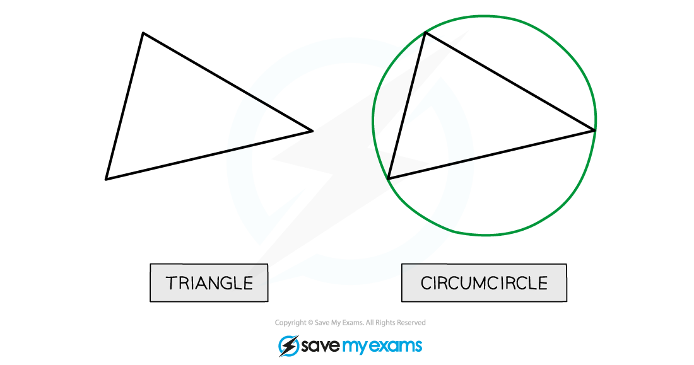
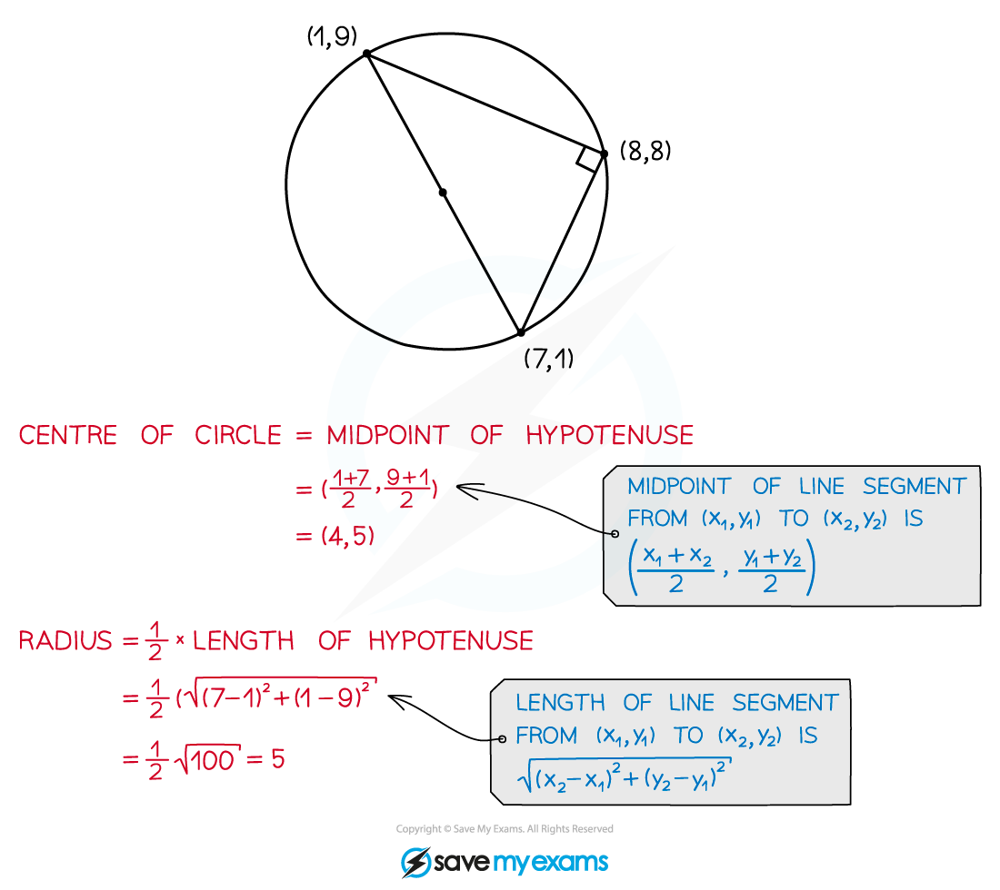
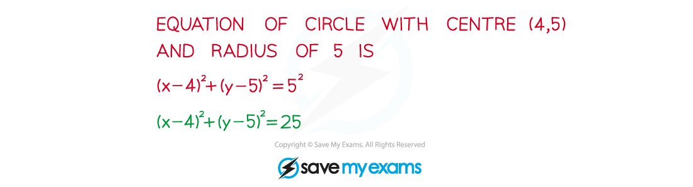

# Angle in a Semicircle

## Angle in a Semicircle

> **Spec point** — `spcpt_g9PqXfbWyG3TGMrx`

## Angle in a semicircle

### What are angles in a semicircle?

- It is always possible to draw a *unique* circle through the three vertices of a triangle – this is called the **circumcircle** of the triangle

- The **angle in a semicircle property** says that if a triangle is right-angled, then its hypotenuse is a diameter of its circumcircle 
- It also says that **any** angle at the circumference in a semicircle is a right angle

### How can I use angles in a semicircle to find the equation of a circle?

- Because the hypotenuse of a right-angled triangle is a diameter of the triangle's circumcircle you also know that:

  1. the radius of the circumcircle is half the length of the hypotenuse
  2. the centre of the circumcircle is the midpoint of the hypotenuse

- Once you know the radius and the centre you can write down the **equation of the circle**

> **Exam Hint**
> - To show that a triangle is right-angled, show that the lengths of its sides satisfy Pythagoras' theorem.

> **Worked Example**
> 
