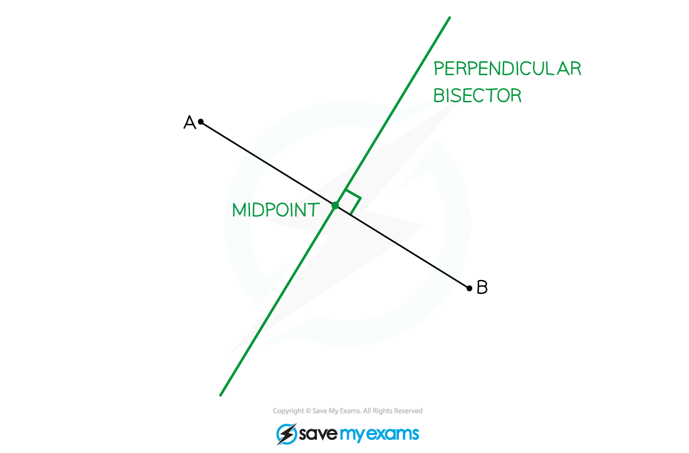
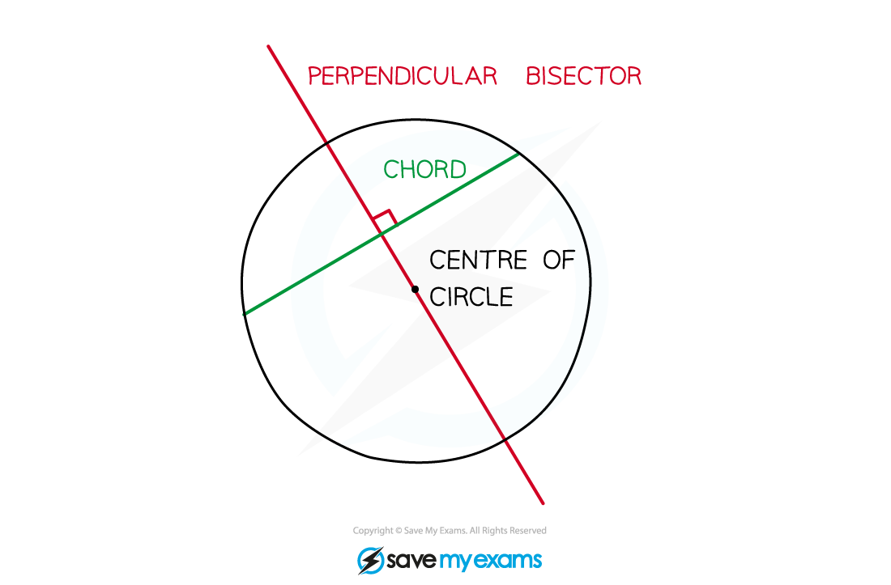
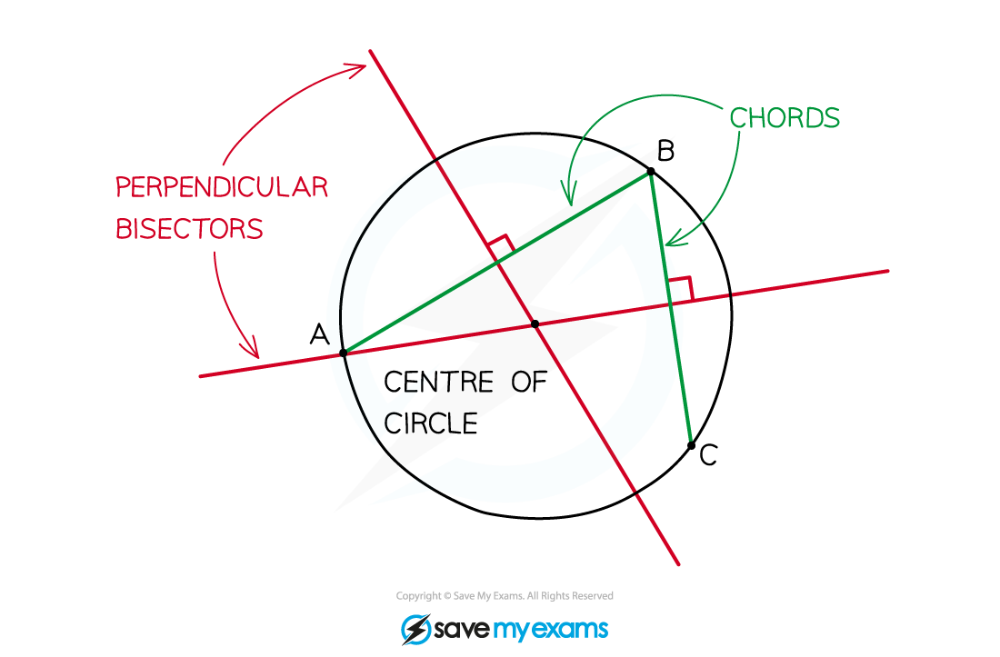

# Bisection of Chords

## Bisection of Chords

> **Spec point** — `spcpt_MTZScqBkSJcYSrv5`

## Bisection of chords

### How can I find the equation of a perpendicular bisector?

- The **perpendicular bisector** of a line segment:

  - is perpendicular to the line segment
  - goes through the midpoint of the line segment

- The midpoint and gradient of the line segment between points **(*****x*****1****, *****y*****1****)** and **(*****x*****2****, *****y*****2****)** are given by the formulae

- The gradient of the perpendicular bisector is therefore

- The equation of the perpendicular bisector is the equation of the line with that gradient through the line segment's midpoint (see Equation of a Straight Line)

### How can I use perpendicular bisectors to find the equation of a circle?

- A **chord** of a circle is a straight line segment between any two points on the circle

- The perpendicular bisector of a chord always goes through the centre of the circle

- If you know three points on a circle, draw any two chords between them – the perpendicular bisectors of the chords will meet at the centre of the circle

- Now that you know the centre of the circle and a point on the circle you can write the equation of the circle

> **Exam Hint**
> - To find the point of intersection of two straight lines, set the equations of the lines equal to each other and solve. 

> **Worked Example**
> 
