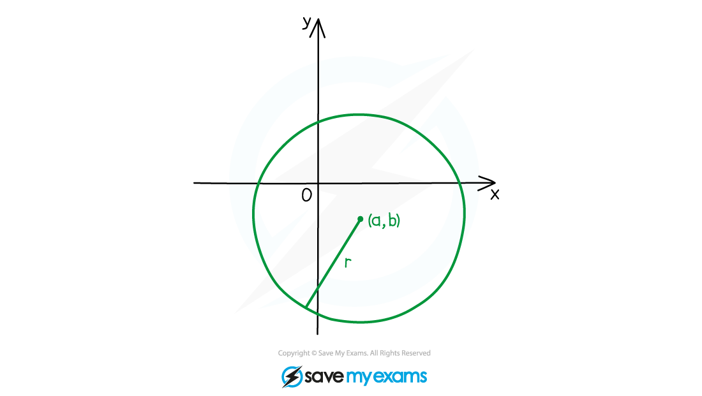
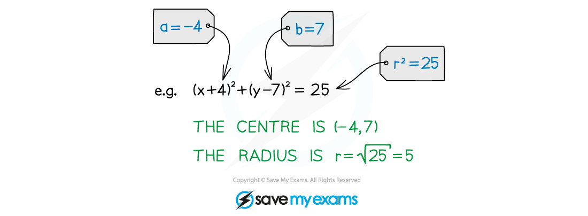
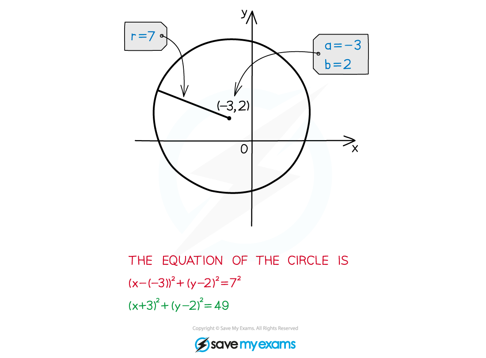

# Equation of a Circle

## Equation of a Circle

> **Spec point** — `spcpt_pYqQwJWmThvrtN5x`

## Equation of a circle

### What is the equation of a circle?

- A circle with centre **(*****a, b*****)** and radius ***r*** has the equation

$(x-a)^{2}+(y-b)^{2}=r^{2}$** **

- ** **You need to be able to find the centre and radius of a circle from its equation

- You need to be able to find the equation of a circle given its centre and radius

> **Exam Hint**
> - Remember that the numbers in the brackets have the opposite signs to the coordinates of the centre.  ** **
> - Don't forget to take the **square root **of the right-hand side of the equation when finding the radius.

> **Worked Example**
> 
