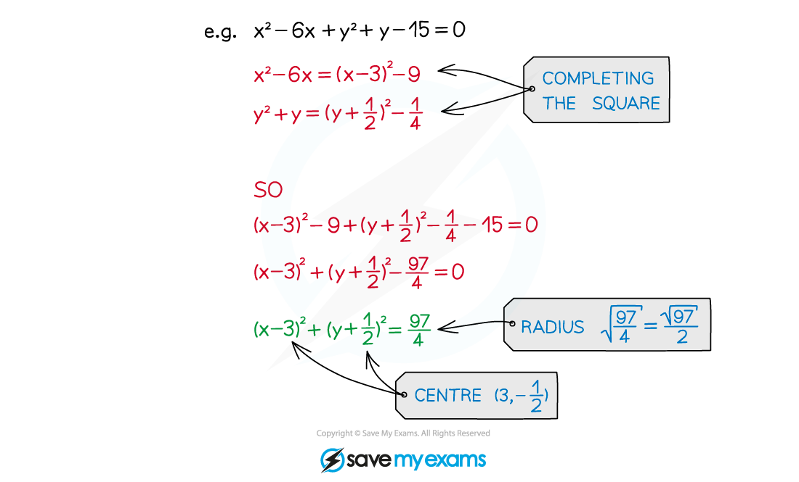

# Finding the Centre & Radius

## Finding the Centre & Radius

> **Spec point** — `spcpt_rczDrkZHwkQtVGj5`

## Finding the centre & radius

### How do I find the centre and radius from the equation of a circle?

- A circle equation in a different form can always be rearranged into** (*****x*****- *****a*****)****2**** + (*****y***** - *****b*****)****2**** = *****r*****2**** **form in order to find the centre and radius
- This will often involve **completing the square**

> **Exam Hint**
> Make sure you are able to rearrange circle equations given in the general form $x^{2}+y^{2}+2fx+2gy+c=0$
> 
> 

> **Worked Example**
> 
