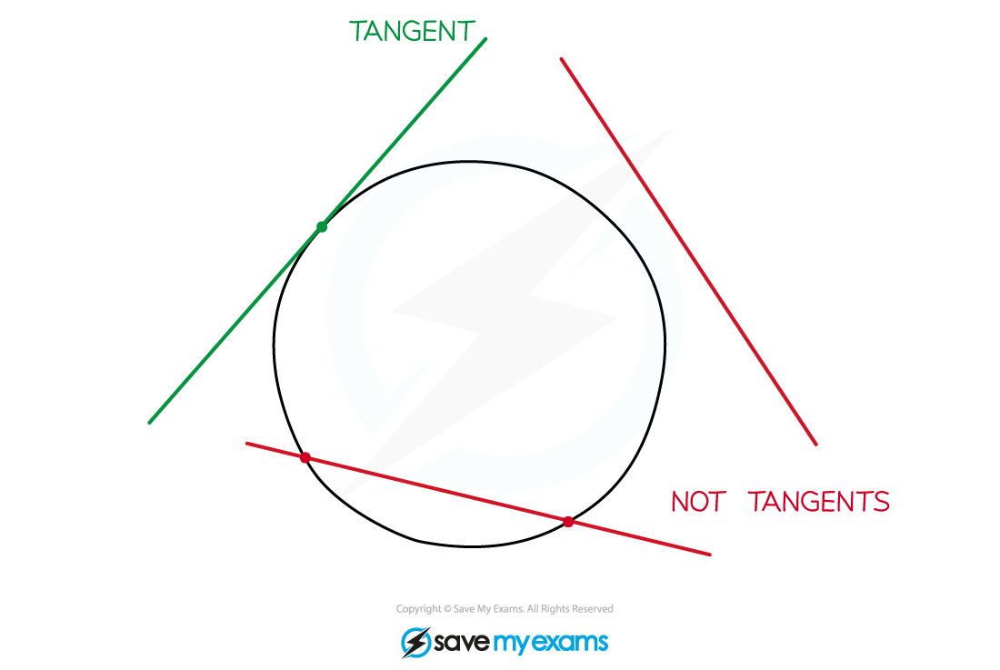
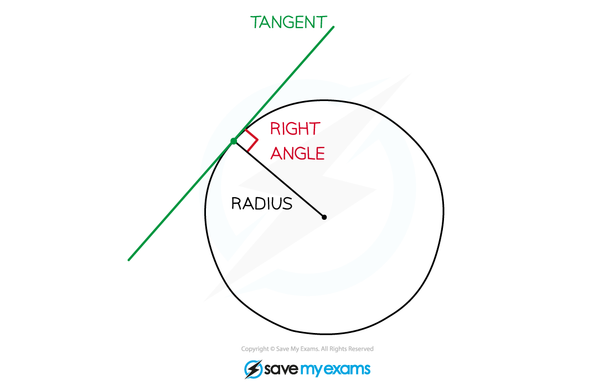
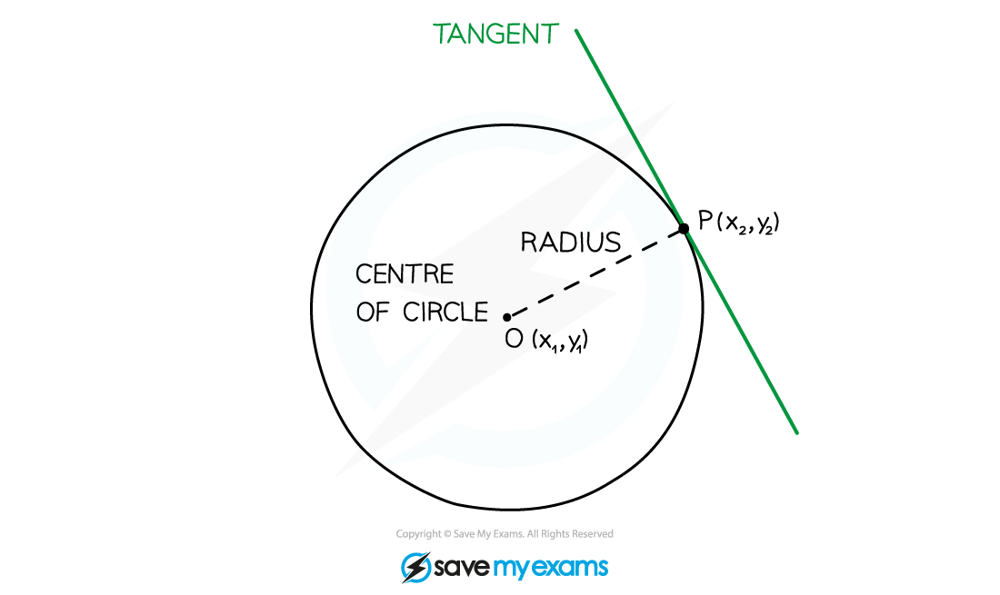

# Radius & Tangent

## Radius & Tangent

> **Spec point** — `spcpt_XQ5kYb9wHhXvrFdP`

## Radius & tangent

### What is the relationship between a tangent and a radius?

- A **tangent** is a line that **touches **a circle at a single point but doesn't cut across the circle

- A tangent to a circle is perpendicular to the radius of the circle at the point of intersection

### How do I find the equation of a tangent to a circle?

- STEP 1: Find the gradient of the radius ***OP***

- STEP 2: Find the gradient of the tangent

- STEP 3: The equation of the tangent is the equation of the line with that gradient that goes through point ***P***** **(see Equation of a Straight Line)

> **Exam Hint**
> - If you understand the formula in Step 2 above, you can find the gradient of the tangent without having to find the gradient of the radius first.

> **Worked Example**
> 
