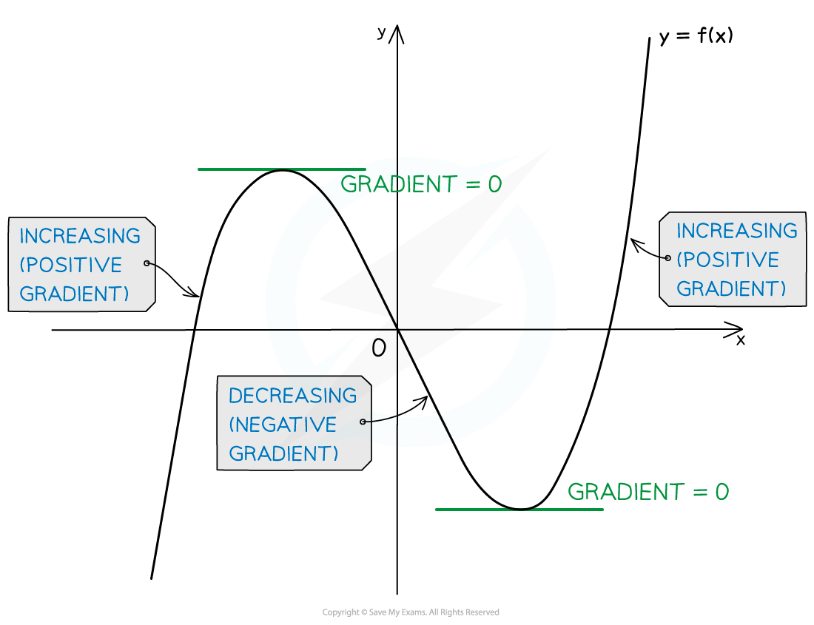

# Increasing & Decreasing Functions

## Increasing & Decreasing Functions

> **Spec point** — `spcpt_BZ8Fv5yMksrMBfHf`

## Increasing & decreasing functions

### What are increasing and decreasing functions?

- A function **f(*****x*****) **is **increasing** on an interval **[*****a*****, *****b*****] **if **f'(*****x*****) ≥ 0 **for all values of ***x*** such that ***a*****< *****x *****< *****b***.

  - If **f'(*****x*****) > 0** for all ***x*** values in the interval then the function is said to be **strictly increasing**
  - In most cases, on an increasing interval the graph of a function goes **up** as ***x*** increases

- A function **f(*****x*****) **is **decreasing** on an interval **[*****a*****, *****b*****] **if **f'(*****x*****) ≤ 0 **for all values of ***x*** such that ***a *****< *****x *****< *****b***

  - If **f'(*****x*****) < 0** for all ***x*** values in the interval then the function is said to be **strictly decreasing**
  - In most cases, on a decreasing interval the graph of a function goes **down** as ***x*** increases

- To identify the intervals on which a function is increasing or decreasing you need to:

1. Find the derivative **f'(*****x*****)**
2. Solve the inequalities **f'(*****x*****) ≥ 0** (for increasing intervals) and/or **f'(*****x*****) ≤ 0** (for decreasing intervals)

> **Exam Hint**
> - On an exam, if you need to show a function is increasing or decreasing you can use either strict (<, >) or non-strict (≤, ≥) inequalities

> **Worked Example**
> 
