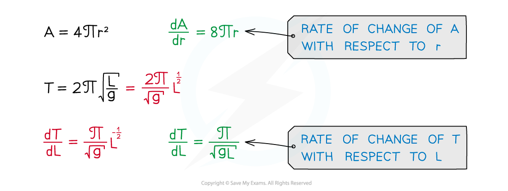
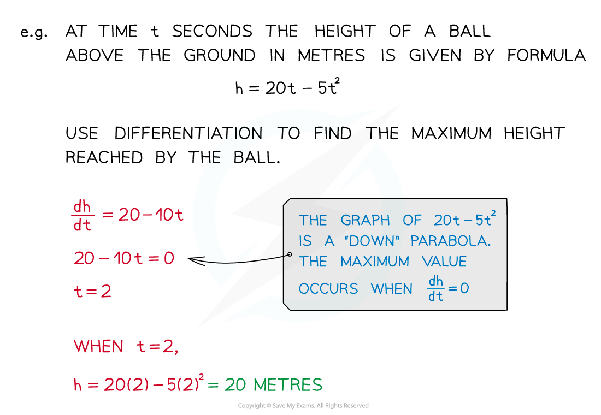

# Modelling with Differentiation (Optimisation)

## Modelling with Differentiation inc. Optimisation

> **Spec point** — `spcpt_B6CWxQXpFwTDsPJP`

## Modelling with differentiation (optimisation)

### How do I find the maximum or minimum values of models?

- Derivatives can be calculated for any variables – not just ***y*** and ***x***
- In every case the derivative is a formula giving the rate of change of one variable with respect to the other variable

- Differentiation can be used to find maximum and minimum points of a function (see Stationary Points)
- Therefore it can be used to solve maximisation and minimisation problems in modelling questions

> **Exam Hint**
> Exam questions on this topic will often be divided into two parts:
> 
> - First a 'Show that...' part where you derive a given formula from the information in the question
> - And then a 'Find...' part where you use differentiation to answer a question about the formula
> 
> Even if you can't answer the first part you can still use the formula to answer the second part.

> **Worked Example**
> 
> 
> 
