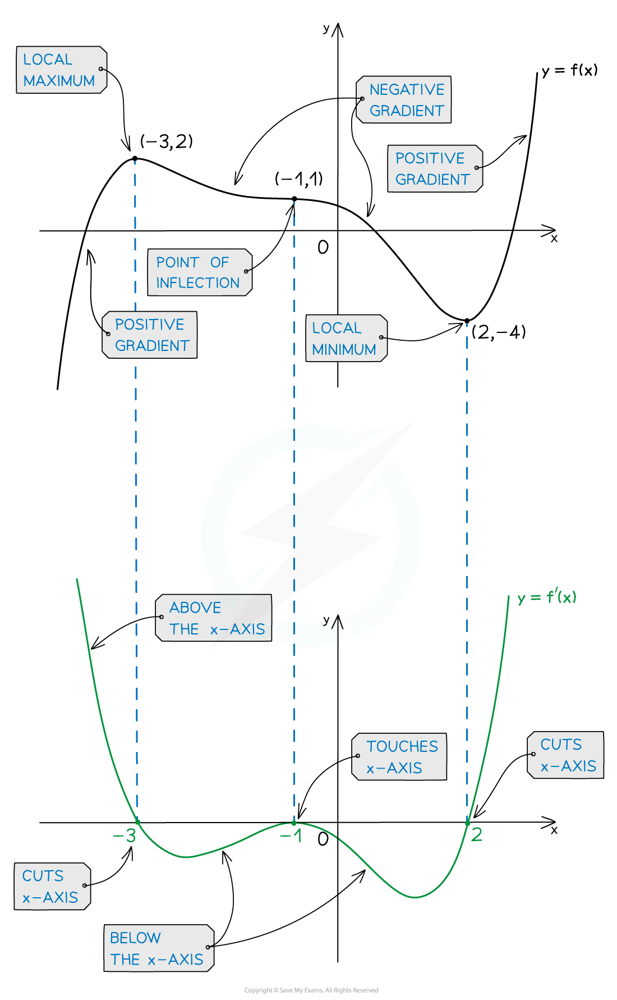
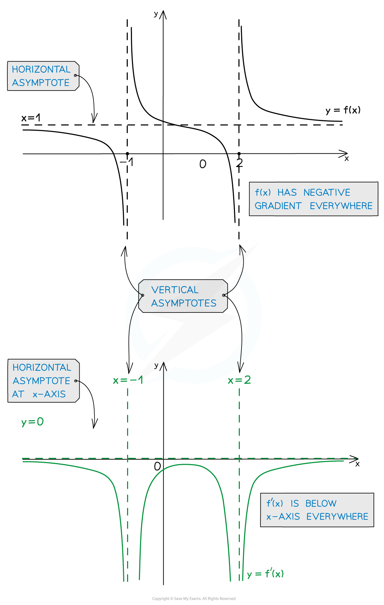

# Sketching Gradient Functions

## Sketching Gradient Functions

> **Spec point** — `spcpt_Jt62sPjwd52d5jjG`

## Sketching gradient functions

### How do I sketch the gradient function from the original function?

- Using your knowledge of gradients and derivatives you can use the graph of a function to sketch the corresponding *gradient function*
- The behaviour of a function tells you about the behaviour of its gradient function

> **Exam Hint**
> - If **f(*****x*****)** is a smooth curve then **f'(*****x*****)** will also be a smooth curve.
> - Take what you know about **f'(*****x*****)** (based on the table above) and then 'fill in the blanks' in between.
> - If all you have is the graph of **f(*****x*****)** you will not be able to specify the coordinates of the *y*-intercept or any stationary points of **f'(*****x*****).**
> - Be careful – points where **f(*****x*****)** cuts the *x*-axis don't tell you anything about the graph of **f'(*****x*****)**!

> **Worked Example**
> 
