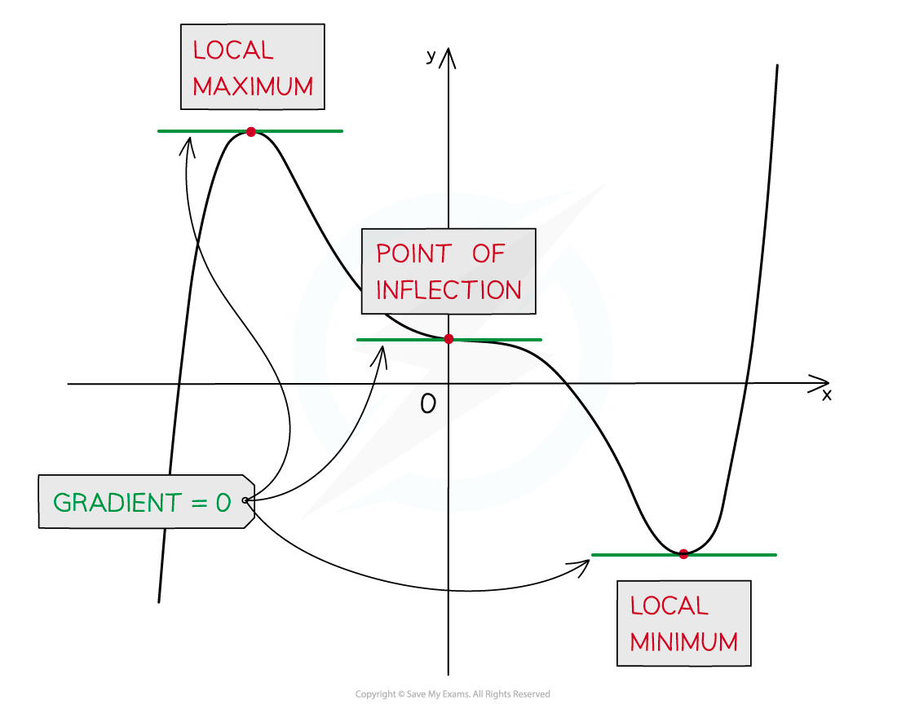
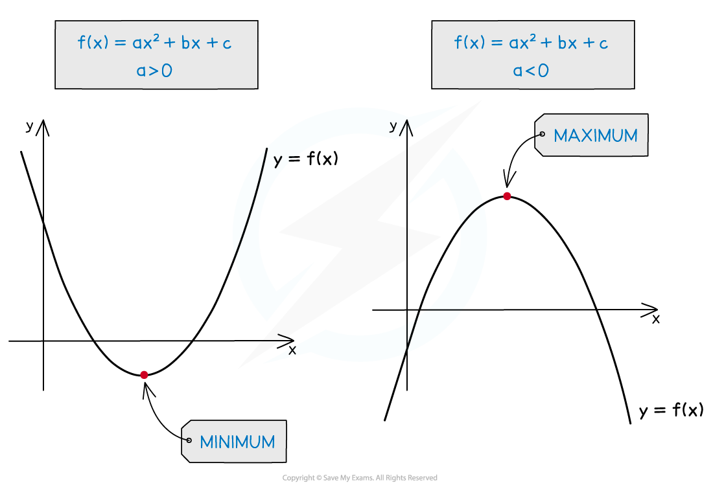
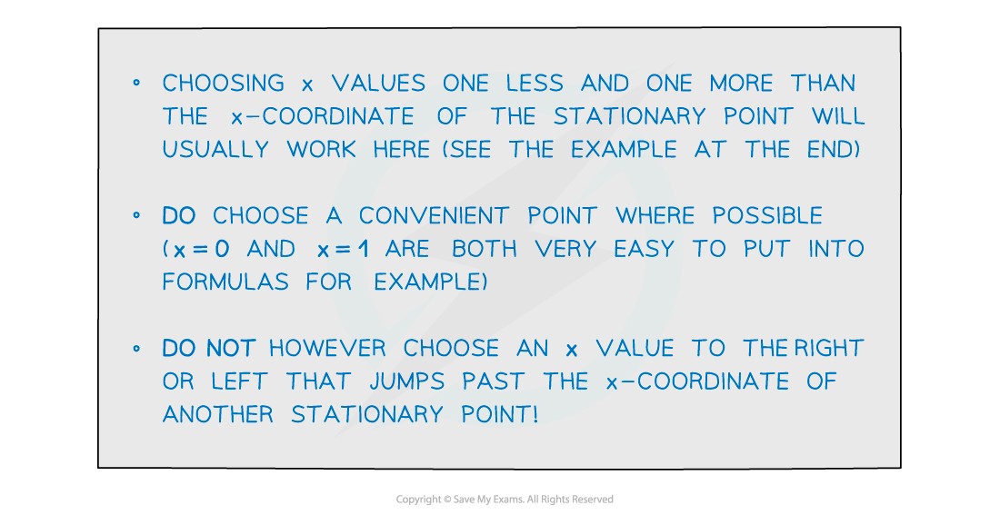
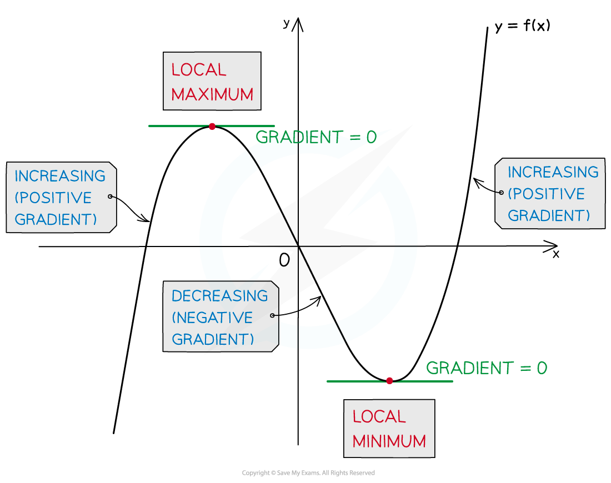
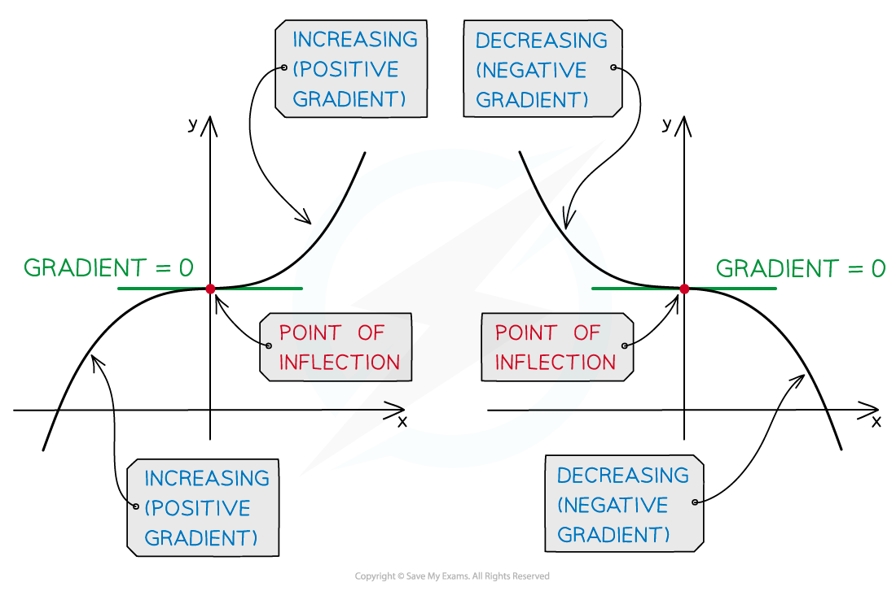
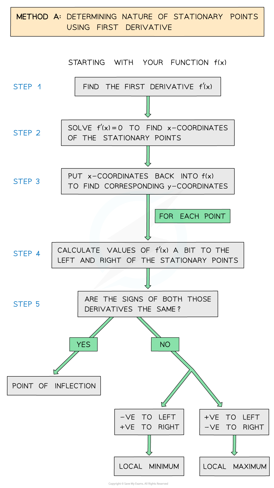
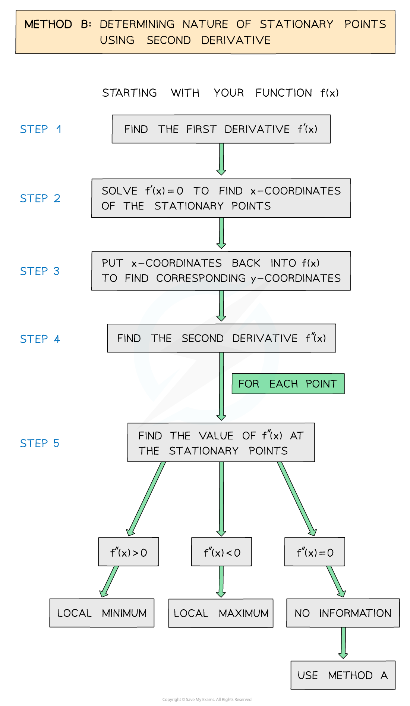

# Stationary Points & Turning Points

## Stationary Points & Turning Points

> **Spec point** — `spcpt_kzV6TBRZ65SSjSBF`

## Stationary points & turning points

### What are stationary points?

- A stationary point is any point on a curve where the gradient is zero
- To find stationary points of a function **f(*****x*****)**

**Step 1:** Find the first derivative **f'(*****x*****)**

**Step 2:** Solve **f'(*****x*****) = 0** to find the *x*-coordinates of the stationary points

**Step 3:** Substitute those *x*-coordinates into **f(*****x*****) **to find the corresponding *y*-coordinates

- A stationary point may be either a **local minimum**, a **local maximum**, or a **point of inflection**
- **Turning points** are maximum points or minimum points only

  - The graph turns from going up to down (or down to up)

### How do I determine the type of stationary point on a quadratic?

- The graph of a quadratic function (ie a parabola) only has a single stationary point
- For an 'up' parabola this is the **minimum**; for a 'down' parabola it is the **maximum** (no need to talk about 'local' here)

- The ***y*** value of the stationary point is thus the minimum or maximum value of the quadratic function
- Quadratics can only have minimum and maximum points

  - so quadratics have **turning points** (also called a **vertex**)

### How do I determine the type of stationary point on a curve?

- For a function **f(*****x*****) **there are two ways to determine the nature of its stationary points** **
- **Method A:** Compare the signs of the **first derivative** (positive or negative) a little bit **to either side of the stationary point**

  - (After completing **Steps 1 - 3 above** to find the stationary points)

**Step 4: **For each stationary point find the values of the first derivative a little bit 'to the left' (ie slightly smaller *x* value) and a little bit 'to the right' (slightly larger *x* value) of the stationary point

**Step 5:** Compare the **signs** (positive or negative) of the derivatives on the left and right of the stationary point

- If the derivatives are **negative** on the **left** and **positive** on the **right**, the point is a** local minimum**
- If the derivatives are **positive** on the **left** and **negative** on the **right**, the point is a** local maximum**
- If the signs of the derivatives are the **same** on both sides (both positive or both negative) then the point is a **point of inflection**

**Method B:** Look at the sign of the **second derivative** (positive or negative) **at the stationary point**

(After completing **Steps 1 - 3 above** to find the stationary points)

**Step 4:** Find the second derivative **f''(*****x*****)**

**Step 5:** For each stationary point find the value of **f''(*****x*****)** at the stationary point (ie substitute the *x*-coordinate of the stationary point into **f''(*****x*****) **)

- If **f''(*****x*****)** is **positive** then the point is a **local minimum**
- If **f''(*****x*****)** is **negative** then the point is a **local maximum**
- If **f''(*****x*****)** is **zero** then the point could be a **local minimum**, a **local maximum** OR a **point of inflection** (use Method A to determine which)

> **Exam Hint**
> - Usually using the second derivative (Method B above) is a much quicker way of determining the nature of a stationary point.
> - However, if the second derivative is zero it tells you nothing about the point.
> 
>   - In that case you will have to use Method A (which **always** works – see the Worked Example).

> **Worked Example**
> 
> 
> 
