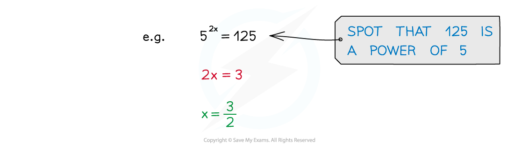

# Exponential Equations

## Exponential Equations

> **Spec point** — `spcpt_9kbfchzHcdwh6WZN`

## Exponential equations

### What are exponential equations?

- An equation where the unknown is a power
- In simple cases the solutions can be “spotted”

- See Exponential Functions

### How do I solve exponential equations in the form af(x) = b?

- If the value of *b *can be written as a power of *a* (*b *= *a**k *)

  - Write $a^{f(x)}=a^{k}$
  - Solve $f(x)=k$
- If the value of *b *can not be written as a power of *a*

  - Apply logs of base *a *to both sides to get:
  
    - $f(x)=\mathrm{log}_{a}b$
  - Solve for *x*

### How do I solve exponential equations in the form af(x) = bg(x)?

- If the value of *b *can be written as a power of *a* (*b *= *a**k *)

  - Use the index law to rewrite $b^{g(x)}$
  
    - `b to the power of straight g left parenthesis x right parenthesis end exponent equals open parentheses a to the power of k close parentheses to the power of straight g left parenthesis x right parenthesis end exponent equals a to the power of k straight g open parentheses x close parentheses blank end exponent`
  - Write `a to the power of straight f open parentheses x close parentheses end exponent equals a to the power of k straight g open parentheses x close parentheses blank end exponent`
  - Solve $f(x)=kg(x)$
- If the value of *b *can not be written as a power of *a*

  - Apply logs of the same base (any base will work) to both sides to get:
  
    - `log invisible function application open parentheses a to the power of straight f open parentheses x close parentheses end exponent close parentheses equals log invisible function application open parentheses b to the power of straight g open parentheses x close parentheses end exponent close parentheses`
  - Use the laws of logarithms to bring the power to the front:
  
    - `straight f open parentheses x close parentheses log invisible function application a equals straight g open parentheses x close parentheses log invisible function application b`
  - log *a* and log *b* are just numbers so rearrange and solve for *x*
- If either side is multiplied by a constant ($pa^{f(x)}$ )

  - Do **not** write as $(pa)^{f(x)}$ – this is **incorrect**
  - Still take logs of both sides but you will need to use another law of logs
  
    - `log invisible function application open parentheses p a to the power of straight f open parentheses x close parentheses end exponent close parentheses equals log invisible function application p plus log invisible function application p a to the power of straight f open parentheses x close parentheses end exponent`
  - log *p *is just a constant so can be solved in the same way as above

### How do I solve exponential equations with three terms?

- If the equation has three terms such as `a to the power of straight f open parentheses x close parentheses end exponent plus a to the power of straight g open parentheses x close parentheses end exponent plus c equals 0`

  - Use the index laws in reverse to split up the powers
  
    - $a^{Ax+B}=a^{Ax}\timesa^{B}$
  - Try and use a substitution to transform the equation into a quadratic
  
    - See Further Solving Quadratics (Hidden Quadratics)
    - Look out for terms where one power is double another power
  - Solve the quadratic
  - For each solution find the corresponding value(s) of *x*

> **Worked Example**
> 

> **Exam Hint**
> - Pay attention to how the question asks you to write your answer
> 
>   - it could ask for exact form, a specific form or rounded to a specified degree of accuracy
