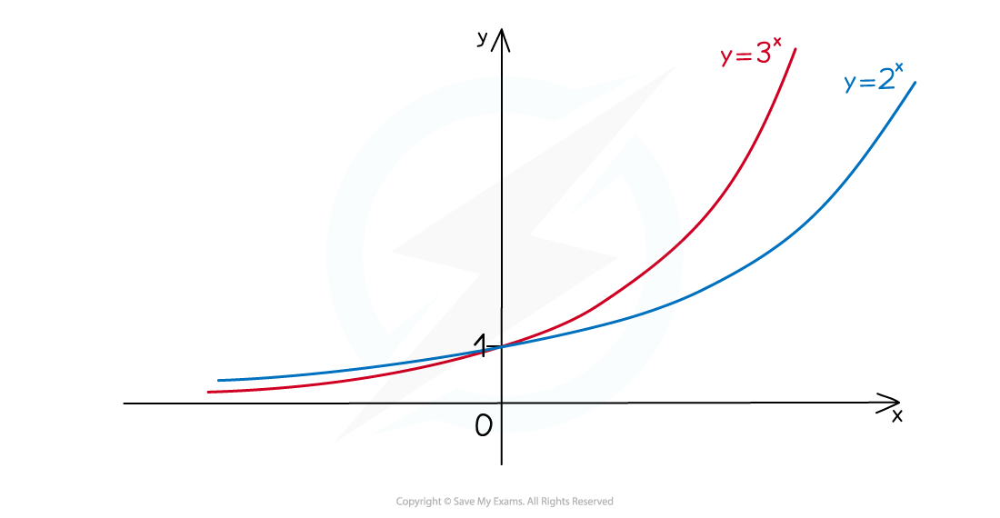
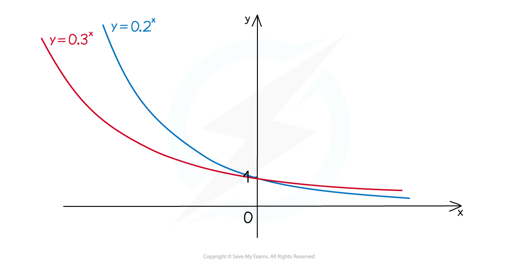

# Exponential Functions

## Exponential Functions

> **Spec point** — `spcpt_9hj7RrpSwthZMfPM`

## Exponential functions

### What are exponential functions?

- Exponential functions of the form **y = a****x** with **a > 0** are considered at A level

### What are exponential graphs?

- All graphs of the form **y = a****x** will pass through (0, 1) because **a****0**** = 1**
- The **x**-axis is an **asymptote** 

### What is exponential growth?

- Where **x < 0** the higher value of **a** is the “lower” graph

  - e.g. $3^{x}<2^{x}$ when $x<0$
- Where **x > 0** the higher value of **a** is the “higher” graph

  - e.g. $3^{x}>2^{x}$ when $x>0$
- **a > 1** is **exponential** **growth **(see Exponential Growth & Decay)

### What is exponential decay?

- Where **x < 0** the higher value of **a** is the “lower” graph

  - e.g. $0.3^{x}<0.2^{x}$ when $x<0$
- Where **x > 0** the higher value of **a** is the “higher” graph

  - e.g. $0.3^{x}>0.2^{x}$ when $x>0$
- **0 < a < 1** is **exponential decay**

- You may like to think about why** a = 1** is **not** considered... If a = 1, y = 1x = 1 for all values of x

> **Worked Example**
> 
