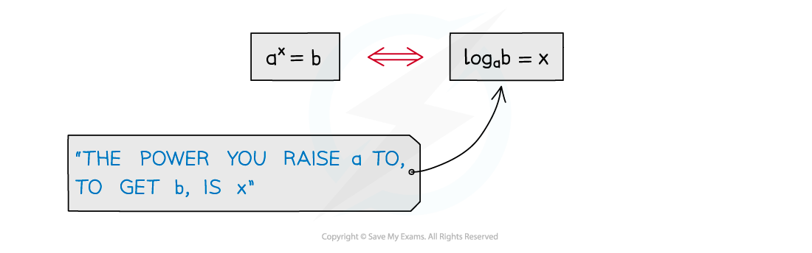
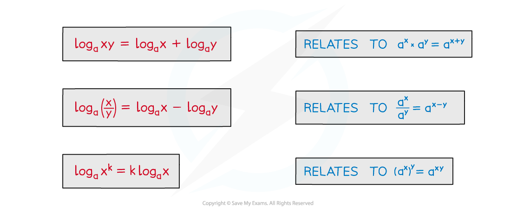
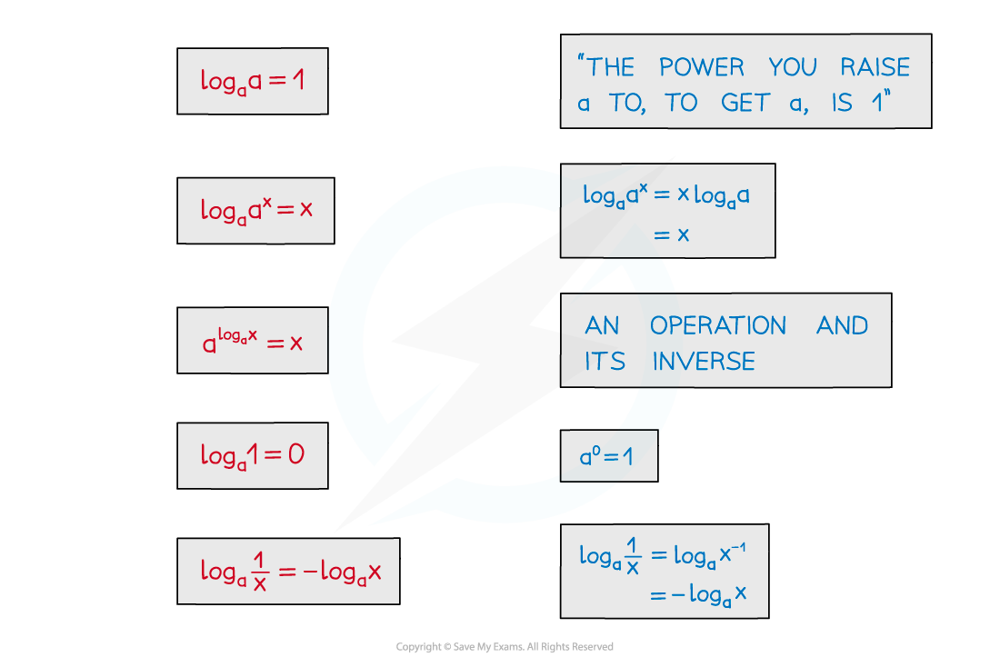
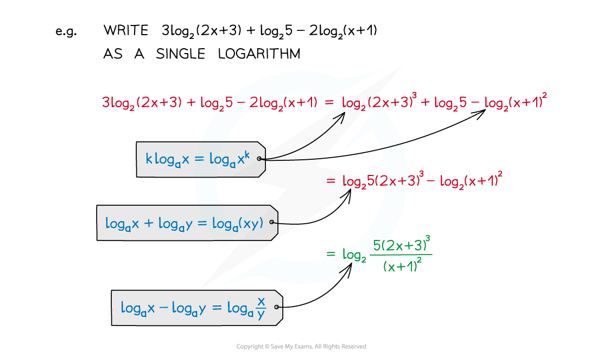

# Laws & Change of Base

## Laws of Logarithms

> **Spec point** — `spcpt_cnypQhcg6z86WTSY`

## Laws of logarithms

### What are the laws of logarithms?

- There are many laws or rules of indices, for example

  - **a****m**** x a****n**** = a****m+n**
  - **(a****m****)****n**** = a****mn**
- There are equivalent laws of logarithms (for a > 0)

  - $\mathrm{log}_{a}xy=\mathrm{log}_{a}x+\mathrm{log}_{a}y$
  - $\mathrm{log}_{a}(\frac{x}{y})=\mathrm{log}_{a}x-\mathrm{log}_{a}y$
  - $\mathrm{log}_{a}x^{k}=k\mathrm{log}_{a}x$

- There are also some particular results these lead to

  - $\mathrm{log}_{a}a=1$
  - $\mathrm{log}_{a}a^{x}=x$
  - $a^{\mathrm{log}_{a}x}=x$
  - $\mathrm{log}_{a}1=0$
  - $\mathrm{log}_{a}(\frac{1}{x})=-\mathrm{log}_{a}x$

- Two of these were seen in the notes Logarithmic Functions
- Beware …

  - … **log (x + y) ≠ log x + log y**

### How do I use the laws of logarithms?

- Laws of logarithms can be used to …

  - … simplify expressions
  - … solve logarithmic equations
  - … solve exponential equations

> **Exam Hint**
> - Remember to check whether your solutions are valid. log (x+k) is only defined if x > -k. You will lose marks if you forget to reject invalid solutions.

> **Worked Example**
> 

## Change of Base

> **Spec point** — `spcpt_gDJSsXQN4sTWgFxJ`

## Change of base

### What is the change of base formula?

- We can rewrite a **logarithm** as a **multiple** of a logarithm of **any different positive base **using the formula

`begin mathsize 22px style log subscript a invisible function application x equals fraction numerator log subscript b invisible function application x over denominator log subscript b invisible function application a end fraction end style`

### How do I use the change of base formula?

- This formula had more use when calculators were less advanced

  - Some old calculators only had a button for logarithm of base 10
  - To calculate $\mathrm{log}_{5}7$on these calculators you would have to enter
  
    - `fraction numerator log subscript 10 invisible function application 7 over denominator log subscript 10 invisible function application 5 end fraction`

- The formula is only needed in a small number of cases

  - This is given in the **formulae booklet** in case it is needed
- The formula can be useful when evaluation a logarithm where the two numbers are **powers of a common number**

  - $\mathrm{log}_{4}8=\frac{\mathrm{log}_{2}8}{\mathrm{log}_{2}4}=\frac{3}{2}$
- The formula can be useful when you are solving equations and two logarithms have **different bases**

  - For example, if you have $\mathrm{log}_{3}k$ and $\mathrm{log}_{9}n$ within the same equation
  
    - You can rewrite $\mathrm{log}_{9}n$ as `fraction numerator log subscript 3 invisible function application n over denominator log subscript 3 invisible function application 9 end fraction blank` which simplifies to $\frac{1}{2}\mathrm{log}_{3}n$
    - Or you can rewrite $\mathrm{log}_{3}k$ as `fraction numerator log subscript 9 invisible function application k over denominator log subscript 9 invisible function application 3 end fraction blank` which simplifies to $2\mathrm{log}_{9}k$
- The formula also allows you to derive and use a formula for switching the numbers:

`begin mathsize 22px style log subscript a invisible function application x equals fraction numerator 1 over denominator log subscript x invisible function application a end fraction end style`

- Using the fact that $\mathrm{log}_{x}x=1$

> **Exam Hint**
> - It is very rare that you will need to use the change of base formula
> - Only use it when the bases of the logarithms are different
