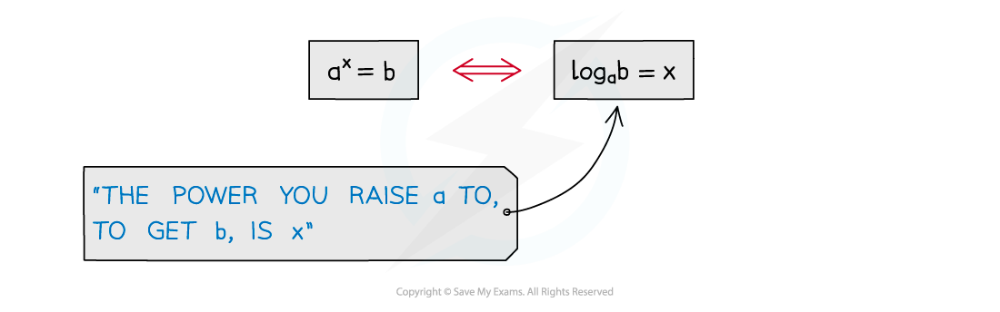
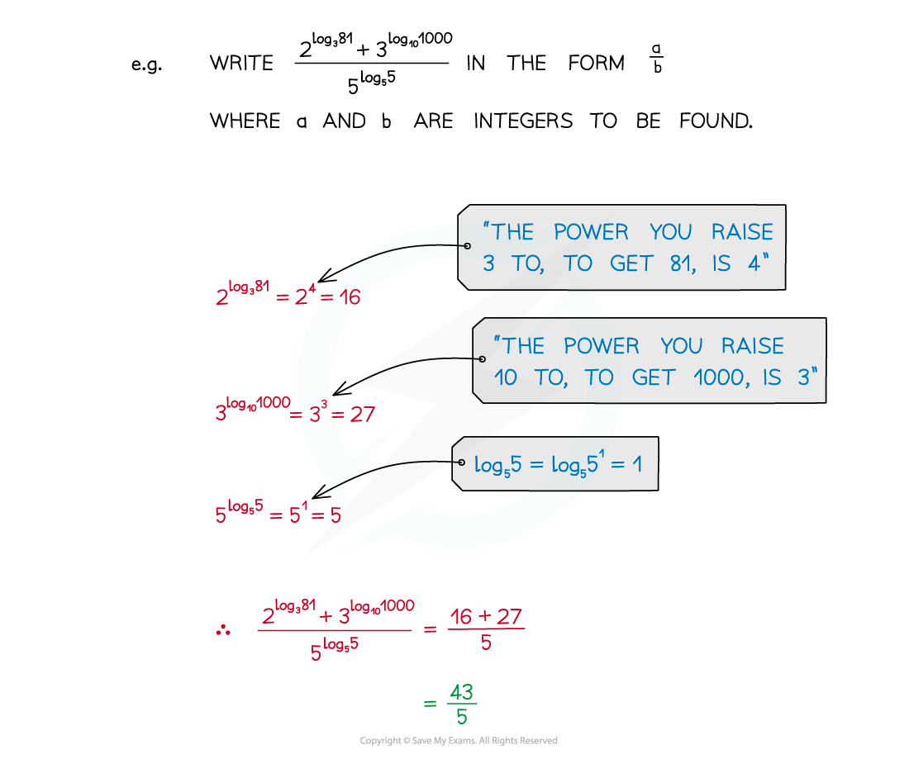
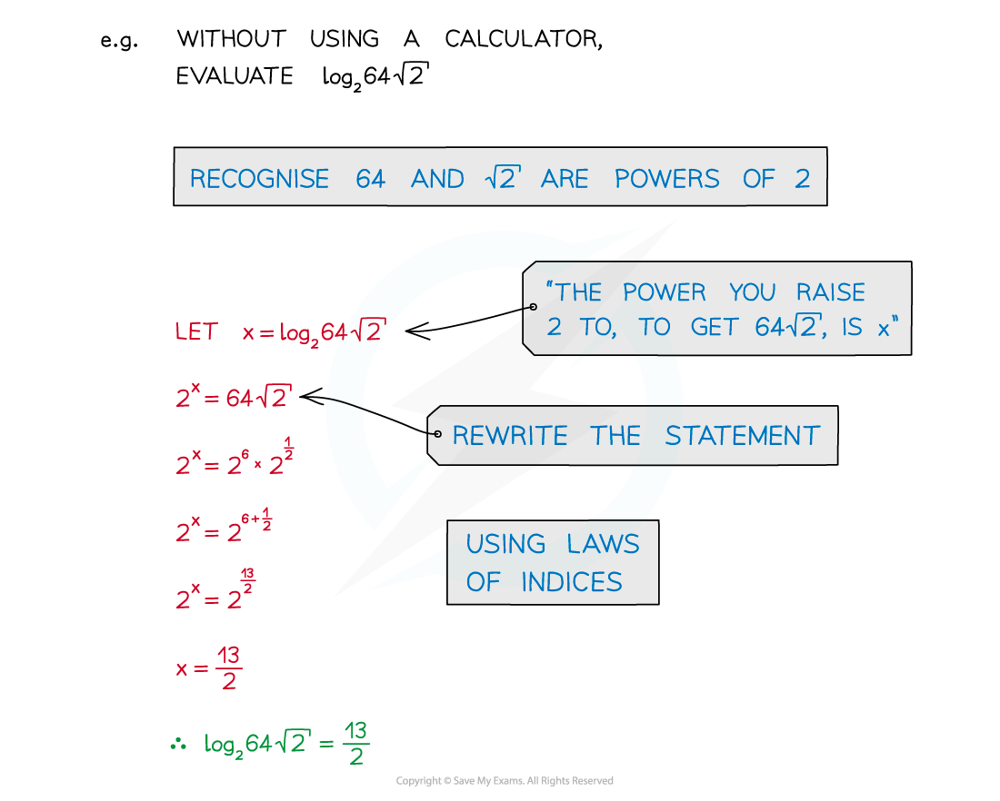
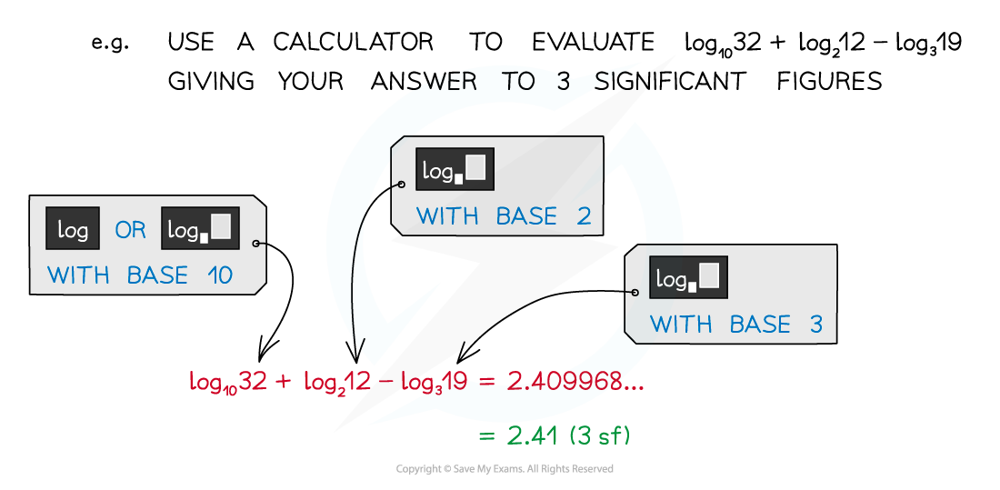

# Logarithmic Functions

## Logarithmic Functions

> **Spec point** — `spcpt_CbPh4WmwTnQkjr3P`

## Logarithmic functions

### What are logarithmic functions?

- **a = b****x** and **log ****b**** a = x** are equivalent statements
- **a > 0**
- **b** is called the base
- Every time you write a logarithm statement say to yourself what it means

  - **log****3**** 81 = 4** “the power you raise 3 to, to get 81, is 4”
  - **log****p**** q = r** “the power you raise **p** to, to get **q**, is **r**”

### How are logarithms and powers inverses of each other?

- As a logarithm is the inverse of raising to a power 

### How do I use the inverse property of logs and powers?

- Recognising the rules of logarithms allows expressions to be simplified

- Recognition of common powers helps in simple cases

  - Powers of 2: 20 = 1, 21 = 2, 22 = 4, 23 = 8, 24 =16, …
  - Powers of 3: 30 = 1, 31 = 3, 32 = 9, 33 = 27, 34 = 81, …
  - The first few powers of 4, 5 and 10 should also be familiar
- For more awkward cases a calculator is needed

- Calculators can have, possibly,  different logarithm buttons

- This button allows you to type in any number for the base

- Shortcut for base 10 although SHIFT button needed** **
- Before calculators, logarithmic values had to be looked up in printed tables

### What notation is used with logarithms?

- 10 is a common base

  - **log****10 ****x** is abbreviated to **log x** or **lg x**
- **(log x)****2**** ≠ log x****2**

> **Worked Example**
> 
