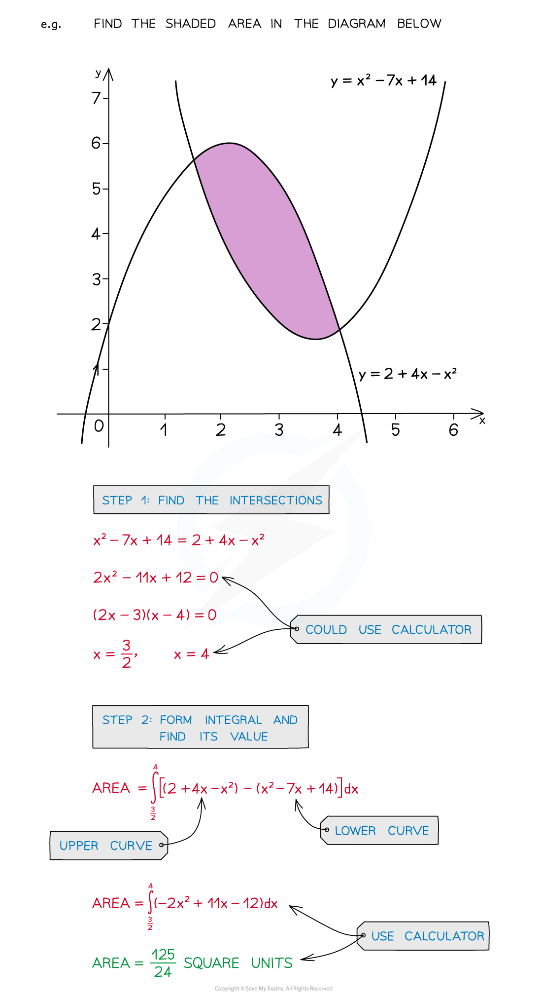

# Area Between 2 Curves

## Area between 2 curves

> **Spec point** — `spcpt_FfdPp8vTNhhpwWJ7`

## Area between 2 curves

### What is the area between two curves?

- Ensure you are familiar with … 

  - Area under a curve
  - Area between a line and a curve
- In general find the definite integral of “upper curve” – “lower curve”
- However this does depend on …

  - … the area being found
  - … if the curves intersect (and cross over)
- The area may have to be split into separate integrals

- The points at which curves intersect may need to be calculated

### How do I find the area between two curves?

- **STEP 1**
Find the intersections of the curves if needed
- **STEP 2**
Form the integral …

  - … using the intersections as limits
  - … “upper curve” – “lower curve” …
  - … and find the value of the integral
- **STEP 3**
Repeat STEP 2 if more than one area needed
- **STEP 4**
Add areas together

> **Exam Hint**
> - If no diagram is provided sketch one, even if the curves are not accurate.
> - Add information to any given diagram as you work through a question.
> - Maximise use of your calculator to save time and maintain accuracy:
> 
>   - Solving equations, especially **cubic** equations
>   - Finding definite integrals

> **Worked Example**
> 
> 
> 
