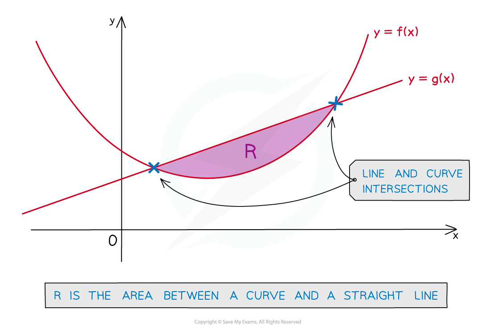
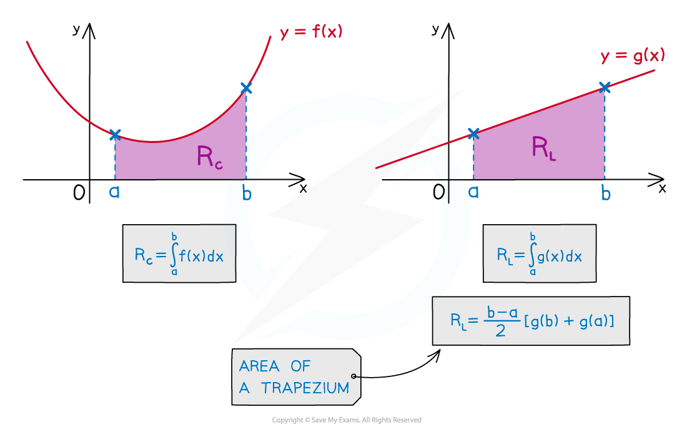
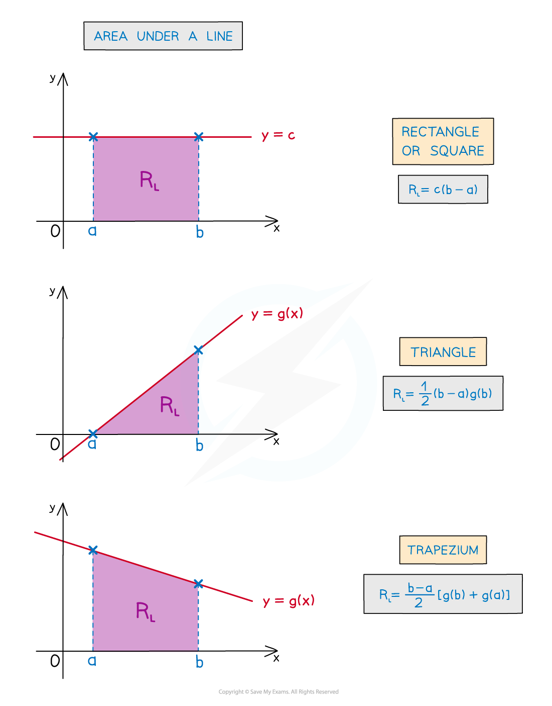
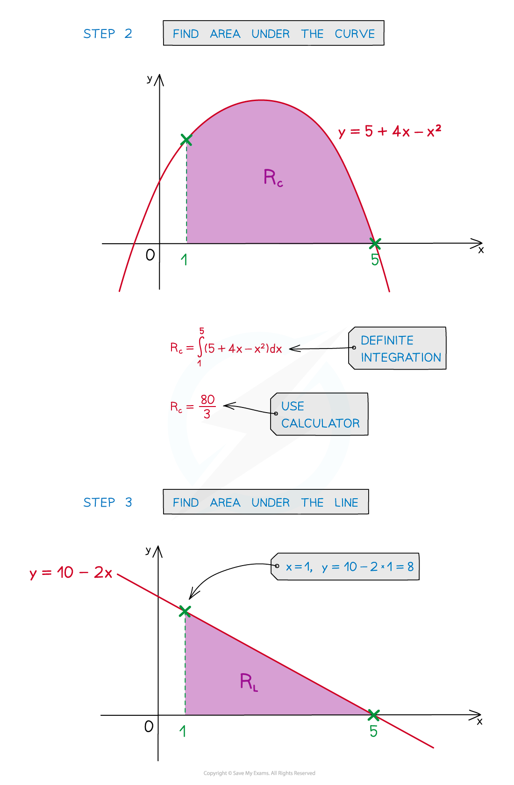
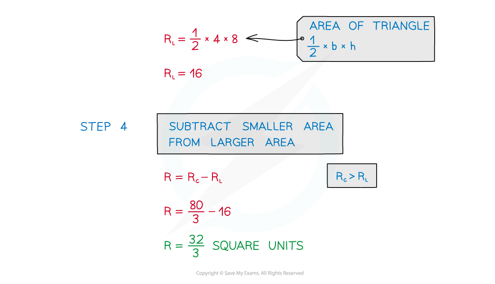
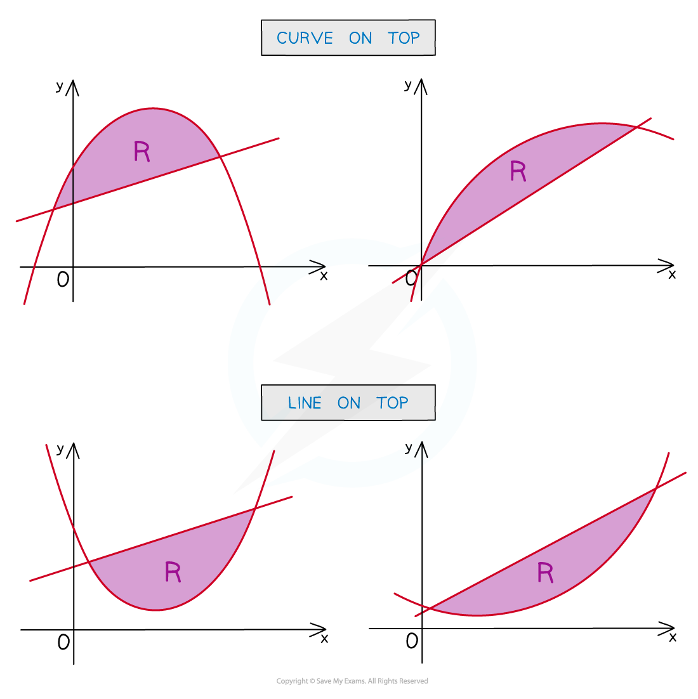
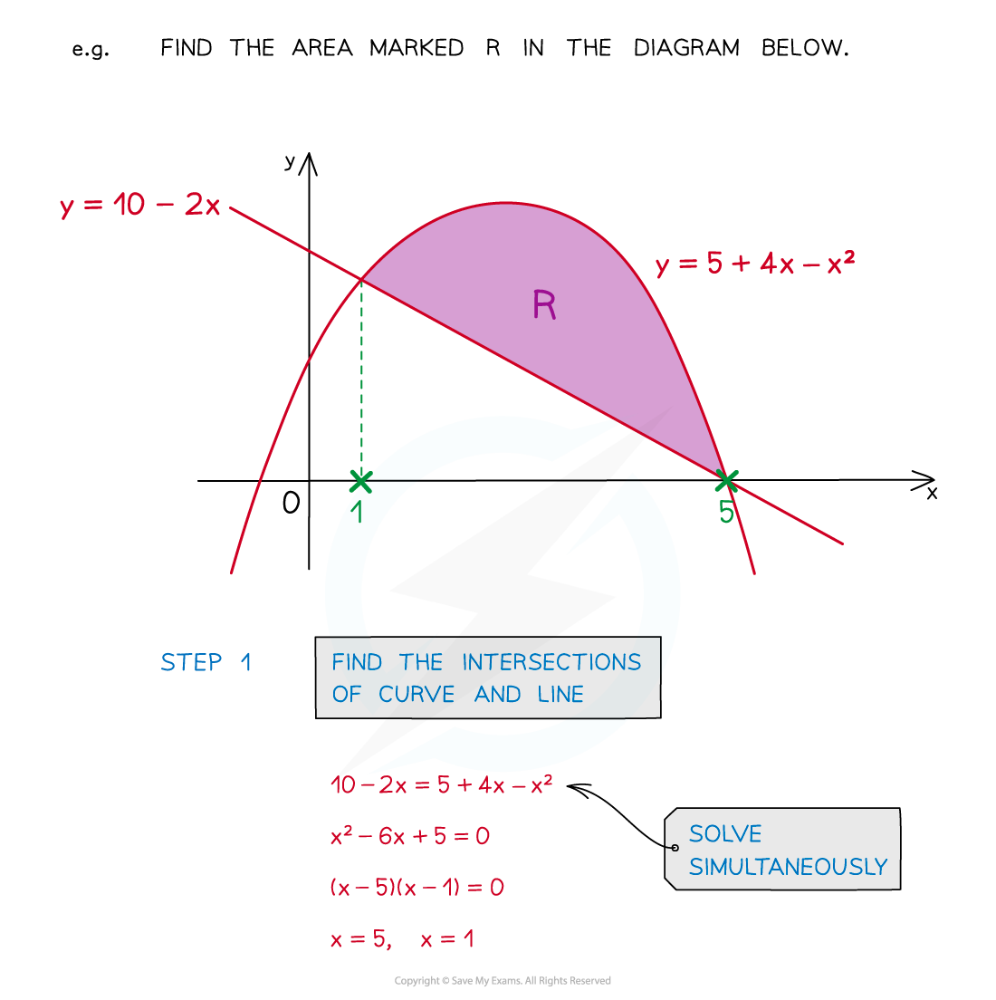
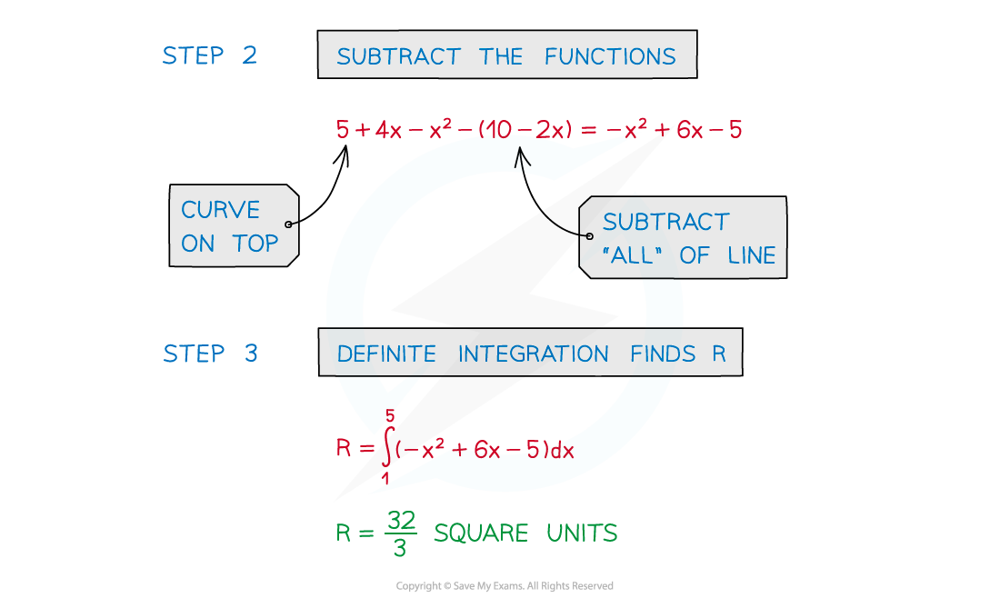

# Area Between a Curve & a Line

## Area between a curve and a line

> **Spec point** — `spcpt_8YwGfFZ89FzYxVj9`

## Area between a curve and a line

### What is the area between a curve and a straight line?

- This is the area enclosed by a curve and a line between their **intersections**
- The intersections may need to be found using simultaneous equations

### How do I find the area between a curve and a line by separating into two areas?

- The area enclosed will be the **difference** between …

  - the **area under the curve** and
  - the **area under** the line
- These can be found separately

- There may be easier ways to find the area under a line

- Once the areas are found a question can be answered in full

- STEP 1: Find the intersections of the line and the curve
- STEP 2: Find the area under a curve, **R****C**, using definite integration
- STEP 3: Find the area under a line, **R****L**, either using definite integration **or** the area formulae for basic shapes
- STEP 4: To find the area, **R**, between the curve and the line **subtract** the **smaller **area **from** the **larger** area

  - If curve on top this will be **R****C**** – R****L**
  - If line on top this will be **R****L**** - R****C**

### How do I find the area between a curve and a line by subtracting their equations?

- An alternative method allows subtraction of the two functions first
- But be extremely careful as to whether the curve or the line is on top

- STEP 1: Find the intersections of the line and the curve
- STEP 2: Subtract the functions algebraically

  - Ensure this is done the correct way round!
- STEP 3: Find the area, **R**, between the curve and the line using **definite** **integration**

> **Exam Hint**
> - Add information to any diagram provided
> - Add axes intercepts, as well as intercepts between lines and curves
> - Mark and shade the area you’re trying to find
> - If no diagram provided, **sketch** one!

> **Worked Example**
> 
> 
> 
> 
> 
> 
> 
