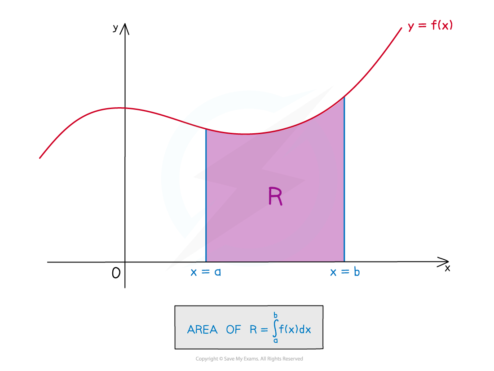
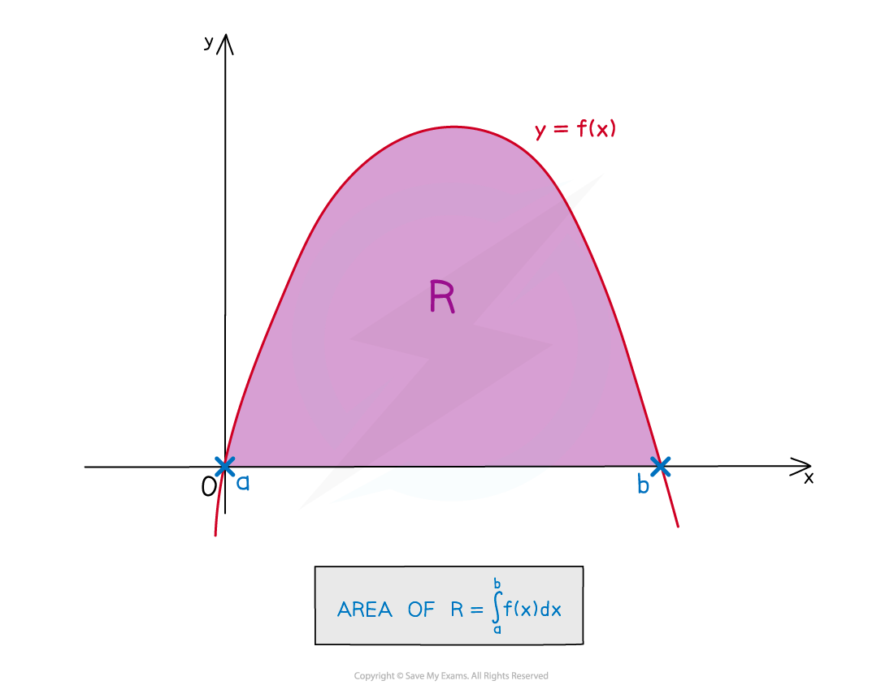
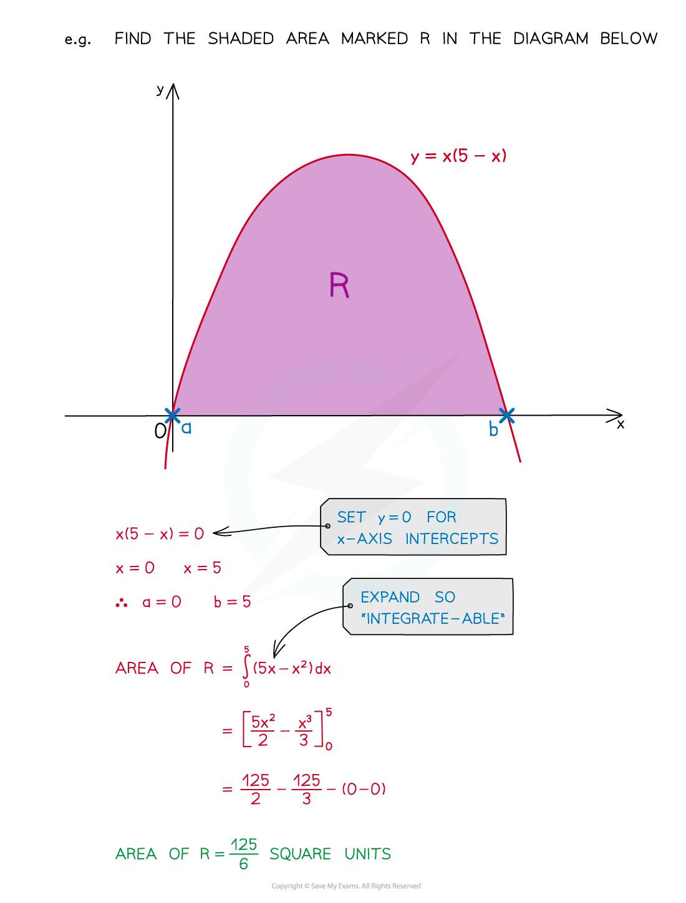
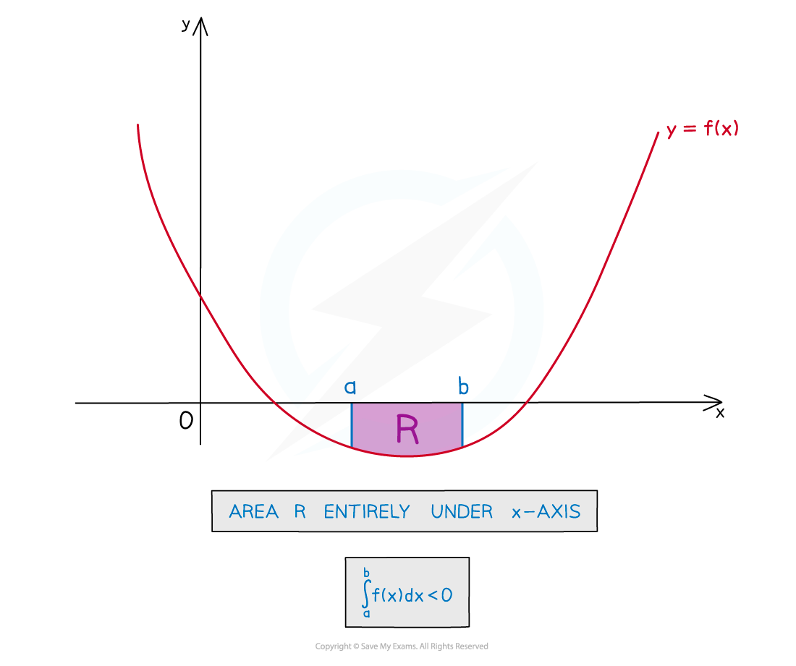
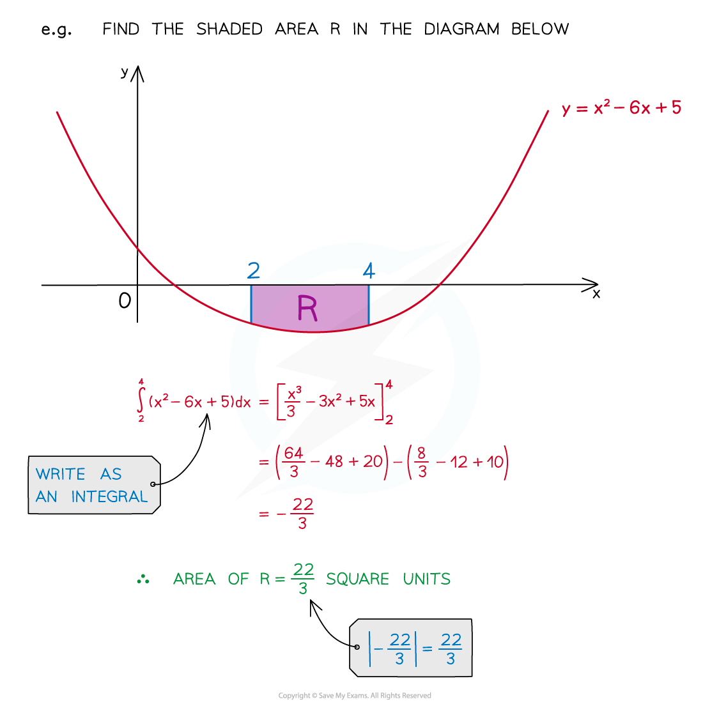
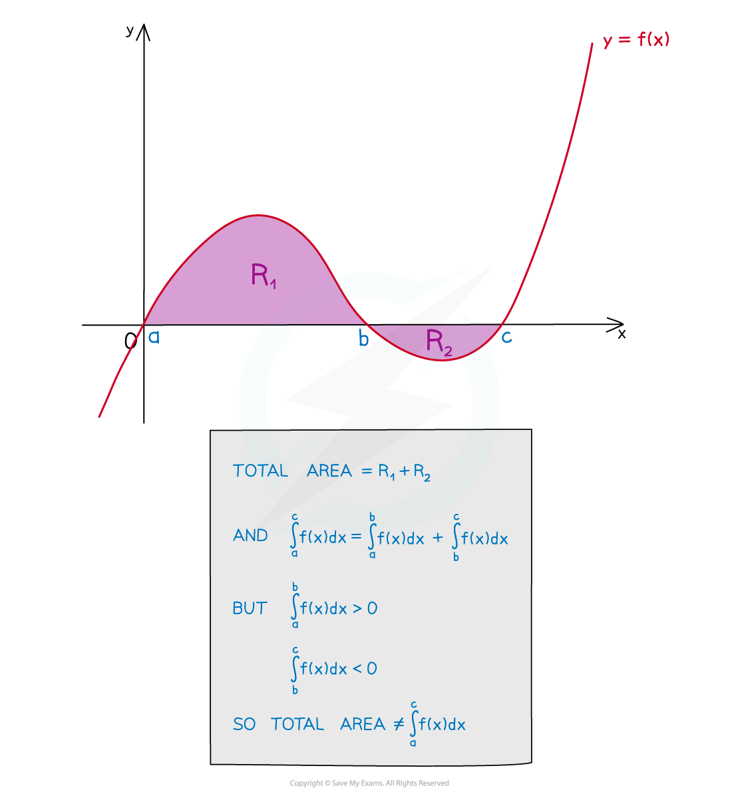

# Area Under a Curve

## Area Under a Curve

> **Spec point** — `spcpt_CQhzHWwghqFHzphh`

## Area under a curve

### What is the area under a curve?

- The phrase “area under a curve” refers to the area bounded by …

  - ... the **x**-axis
  - … the graph of **y = f(x)**
  - … the vertical line **x = a**
  - … the vertical line **x = b**

### How do I find the area under a curve using definite integration?

- The value from **definite** **integration** is equal to the “area under a curve” 

### How do I find the limits of integration?

- If limits are not provided they will be the **x**-axis intercepts

  - Set **y = 0** and solve the equation to find the **x**-axis intercepts

### How do I find areas that are below the x-axis (negative areas)?

- If the area lies underneath the **x**-axis the value of the integral will be negative
- An **area** cannot be negative, so take the **modulus** of the integral

### How do I find total areas without areas cancelling each other out?

- Be careful when one section is above and one section is below the **x**-axis 

  - You will need a separate integral for each section, BUT...
  - ...One section's integral will be **negative**
  - ...One section's integral will be **positive**
  - So you’ll need to take the **modulus** before adding to find the total area

> **Exam Hint**
> - Add information to any diagram provided in the question, as well as axes intercepts and values of limits.
> - Mark and shade the area you’re trying to find, and if no diagram is provided, **sketch** one!

> **Worked Example**
> 
