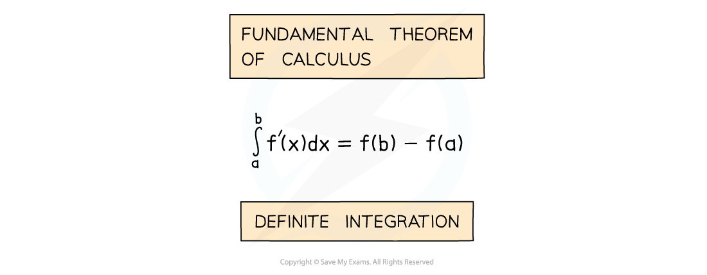
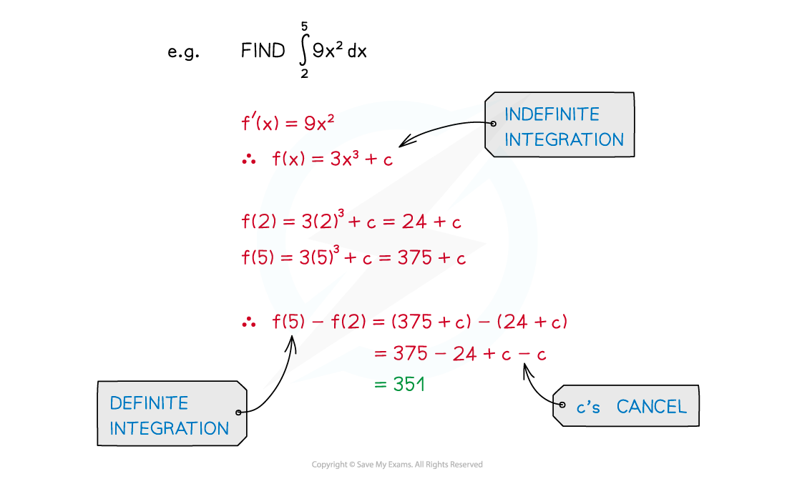
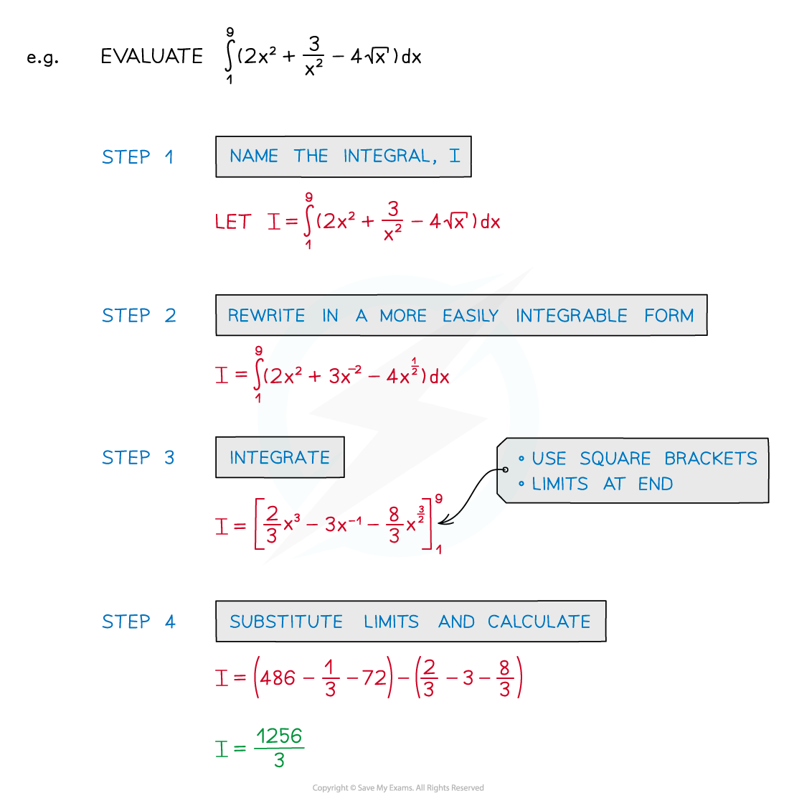

# Definite Integration

## Definite Integration

> **Spec point** — `spcpt_9Cpr29P5QKVBBZY6`

## Definite integration

### What is definite integration?

- **Definite** **Integration** occurs in an alternative version of the Fundamental Theorem of Calculus
- This version of the Theorem is the one referred to by most AS/A level textbooks/websites

- **a** and **b** are called limits

  - **a** is the lower limit
  - **b** is the upper limit
- **f’(x)** is the **derivative** of **f(x)**

### Why is there no constant of integration in definite integration?

- “**+c**” would appear in both **f(a)** and **f(b)**

  - Since we then calculate **f(b)** – **f(a)** they cancel each other out
  - There would be a “**+c**” from **f(b)** and a **–**“**+c**” from **f(a)**
- So “**+c**” is not included with definite integration

### How do I find a definite integral on my calculator?

- STEP 1: If not given a name, call the integral

  - This saves you having to rewrite the whole integral every time!
- STEP 2:  If necessary rewrite the integral into a more easily ***integrable*** form

  - Not all functions can be integrated directly
- STEP 3:  Integrate without applying the limits

  - Notation: use square brackets [ ] with limits placed after the end bracket
- STEP 4:  Substitute the limits into the function and calculate the answer

#### Using a calculator

- Advanced scientific calculators can work out the values of definite integrals
- The button will look similar to:

- (Note how the calculator did not return the exact value `open parentheses 1256 over 3 close parentheses` of the integral)

> **Exam Hint**
> - Look out for questions that ask you to find an **indefinite** integral in one part (so “**+c**” needed), then in a later part use the same integral as a **definite** integral (where “**+c**” is not needed).

> **Worked Example**
> Find the value of
> 
> `integral subscript 2 superscript 4 3 x left parenthesis x squared minus 2 right parenthesis space straight d x`
> 
> **Answer:**
> 
> > *Start by expanding the brackets inside the integral*
> 
> `integral subscript 2 superscript 4 open parentheses 3 x cubed minus 6 x close parentheses space straight d x`
> 
> > *Integrate as usual (here it's a 'powers of *$x$*' integration)*
> 
> > *Write the answer in square brackets with the integration limits outside*
> 
> `table row cell integral subscript 2 superscript 4 open parentheses 3 x cubed minus 6 x close parentheses space straight d x end cell equals cell open square brackets 3 open parentheses fraction numerator x to the power of 3 plus 1 end exponent over denominator 3 plus 1 end fraction close parentheses minus 6 open parentheses fraction numerator x to the power of 1 plus 1 end exponent over denominator 1 plus 1 end fraction close parentheses close square brackets subscript 2 superscript 4 end cell row blank equals cell open square brackets 3 over 4 x to the power of 4 minus 3 x squared close square brackets subscript 2 superscript 4 end cell end table`
> 
> > *Now substitute 4 into that function *
> *And subtract from it the function with 2 substituted in*
> 
> `table attributes columnalign right center left columnspacing 0px end attributes row cell open square brackets 3 over 4 x to the power of 4 minus 3 x squared close square brackets subscript 2 superscript 4 end cell equals cell open parentheses 3 over 4 open parentheses 4 close parentheses to the power of 4 minus 3 open parentheses 4 close parentheses squared close parentheses minus open parentheses 3 over 4 open parentheses 2 close parentheses to the power of 4 minus 3 open parentheses 2 squared close parentheses close parentheses end cell row blank equals cell open parentheses 192 minus 48 close parentheses minus open parentheses 12 minus 12 close parentheses end cell row blank equals cell 144 minus 0 end cell row blank equals 144 end table`
> 
> `Error converting from MathML to accessible text.`
