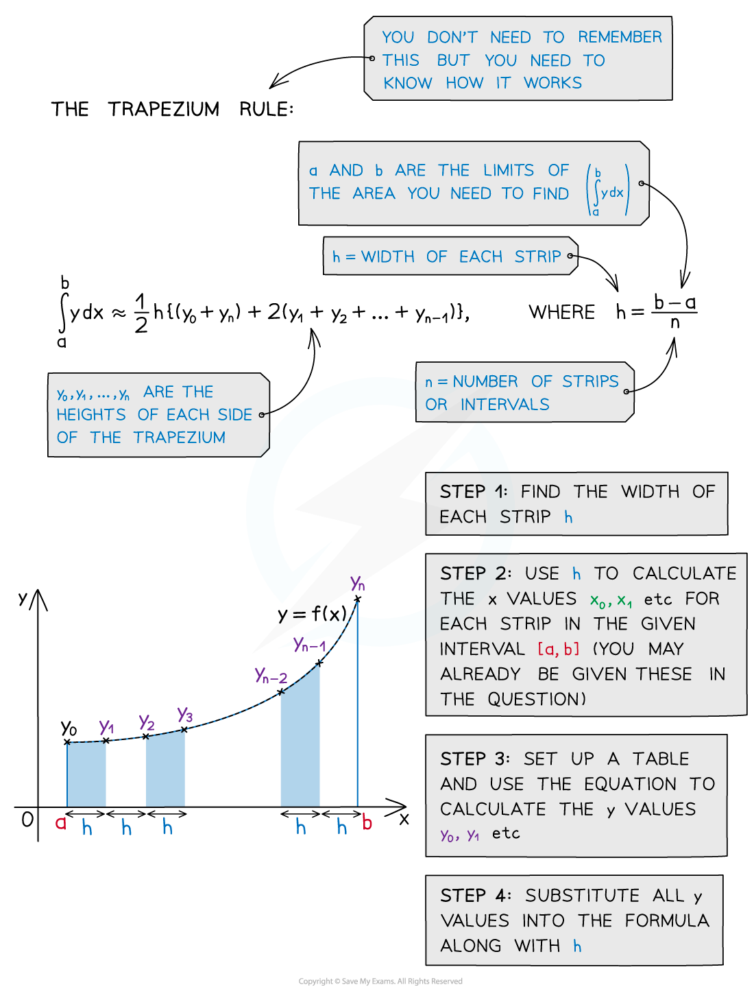
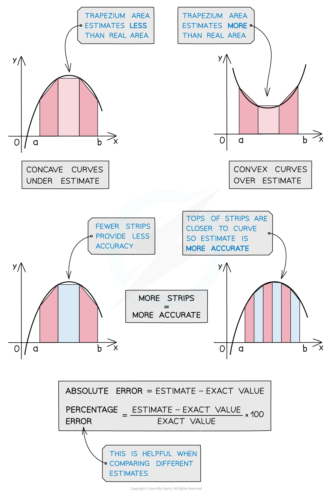

# Trapezium Rule (Numerical Integration)

## Trapezium Rule (Numerical Integration)

> **Spec point** — `spcpt_RVNjC2y684mYfGyD`

## Trapezium rule (numerical integration)

### What is the trapezium rule?

- The **trapezium rule** is a numerical method of integration used to find the **approximate area** under a curve
- It can be used when **analytical methods** of **integration** won’t work
- It finds an **approximation** of the area by finding the **sum of the areas** of trapeziums beneath the curve
- The **formula **for an **estimate** of the area when splitting it into *n *strips (trapezium) is

`integral subscript a superscript b y d x almost equal to 1 half h left curly bracket left parenthesis y subscript 0 plus y subscript n right parenthesis plus 2 left parenthesis y subscript 1 plus y subscript 2 plus... plus y subscript n minus 1 end subscript right parenthesis right curly bracket` where $h=\frac{b-a}{n}$

- If you have ***n *****strips** then you need ***n *****+ 1 *****y*****-values**

### How do I know if it is an underestimate or an overestimate?

- Depending on the shape of the curve, the trapezium rule could be an **underestimate** or **overestimate**
- The **more trapezium strips** used the **more accurate** the estimate
- Calculating the **percentage error** can tell you how **accurate** your estimate is

> **Exam Hint**
> The formula for the trapezium rule is given in the formula booklet.

> **Worked Example**
> 
