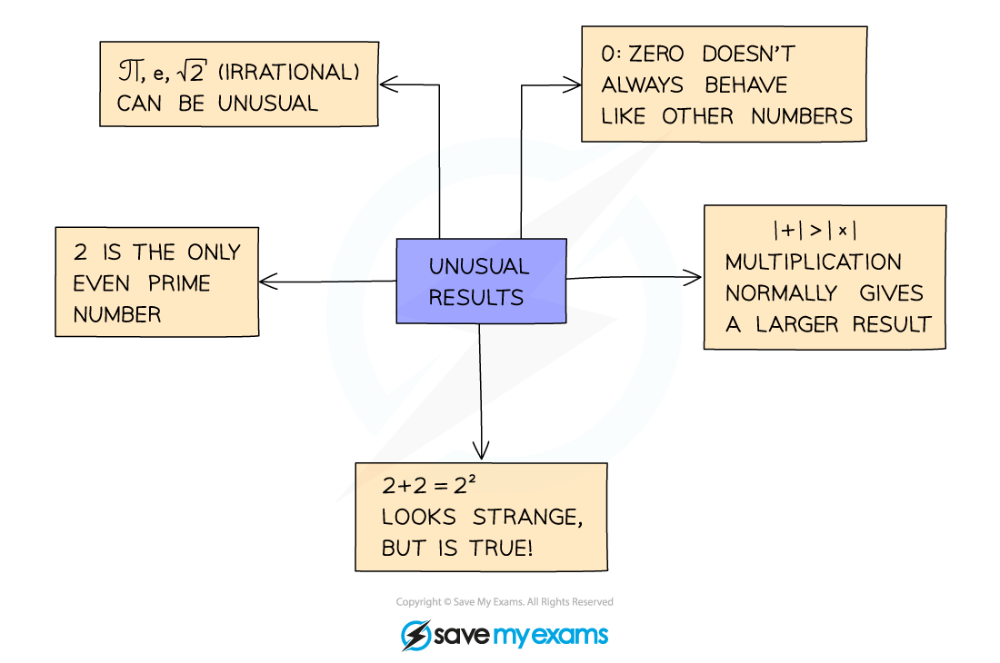

# Disproof by Counter Example

## Disproof by Counter Example

> **Spec point** — `spcpt_W8PnMt9XTWNsVjfd`

## Disproof by counter example

### What is disproof by counter example?

- Disproof by counter examples involves finding a value that does **not** work for the given statement

  - That value is called a **counter** **example**

### How do I disprove a result?

- You only need to find **one** value that does “not work”
- Numbers that have unusual results are often helpful to try

- Look carefully to see what types of number the result is claimed for – it may just be integers rather than real numbers
- *Irrational numbers* can be unusual
- Think about areas of maths where unusual things happen – such as in trigonometry where there are several angles with the same sine value

> **Worked Example**
> 
