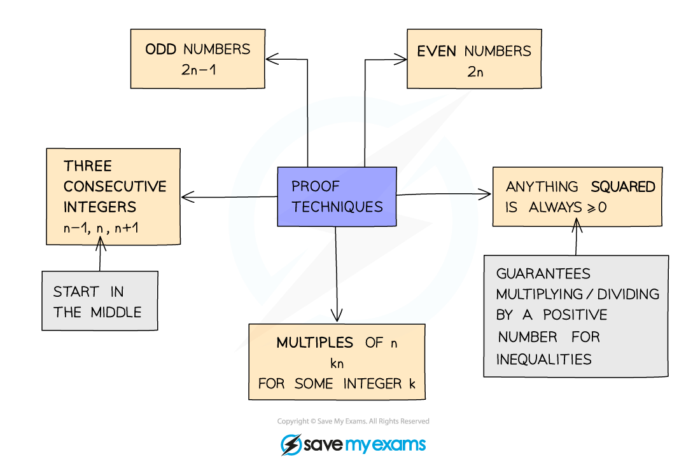
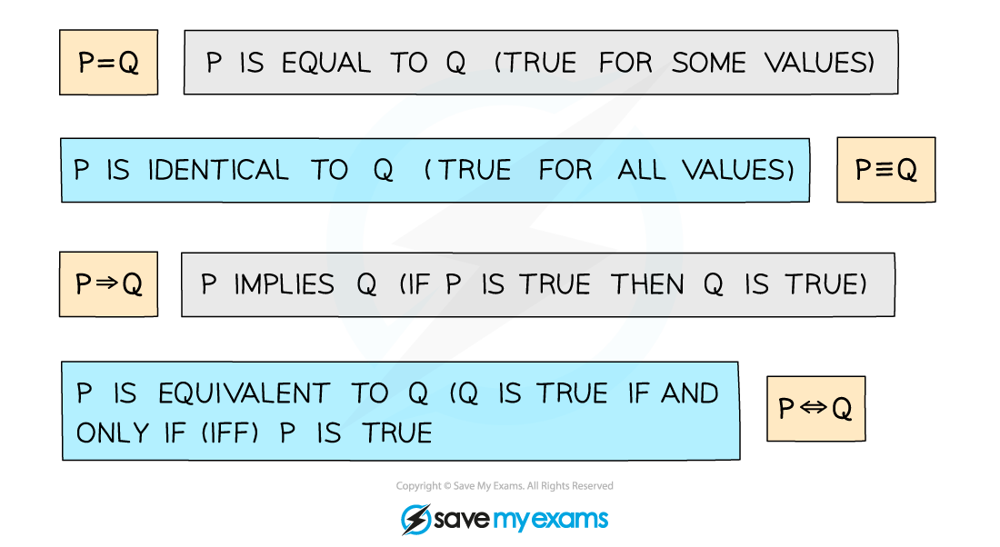

# Language of Proof

## Language of Proof

> **Spec point** — `spcpt_WnXxjkVHPcdKzygN`

## Language of proof

### What is proof?

- Proof is a series of logical steps which show whether a result is **true** or not for a set of specified numbers

  - e.g. All integers, all even numbers etc

### Notation in proof

- LHS and RHS are standard abbreviations for left-hand side and right-hand side
- *Integers* are used frequently in the language of proof

  - The set of integers is denoted by ℤ

### Techniques for proof

> **Worked Example**
> 
