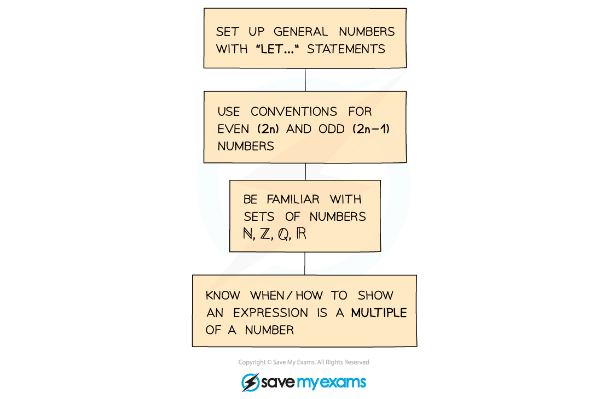
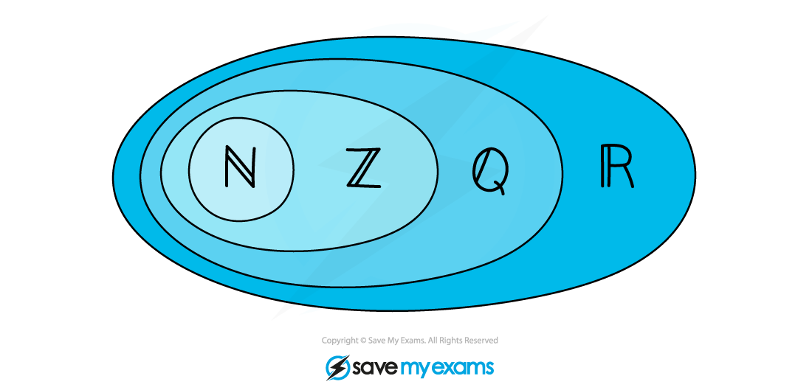

# Proof by Deduction

## Proof by Deduction

> **Spec point** — `spcpt_nsZF8WtVDsdDXGkw`

## Proof by deduction

### What is proof by deduction?

Proof by deduction is when a mathematical and logical argument is used to show whether or not a result is true

### How do I use proof by deduction?

You may also need to:

- Write multiples of **n **in the form **kn** for some integer **k**
- Use algebraic techniques, showing logical steps of simplifying
- Use correct mathematical notation

### Sets of numbers

- ℕ - the set of *natural numbers*
- ℤ - the set of *integers*
- ℚ - the set of *quotients*/rational numbers
- ℝ - the set of *real numbers*

> **Exam Hint**
> - Try the result you are proving with a few values
> 
>   - Use a sequence of them (eg 1, 2, 3)
>   - Try different types of numbers (positive, negative, zero)
> - This may help you see a pattern and spot what is going on

> **Worked Example**
> 
