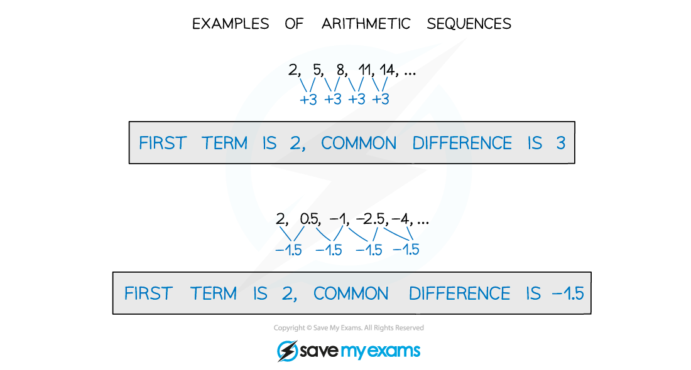

# Arithmetic Sequences

## Arithmetic Sequences

> **Spec point** — `spcpt_CMsJ9gvnYdHbXF3w`

## Arithmetic sequences

### What do I need to know about arithmetic sequences?

- In an **arithmetic sequence**, the difference between consecutive terms in the sequence is constant

- That constant difference is known as the **common difference** of the sequence
- You need to know the ***n*****th**** term formula** for an arithmetic sequence $u_{n}=a+(n-1)d$

  - *a *is the first term
  - *d *is the common difference

> **Exam Hint**
> If you know two terms in an arithmetic sequence you can find ***a*** and ***d*** using simultaneous equations.
> 
> 

> **Worked Example**
> 
