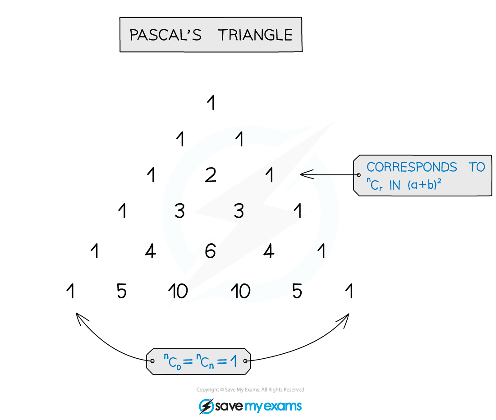
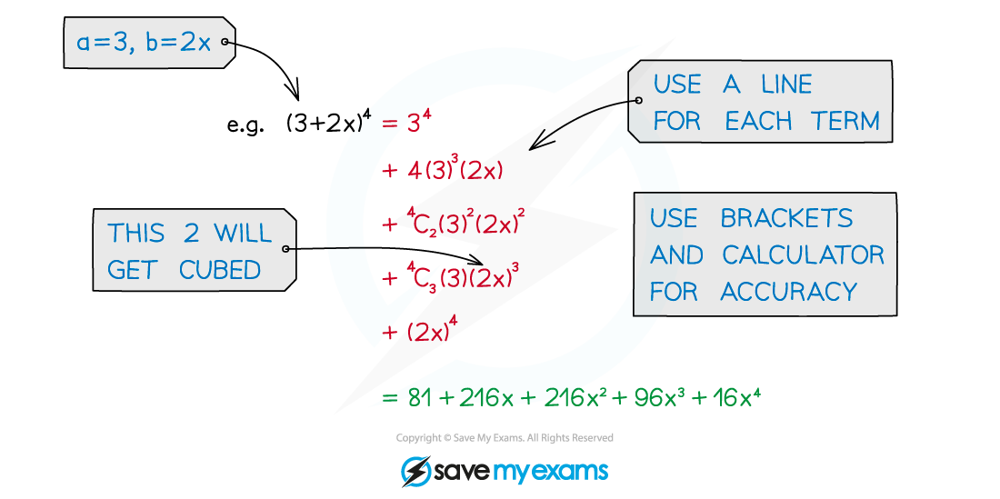
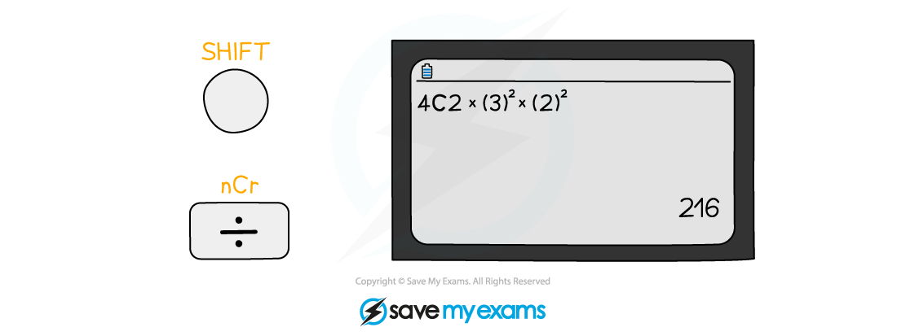
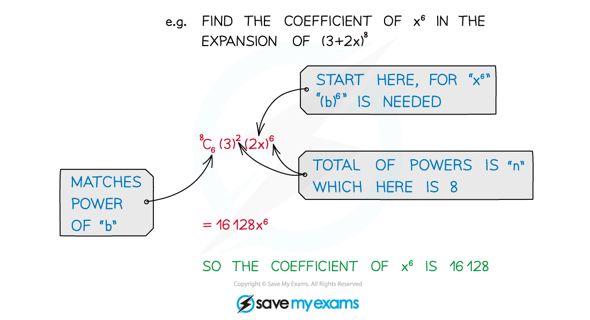
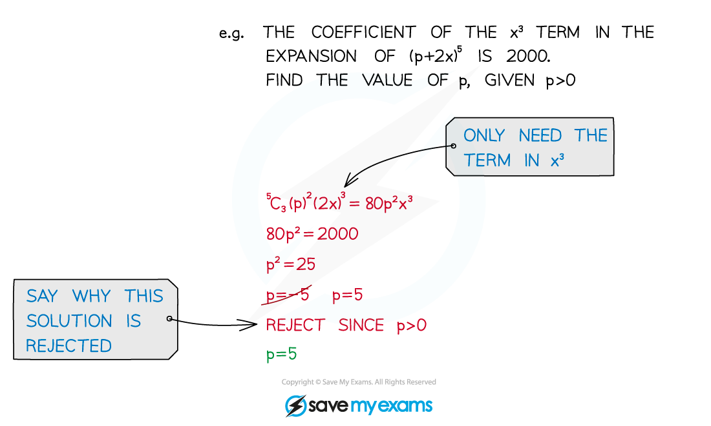

# Binomial Expansion

## Binomial Expansion

> **Spec point** — `spcpt_GKtcZwdYPVpT9kGZ`

## Binomial expansion

### What is the binomial expansion?

- Look at the pattern

  - Start at **n****C****0**, then **n****C****1**, **n****C****2**, etc
  - Powers of **a** start at **n** and decrease by 1
  - Powers of **b** start at 0 and increase by 1
- There are shortcuts but these hide the pattern

  - **n****C****0**** = ****n****C****n**** = 1**
  - **n****C****1**** = ****n****C****n-1 ****= n**
  - **n****Cr = ****n****C****n-r**
  - **(b)****0**** = (a)****0**** = 1**
- Use the shortcuts once familiar with the pattern
- ! means *factorial*

- This is given in the formula booklet

### What is Pascal’s triangle?

- Pascal’s triangle is an alternative to **n****C****r**
- It is useful for lower values of **n**
- For larger **n** it is slow and prone to arithmetic errors

### How do I expand brackets with the binomial expansion?

- Use a line for each term to make things easier to read and follow
- Use brackets, particularly helpful when negatives involved
- Use a calculator for **n****C****r**

> **Worked Example**
> 

## Applications of binomial expansion

### What are binomial expansions used for?

- Expanding brackets, it is usual to be asked for either … ** ** 

  - … the first few terms only

- or (the coefficient of) a particular term

** **

- **Solving** **problems** in unknowns

