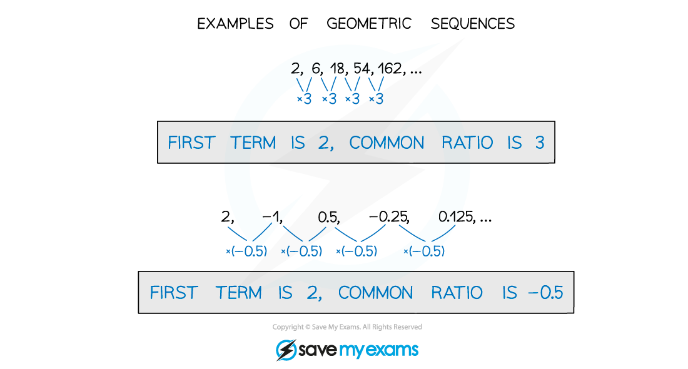

# Geometric Sequences

## Geometric Sequences

> **Spec point** — `spcpt_nrj5pMPm4p7BYjGD`

## Geometric sequences

### What do I need to know about geometric sequences?

- In a **geometric sequence,** there is a **common ratio** between consecutive terms in the sequence

- You need to know the ***n*****th**** term formula** for a geometric sequence $u_{n}=ar^{n-1}$

  - a is the first term
  - *r *is the common ratio

> **Exam Hint**
> If you know two terms in a geometric sequence you can find ***a*** and ***r*** using simultaneous equations.
> 
> 

> **Worked Example**
> 
