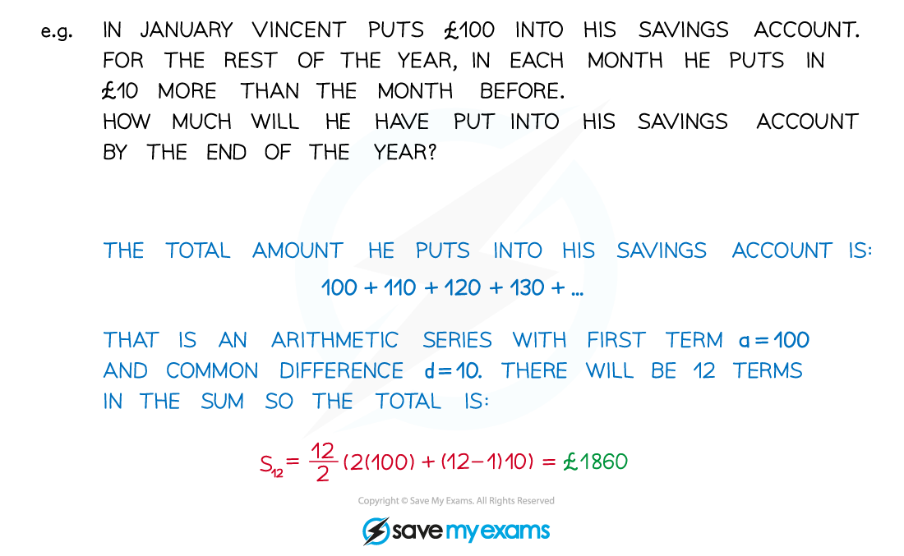
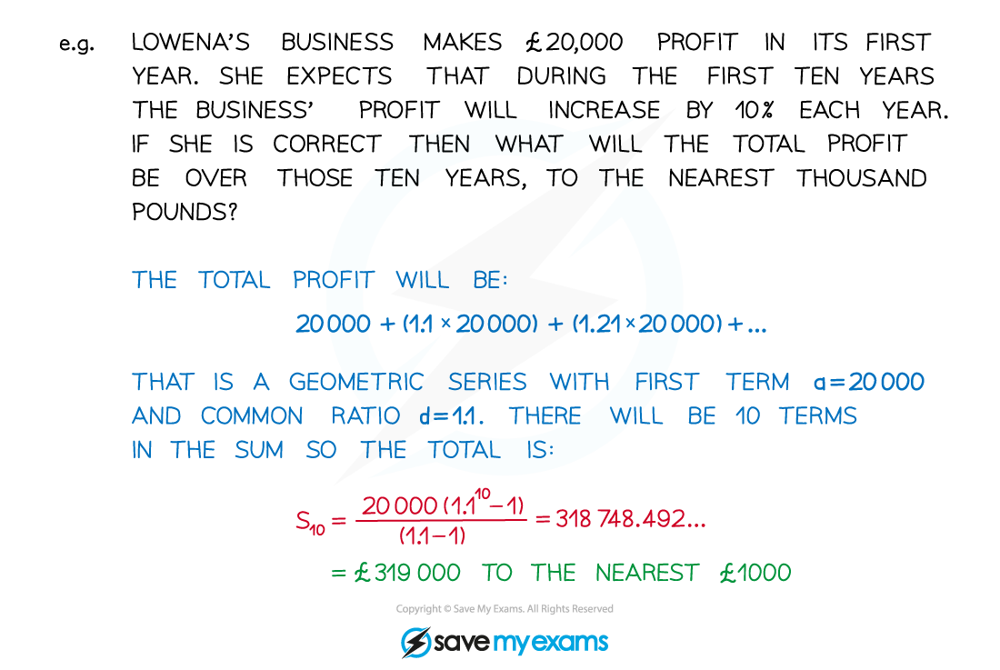

# Modelling with Sequences & Series

## Modelling with Sequences & Series

> **Spec point** — `spcpt_K9BkPp9nsRfrWjH9`

## Modelling with sequences & series

### How do I model with sequences and series?

- Many real-life situations can be modelled using sequences and series
- If a quantity is changing repeatedly by having a fixed amount** added** to or **subtracted** from it then the use of **arithmetic sequences** and **arithmetic series** is appropriate

- If a quantity is changing repeatedly by a fixed** percentage, **or by being **multiplied** repeatedly by a fixed amount, then the use of **geometric sequences** and **geometric series** is appropriate

** **

> **Exam Hint**
> - Remember, an exam question won't always tell you to use sequence and series methods, so you've got to be able to spot 'hidden' sequence and series questions.
> - To help you do this, be suspicious of questions about savings accounts, salaries, sales commissions, profits and the like – these are often sequence and series questions in disguise!

> **Worked Example**
> 
