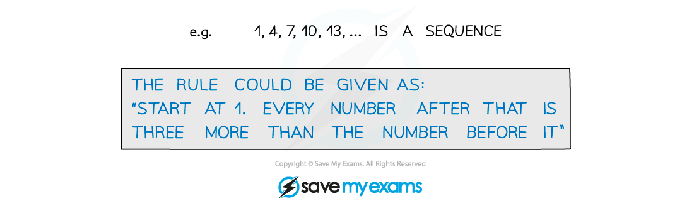

# Language of Sequences & Series

## Language of Sequences & Series

> **Spec point** — `spcpt_22PStrhwhrR4JVnB`

## Language of sequences & series

### What is a sequence?

- A **sequence** is an *ordered* set of numbers with a rule for finding all the numbers in the sequence

- The numbers in a sequence are called **terms**
- The terms of a sequence are often referred to by letters with a subscript

### What is a series?

- You get a **series** by summing up the terms in a sequence

*** ***

- We use the notation ***S******n ***to refer to the sum of the first ***n*** terms in the series i.e.   ***S******n***** =** ***u*****1**** +***** u*****2***** *****+ *****u*****3**** + … + *****u*****n**

### What are increasing, decreasing and periodic sequences?

- A sequence is **increasing** if ***u******n*****+1**** > *****u******n*** for all positive integers ***n***

  - i.e. if every term is greater than the term before it
- A sequence is **decreasing** if ***u******n*****+1**** < *****u******n*** for all positive integers ***n***

  - i.e. if every term is less than the term before it

- A sequence is **periodic** if the terms repeat in a cycle
- The **order** (or **period**) of a periodic sequence is the number of terms in each repeating cycle

> **Exam Hint**
> Look out for sequences defined by trigonometric functions – this can be a way of 'hiding' a periodic function.
> 
> 

> **Worked Example**
> 
