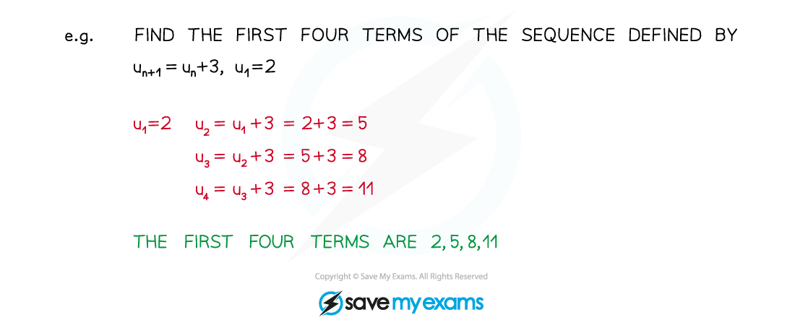
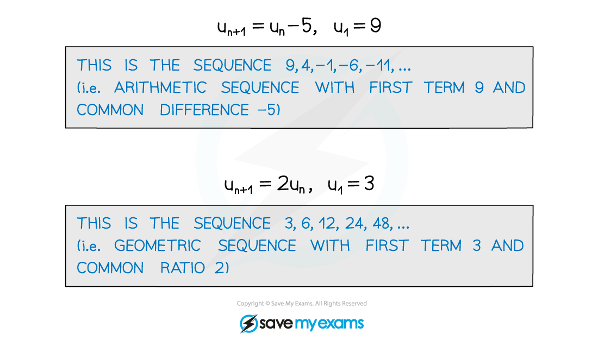
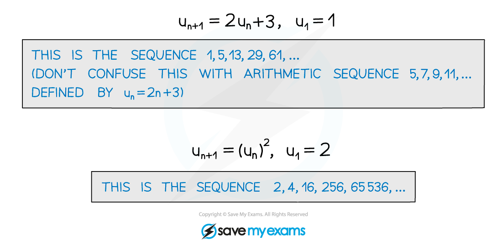

# Recurrence Relations

## Recurrence Relations

> **Spec point** — `spcpt_fKfGVXDRSZvMFXmj`

## Recurrence relations

### What is a recurrence relation?

- A **recurrence relation** describes each term in a sequence as a function of the previous term – ie ***u******n*****+1**** = f(*****u******n*****)**
- Along with the first term of the sequence, this allows you to generate the sequence term by term

- Both **arithmetic sequences** and **geometric sequences** can be defined using recurrence relations

  - **Arithmetic** can be defined by $u_{n+1}=u_{n}+d,u_{1}=a$
  - **Geometric** can be defined by $u_{n+1}=u_{n}\timesr,u_{1}=a$

- However, you can also define sequences that are neither arithmetic nor geometric

> **Exam Hint**
> - For arithmetic or geometric sequences defined by recurrence relations, you can sum the terms using the **arithmetic series** and **geometric series** formulae.
> - To sum up the terms of other sequences, you may have to think about the series and find a clever trick.

> **Worked Example**
> 
