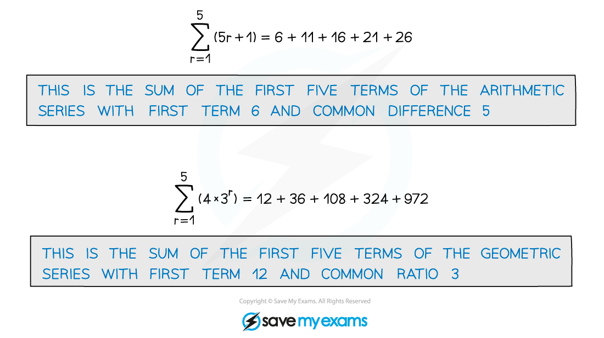

# Sigma Notation

## Sigma Notation

> **Spec point** — `spcpt_Tbx53jRsYyGBMGHs`

## Sigma notation

### What is sigma notation?

- The symbol Σ is the capital Greek letter sigma – that's why it's called 'sigma notation'!
- 'Σ' stands for 'sum' – the expression to the right of the Σ tells you what is being summed, and the limits above and below tell you which terms you are summing

- Be careful – the limits don't have to start with 1!

  - For example: `sum from r equals 0 to 4 of left parenthesis 2 r plus 1 right parenthesis` or `sum from r equals 7 to 11 of left parenthesis 2 r minus 13 right parenthesis`

### How do I use sigma notation?

- Sigma notation can be used to represent both **arithmetic series** and **geometric series**

  - **Arithmetic **will have the form $A+Br$
  - **Geometric** will have the form $A\timesB^{r}$
  - Writing out the first few terms will help you

- To work out such a sum use the arithmetic and geometric series formulae
- As long as the expressions being summed are the same you can add and subtract in sigma notation

  - For example:

`sum from r equals 1 to 6 of left parenthesis 4 r plus 7 right parenthesis plus sum from r equals 7 to 11 of left parenthesis 4 r plus 7 right parenthesis equals sum from r equals 1 to 11 of left parenthesis 4 r plus 7 right parenthesis`

`sum from r equals 1 to 100 of left parenthesis 7 cross times 2 to the power of r right parenthesis minus sum from r equals 1 to 50 of left parenthesis 7 cross times 2 to the power of r right parenthesis equals sum from r equals 51 to 100 of left parenthesis 7 cross times 2 to the power of r right parenthesis`

> **Exam Hint**
> Be careful when more than one letter appears in a sigma notation question.
> 
> 

> **Worked Example**
> 
