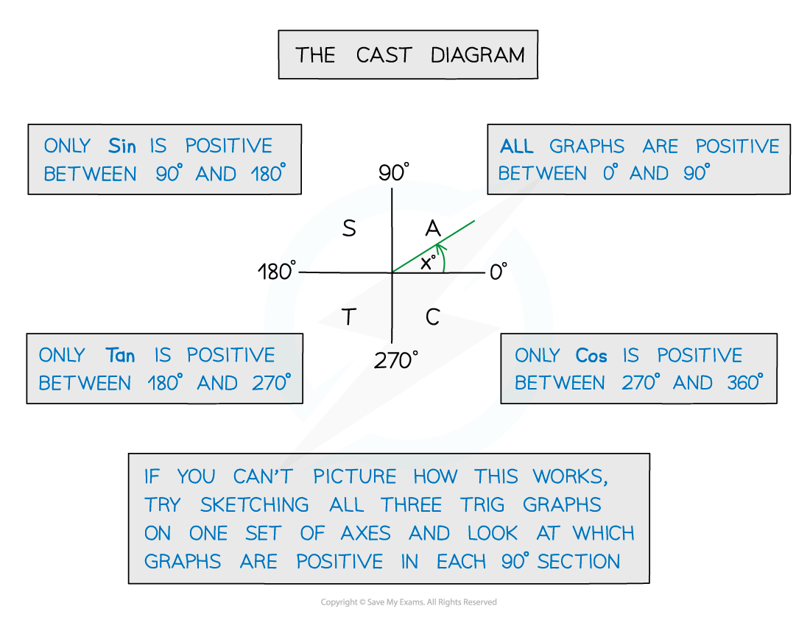
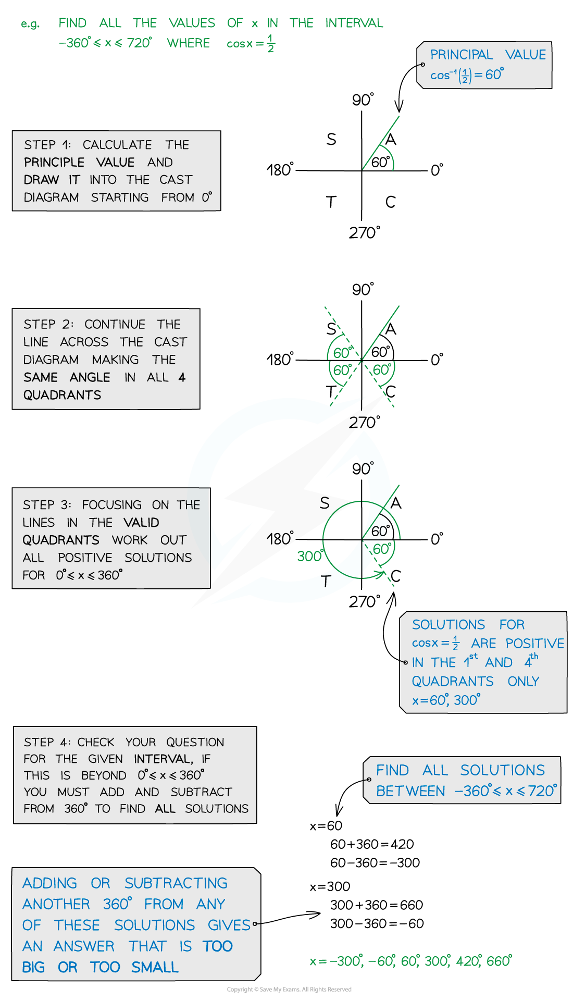
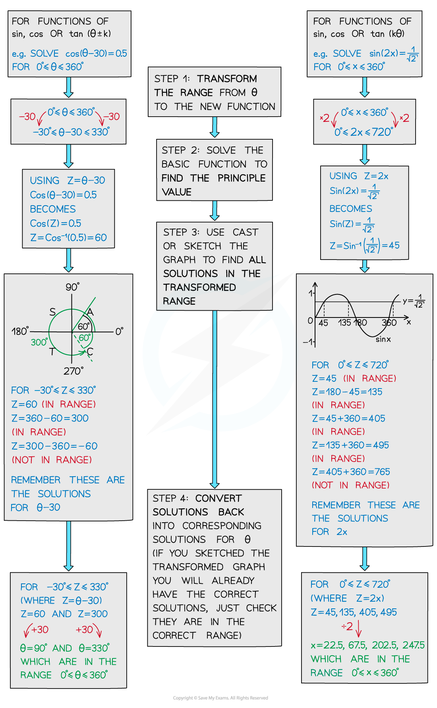

# Linear Trigonometric Equations

## Linear Trigonometric Equations

> **Spec point** — `spcpt_V3DYvZkCYJRnM4gY`

## Linear trigonometric equations

### How do I solve linear trigonometric equations?

- You should have already seen two ways to solve linear trig equations

  - By **sketching the graph** (see Graphs of Trigonometric Functions) you can read off all the solutions in a given *range (or interval)*
  - By using** trigonometric identities** you can simplify harder equations
- Another way to find solutions is by using the *CAST* diagram which shows where each function has positive solutions
- You may be asked to use **degrees or radians** to solve trigonometric equations

  - Make sure your calculator is in the **correct mode**
  - Remember common angles
  
    - 90° is ½π radians
    - 180° is π radians
    - 270° is 3π/2 radians
    - 360° is 2π radians** **

### How do I use the CAST diagram?

### How do I solve more complicated trigonometric equations?

- Some trig equations could involve a **function** of *x* or θ (see Transformations of Trigonometric Functions)
- Functions could be in two forms, either y = ** sin(θ ± k)** or y = **sin kθ**
- An easy way to solve an equation involving sin, cos or tan of (θ± k) or kθ is by transforming the range of the question

> **Exam Hint**
> - Your calculator will only give you the principal value and you need to find all other solutions for the given interval.
> - Also, remember the CAST diagram only gives you some solutions, so again you may need to find more depending on the given interval.
> - It is entirely up to you how you solve a trig equation, but some ways are more helpful than others depending on the type of equation you are trying to solve

> **Worked Example**
> 
