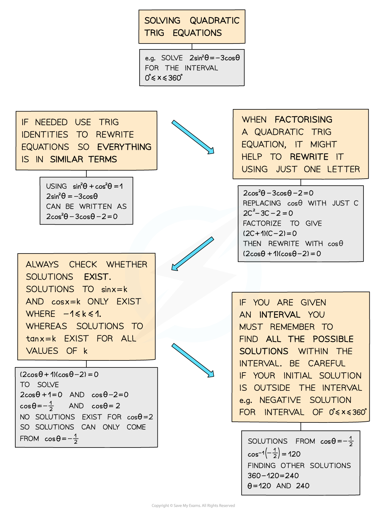

# Quadratic Trigonometric Equations

## Quadratic Trigonometric Equations

> **Spec point** — `spcpt_NS8V98b3c53sJ393`

## Quadratic trigonometric equations

### How do I solve quadratic trigonometric equations?

- If an equation involves sin2θ or cos2θ then it is a quadratic trigonometric equation
- These can be solved by factorising and/or using **trigonometric identities **(see **Trigonometry – Simple Identities**)
- As a quadratic can result in two solutions, you will need to consider whether each solution exists and then find all solutions within a given *interval* for each
- You may be asked to use **degrees or radians** to solve trigonometric equations

  - Make sure your calculator is in the **correct mode**
  - Remember common angles
  
    - 90° is ½π radians
    - 180° is π radians
    - 270° is 3π/2 radians
    - 360° is 2π radians

> **Exam Hint**
> - Sketch the appropriate sin, cos, tan graph to ensure you find ALL solutions **within** the given interval, and be super-careful if you get a negative solution but have a positive interval.
> - For example, for an equation, in the interval 0° ≤ x ≤ 360°, with solution sin x = ‑¼ then sin‑1(‑¼) = -14.5 (to 1d.p.), which is not between 0 and 360 – by sketching the graph you’ll be able to spot the two solutions will be 180 + 14.5 and 360 ‑ 14.5.

> **Worked Example**
> 
