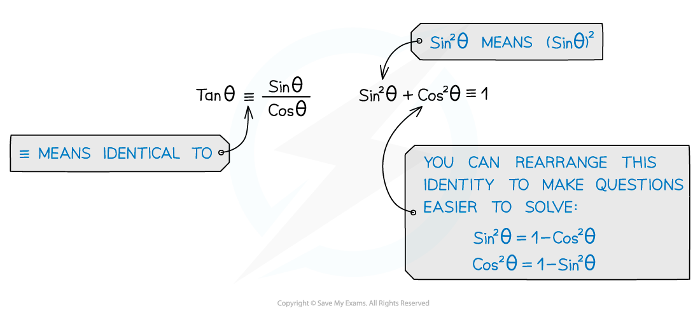
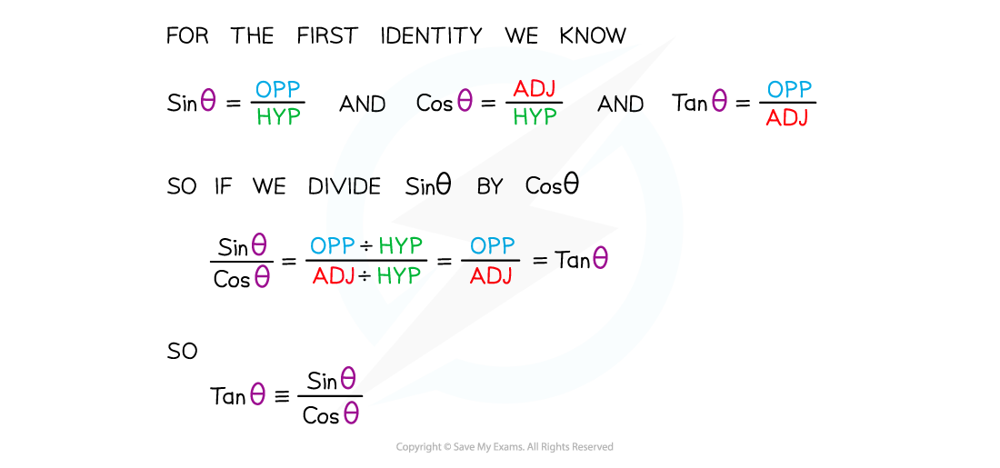
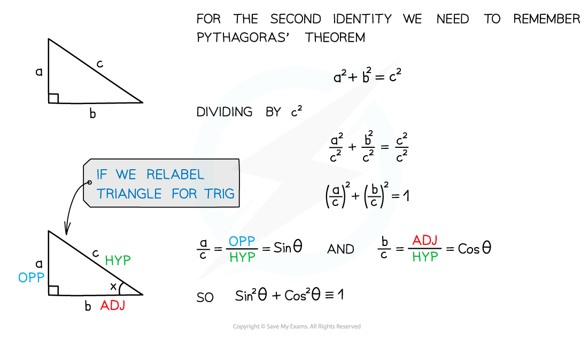
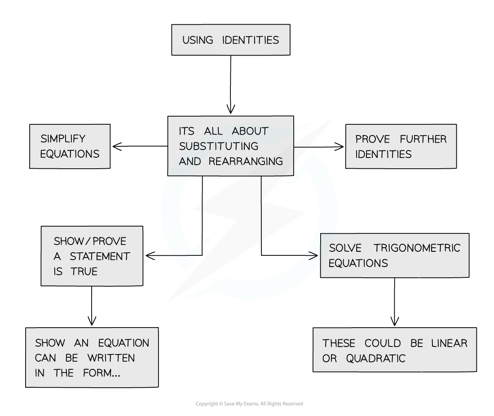

# Simple Trigonometric Identities

## Trigonometry - Simple Identities

> **Spec point** — `spcpt_TFVmY342yXBjJsWP`

## Simple trigonometric identities

### What is a trigonometric identity?

- Trigonometric identities are statements that are true for all values of ****x******* or theta (θ)***
- They are used to help simplify trig equations before solving them
- The first two identities you must know are:

### Where do trigonometric identities come from?

- Although you don’t need to know the proof for these identities it is important to understand where they come from

### How do I use trigonometric identities?

> **Exam Hint**
> - You’ll need to remember these identities as they aren’t in the formula booklet.
> - If asked to show one thing is identical (≡) another look at what parts are missing –  for example, if tan x has gone it must have been substituted.

> **Worked Example**
> 
