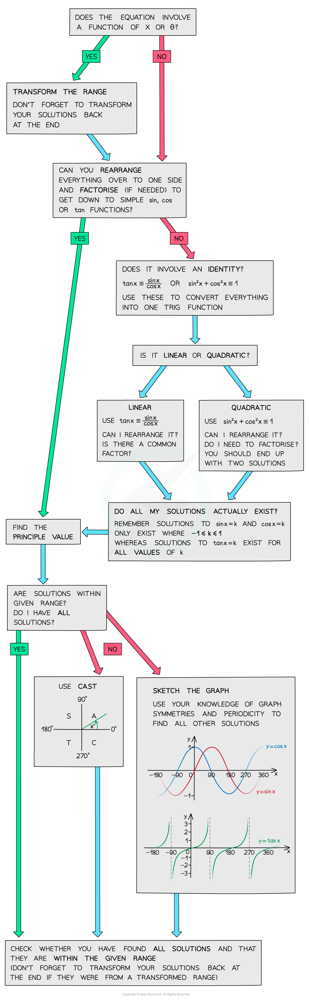

# Strategy for Trigonometric Equations

## Strategy for Trigonometric Equations

> **Spec point** — `spcpt_jyYXR3g8kx82sMNn`

## Strategy for trigonometric equations

### What strategies can I use for solving trigonometric equations?

- You can solve trig equations in a variety of different ways

  - **Sketching a graph **(see **Graphs of Trigonometric Functions**)
  - Using** trigonometric identities **(see **Trigonometry – Simple Identities**)
  - Using the** CAST **diagram (see **Linear Trigonometric Equations**)
  - Factorising** quadratic** trig equations (see **Quadratic Trigonometric Equations**)
- You may be asked to use **degrees or radians** to solve trigonometric equations

  - Make sure your calculator is in the **correct mode**
  - Remember common angles
  
    - 90° is ½π radians
    - 180° is π radians
    - 270° is 3π/2 radians
    - 360° is 2π radians** **
- If you’re having trouble solving a trig equation, this flowchart might help:

** **

> **Exam Hint**
> - Don’t forget to check the function range and ensure you have included all possible solutions.
> - If the question involves a function of x or θ, make sure you transform the range first (and ensure you transform your solutions back again at the end!).

> **Worked Example**
> 
