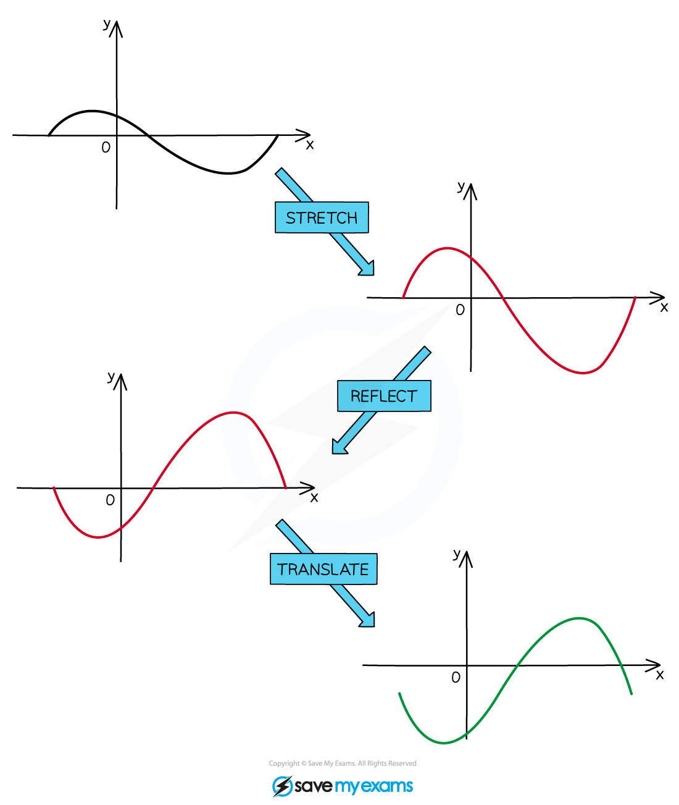
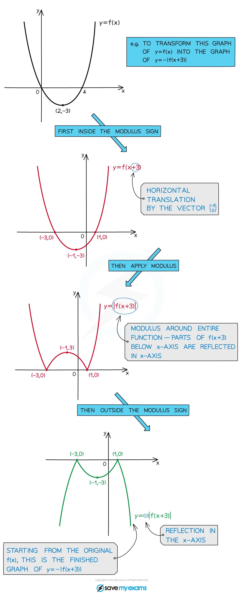

# Combinations of Transformations

## Combinations of Transformations

> **Spec point** — `spcpt_CR59J4ZBr3YRZgvW`

## Combinations of transformations

### What are combinations of graph transformations?

- When you alter a function in certain ways, the effects on the graph of the function can be described by geometrical transformations
- In additional to single transformations, you need to be able to interpret the effects of multiple transformations applied to the same function

### How do I combine two or more graph transformations?

- Make sure you understand the effects of individual **translations**, **stretches**, and **reflections** on the graph of a function (see the previous pages)
- When applying **combinations** of these transformations, apply them to the graph **one at a time** according to the following guidelines:

  - First apply any **horizontal** transformations **inside** the brackets (if you have more than one transformation inside the brackets, **translations** must be applied **before** **stretches and reflections**)
  
    - *y *= *k*f(***a****x ***+ *****b***)+ *c*
    - For your exam you will only be given **at most one inside** the bracket
  - Then apply any **vertical** transformations **outside** the brackets (if you have more than one transformation outside the brackets, **stretches and reflections** must be applied **before translations**)
  
    - *y *= ***k***f(*ax *+ *b*)**+ *****c***** **
- If the transformation involves a modulus

  - First apply any transformations **inside the modulus sign**
  - Then apply the **effects of the modulus**
  - Then apply any transformations **outside the modulus sign**

- Any ***asymptotes*** of the function are also affected by the combined transformation (perform the transformations one at a time in the same order as above)

> **Exam Hint**
> - Be sure to apply transformations in the correct order – applying them in the wrong order can produce an incorrect transformation.
> - When you sketch a transformed graph, indicate the new coordinates of any points that are marked on the original graph.
> - Try to indicate the coordinates of points where the transformed graph intersects the coordinate axes (although if you don't have the equation of the original function this may not be possible).
> - If the graph has asymptotes, don't forget to sketch the asymptotes of the transformed graph as well.

> **Worked Example**
> 
