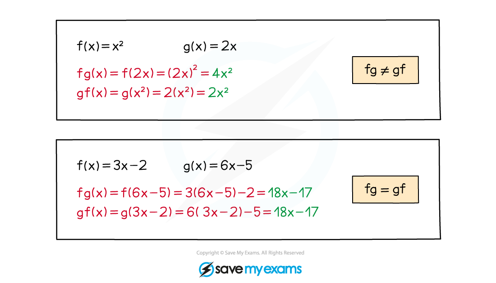

# Composite Functions

## Composite Functions

> **Spec point** — `spcpt_M8pcsBkNN7dyg4b9`

## Composite functions

### What is a composite function?

- A **composite function **is where one function is applied after another function

- The ‘**output’** of one function will be the ‘**input’** of the next one
- Sometimes called **function-of-a-function**
- A composite function can be denoted

  - $fg(x)$
  - $f(g(x))$
  - `f open square brackets g left parenthesis x right parenthesis close square brackets`
  - $(f\circg)(x)$
  - All of these mean “$f$ of $g(x)$”

### How do I use composite functions?

- **Recognise** the notation The order matters

  - **fg(x)** means **“f **of** g **of** x”**

  - First apply *g *to *x *to get $g(x)$
  - Then apply *f* to the previous output to get $f(g(x))$
  - Always start with the function **closest to the variable**
  - $fg(x)$ is not usually equal to $gf(x)$

### What are special cases of composite functions?

- **fg(x)** and **gf(x)** are generally different but can sometimes be the same
- **ff(x)** is written as **f****2****(x)**
- Inverse functions **ff****-1****(x) = f****-1****f(x) = x**

> **Exam Hint**
> - **Domain** and **range** are important.In **fg(x)**, the ‘output’ (range) of **g** **must** be in the domain of **f(x), s**o **fg(x)** could exist, but **gf(x)** may not (or not for some values of x).

> **Worked Example**
> 
