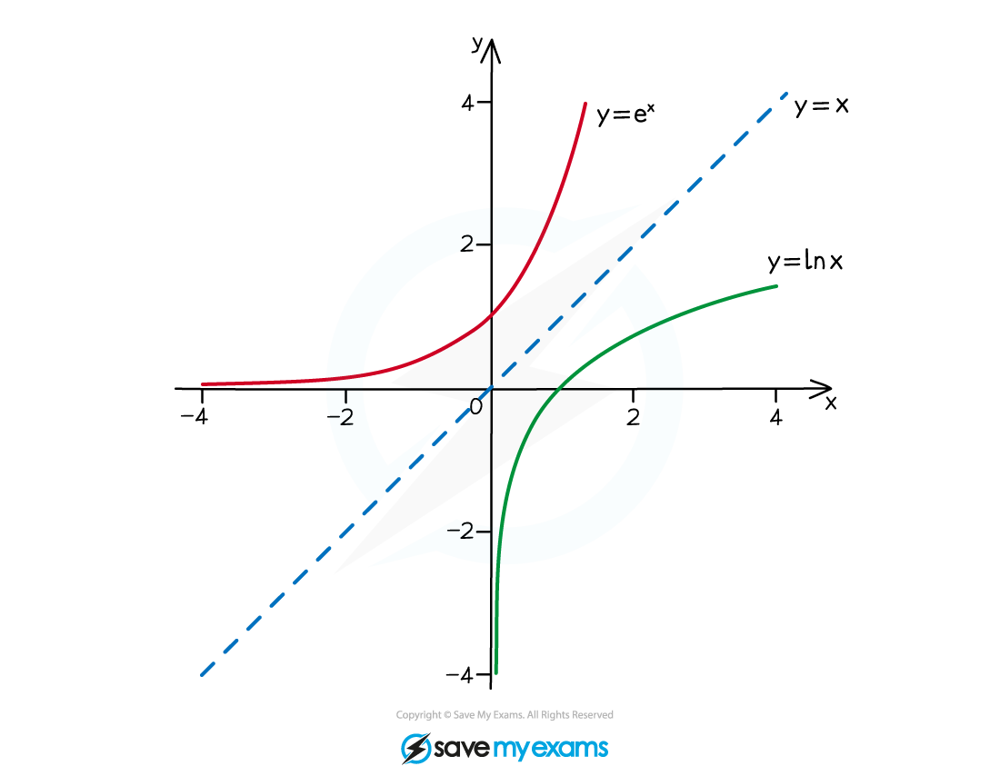
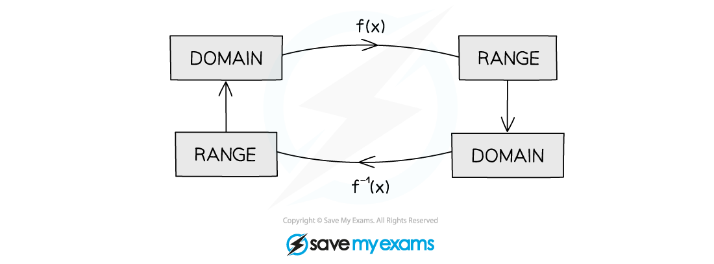
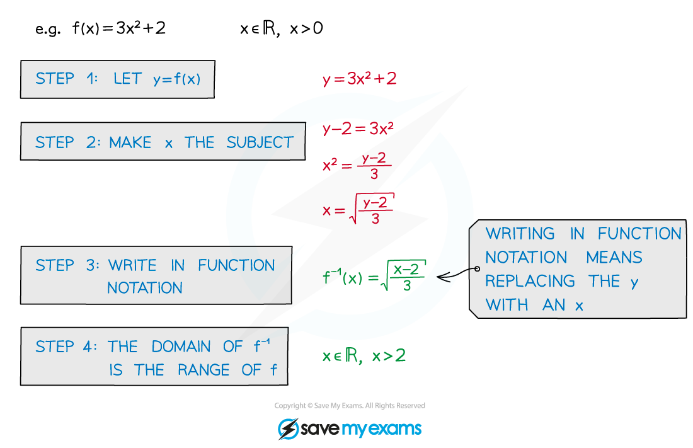
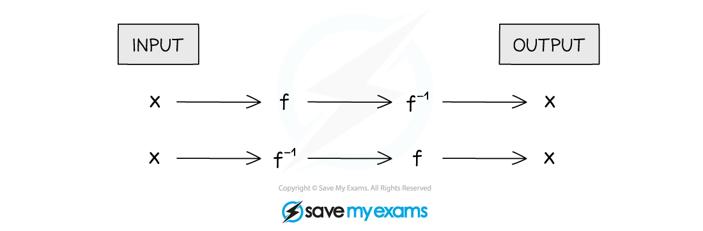

# Inverse Functions

## Inverse Functions

> **Spec point** — `spcpt_hkRXmkKtJFyb5tyD`

## Inverse functions

### What is an inverse function?

- An **inverse** **function** is the **opposite** to the original function
- An inverse function is denoted by $f^{-1}(x)$
- The **inverse** of a function only exists if the function is **one**-to-**one**
- Inverse functions are used to solve equations

  - The solution of $f(x)=5$ is $x=f^{-1}(5)$

** **

### How do I sketch the graph of an inverse function?

- The graphs of a function and its inverse are reflections in the line** y = x**

### What is the domain and range of an inverse function?

- The range of a function will be the domain of its inverse function
- The domain of a function will be the range of its inverse function

### How do I find an inverse function using algebra?

- Set **y = f(x)** and make **x** the subject
- Then rewrite in function notation
- Domain is needed to fully define a function
- The range of **f** is the domain of **f****-1** (and vice versa)

### How are inverse functions related to composite functions?

- A function (**f**) followed by its inverse (**f****-1**) will return the input (**x**)
- **ff****-1****(x) = f****-1****f(x) = x **(for all values of x)

** **

> **Worked Example**
> 
