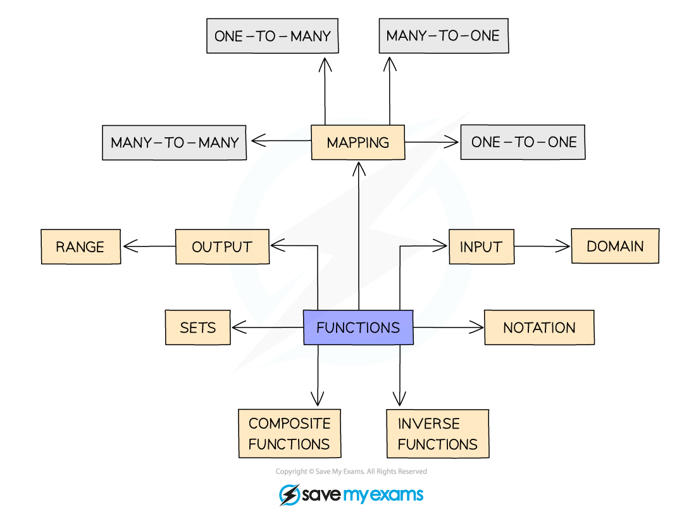
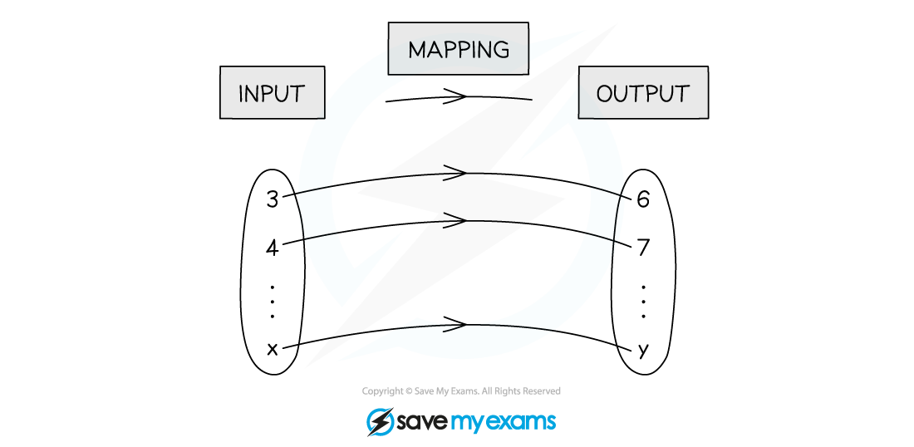
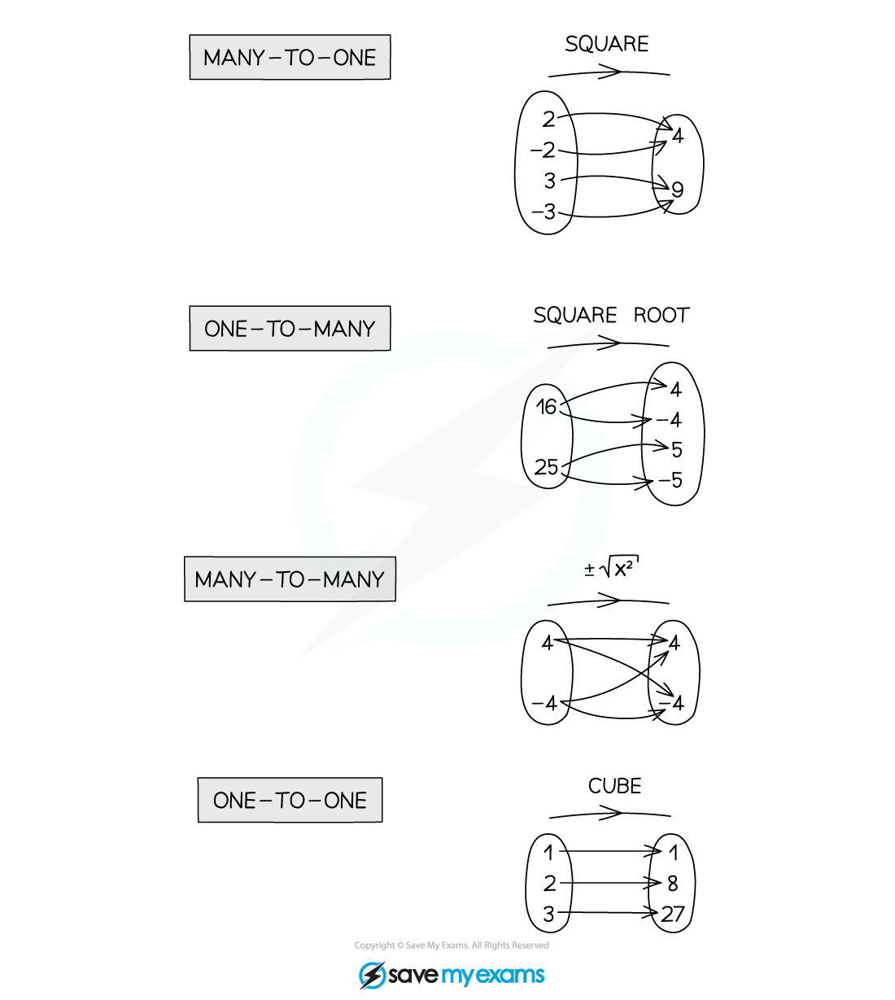
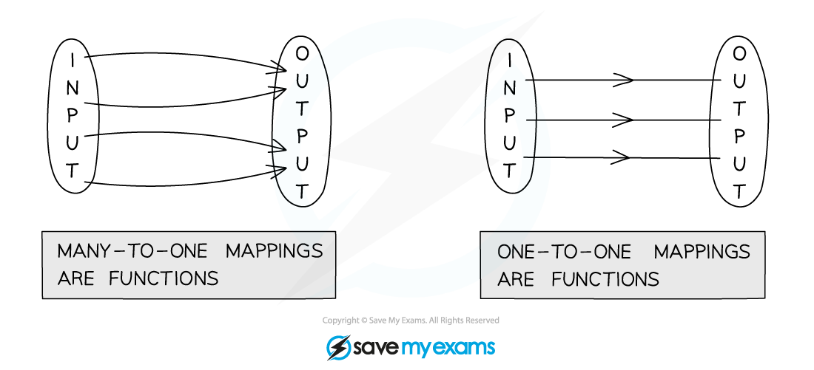
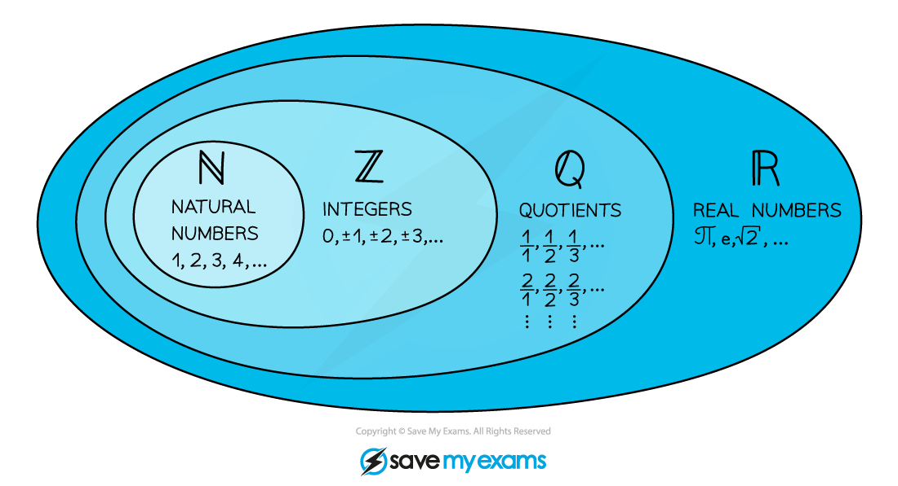
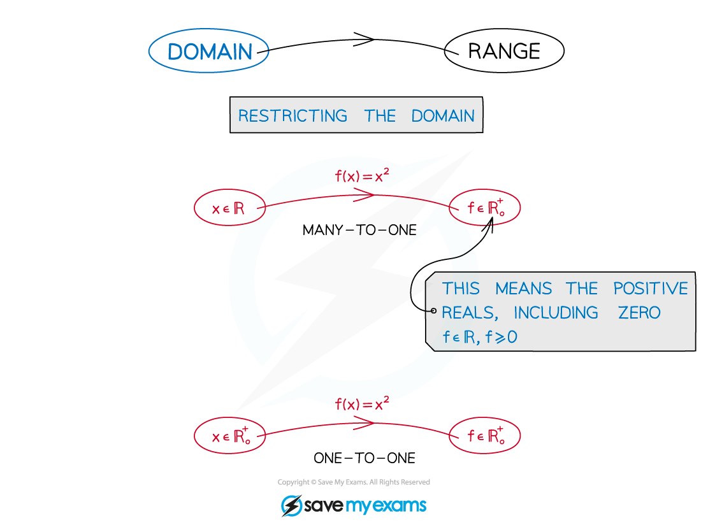
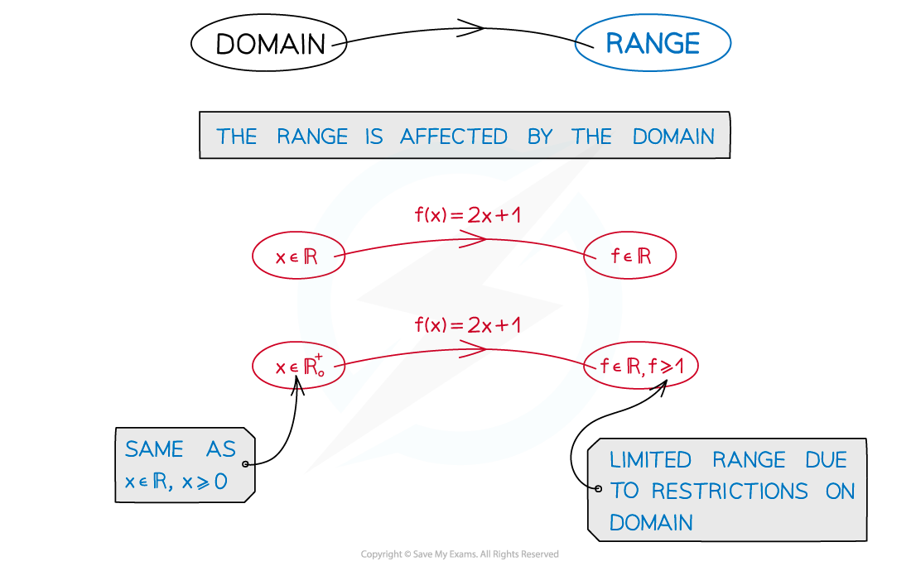

# Language of Functions

## Language of Functions

> **Spec point** — `spcpt_BPzK4hYjprckscTt`

## Language of functions

### What language is used with functions?

- The language of functions has many keywords associated with it that need to be understood

### What are mappings?

- A **mapping** takes an ‘**input’** from one **set** of values to an ‘**output’** in another

- Mappings can be

  - ‘**many**-to-**one’** (**many** ‘input’ values go to **one** ‘output’ value)
  - ‘**one**-to-**many’**
  - ‘**many**-to-**many’**
  - ‘**one**-to-**one’**

### What is the difference between a mapping and a function?

- A **function** is a mapping where every ‘input’ value maps to a **single** ‘output’
- **Many**-to-**one** and **one**-to-**one** mappings are functions
- **Mappings **which have** many possible outputs **are** not functions**

### What is function notation?

- Functions are denoted by the notation** f(x)**, **g(x)**, etc

  - eg. f(x) = x2 - 3x + 2
- Or the alternative notation

  - eg. f : x ↦ x2 – 3x + 2

### What sets of numbers do I need to know?

- Functions often involve domains and ranges for specific sets of numbers
- All numbers can be organised into different sets ℕ, ℤ, ℚ, ℝ

- So ℕ is a **subset** of ℤ etc
- ℤ- would be the set of negative integers only

### What is the domain of a function?

- The **domain** of a function is the set of values that are allowed to be the ‘input’

- A function is only fully defined once its domain has been stated
- **Restrictions** on a domain can turn **many**-to-**one** functions into **one**-to-**one** functions

### What is the range of a function?

- The **range** of a function is the set of values of all possible ‘outputs’ 
- The type of values in the range depend on the domain

> **Worked Example**
> 
