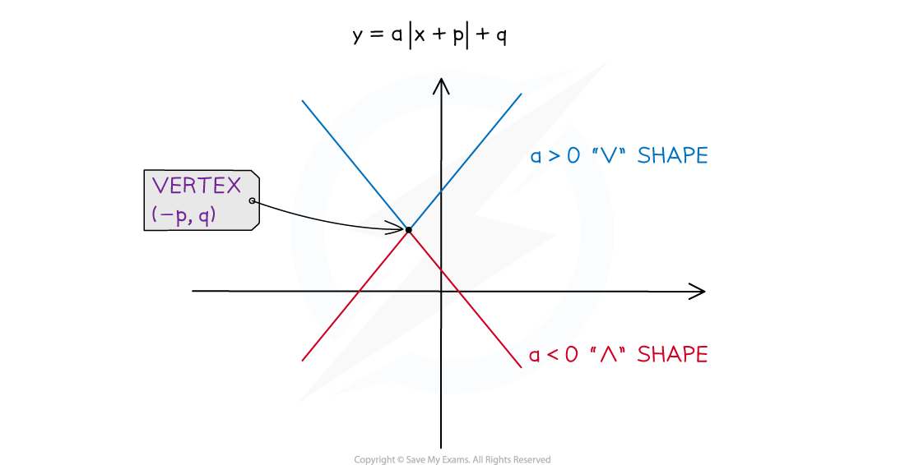
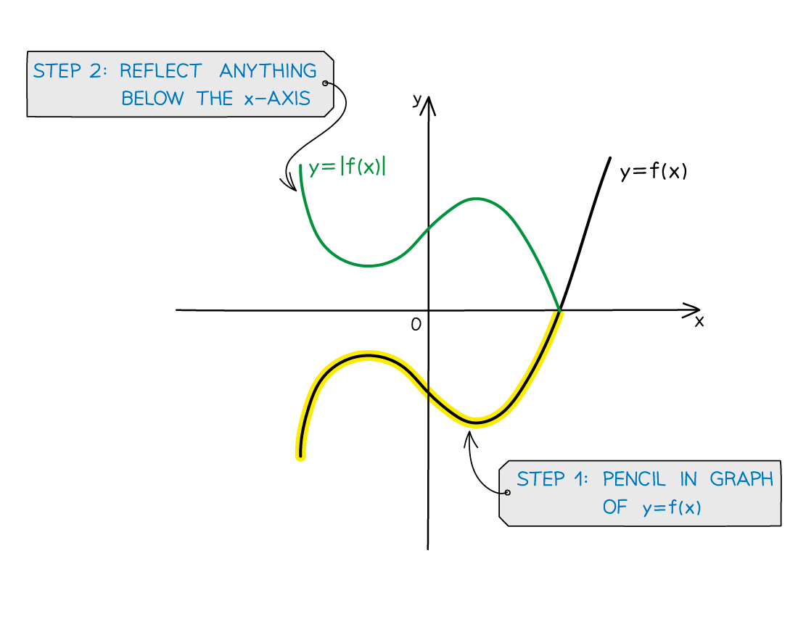
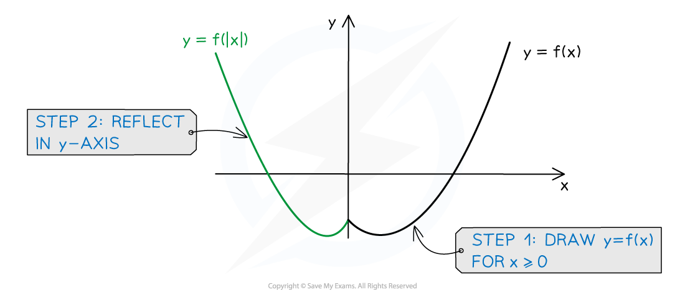
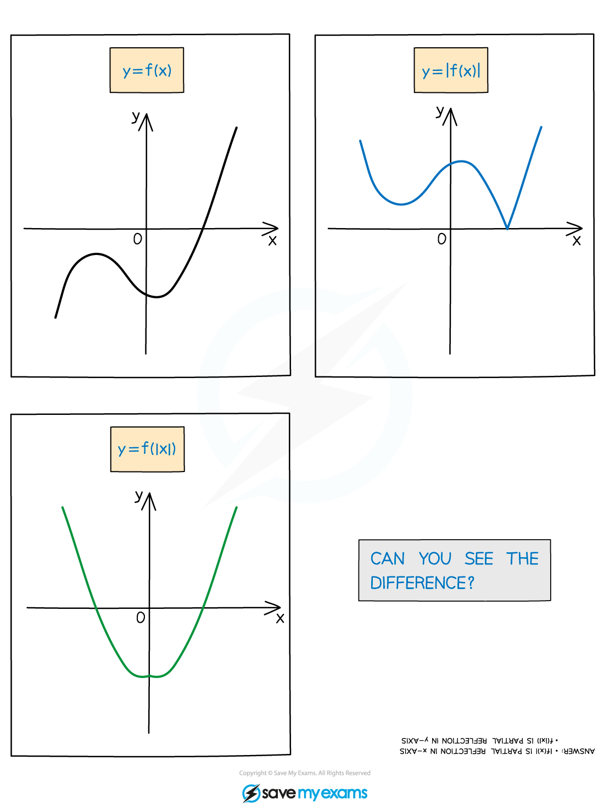

# Sketching Graphs of Modulus Functions

## Modulus Functions - Sketching Graphs

> **Spec point** — `spcpt_G8dbQ7ZXvDdWYfYC`

## Sketching graphs of modulus functions

### What is the modulus function?

- The **modulus** function makes **any** ‘input’ **positive**
- **|x| = x   if x ≥ 0   |f(x)| = f(x)   if f(x) ≥ 0**
- **|x| = -x if x < 0   |f(x)| = -f(x)   if f(x) < 0**

  - **For example: **|5| = 5 and |-5| = 5
- Sometimes called **absolute value**

### How do I sketch the straight line modulus graph y = a|­x+p|+q?

- The graph will look like a “ꓦ” if *a *> 0 or a “ꓥ” if *a *< 0
- There will be a vertex at the point (-*p*, *q*)
- There could be 0, 1 or 2 roots

  - This depends on the location of the vertex and the orientation of the graph (ꓦ or ꓥ)
- Compare this to the **completed square form** of a **quadratic** *a*(x* *+ *p*)² + *q*

### How do I sketch the modulus of a function y = |f(x)|?

STEP 1        Pencil in the graph of **y = f(x)**

STEP 2        **Reflect** anything **below** the **x**-axis, in the **x**-axis, to get **y = |f(x)|**

** **

### How do I sketch functions of mod x, y = f(|x|)?

STEP 1          Sketch the graph of **y = f(x) only for *****x***** ≥ 0**

STEP 2          **Reflect** this in the ***y*****-axis**

### What is the difference between y = |f(x)| and y = f(|x|)?

- There is a difference between ***y***** = |f(*****x*****)|** and ***y***** = f(|*****x*****|)**
- The graph of** *****y***** = |f(*****x*****)| never **goes **below** the **x-axis**

  - It does not have to have any lines of symmetry
- The graph of ***y***** = f(|*****x*****|) **is **always** **symmetrical** about the ***y*****-axis**

  - It can go below the *y*-axis

> **Worked Example**
> 
