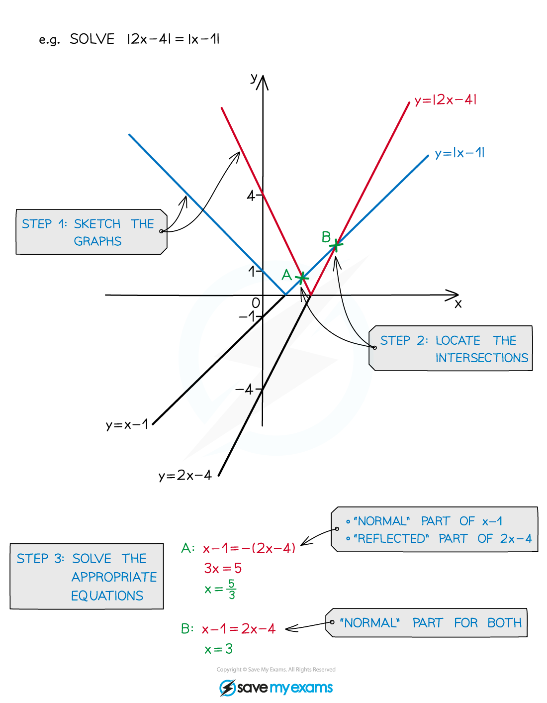

# Solving Equations with Modulus Functions

## Modulus Functions - Solving Equations

> **Spec point** — `spcpt_rcz347qWK3S8MqfS`

## Solving equations with modulus functions

### How do I sketch modulus equations?

- Two non-parallel straight-line graphs would intersect **once**
- If a **modulus** is involved there **could** be **more** than one intersection
- **Deducing** where these **intersections** are is crucial to solving equations

### How do I solve modulus equations?

- STEP 1        **Sketch** the graphs including any **modulus** (reflected) parts

  - (see Modulus Functions – Sketching Graphs)

- STEP 2        **Locate** the graph **intersections**
- STEP 3       **Solve** the appropriate equation(s) or inequality

  - For `vertical line straight f left parenthesis x right parenthesis vertical line equals vertical line straight g left parenthesis x right parenthesis vertical line` the two possible equations are $f(x)=g(x)$ and $f(x)=-g(x)$

> **Exam Hint**
> - Sketching the graphs is important as solving algebraically can lead to invalid solutions.
> - For example, *x* = 1 is a solution to $x-4=2x-5$ but it is not a solution to `vertical line x minus 4 vertical line equals 2 x minus 5` (substitute *x* = 1 into both sides and see why it does not work).

> **Worked Example**
> 
> 
> 
