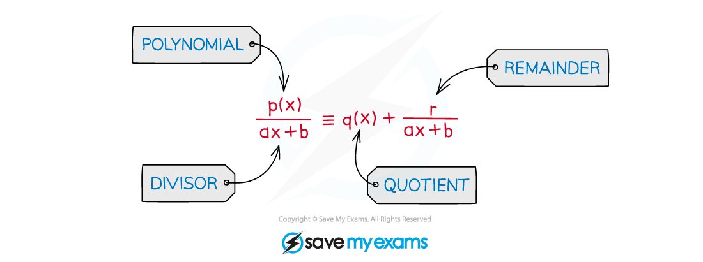
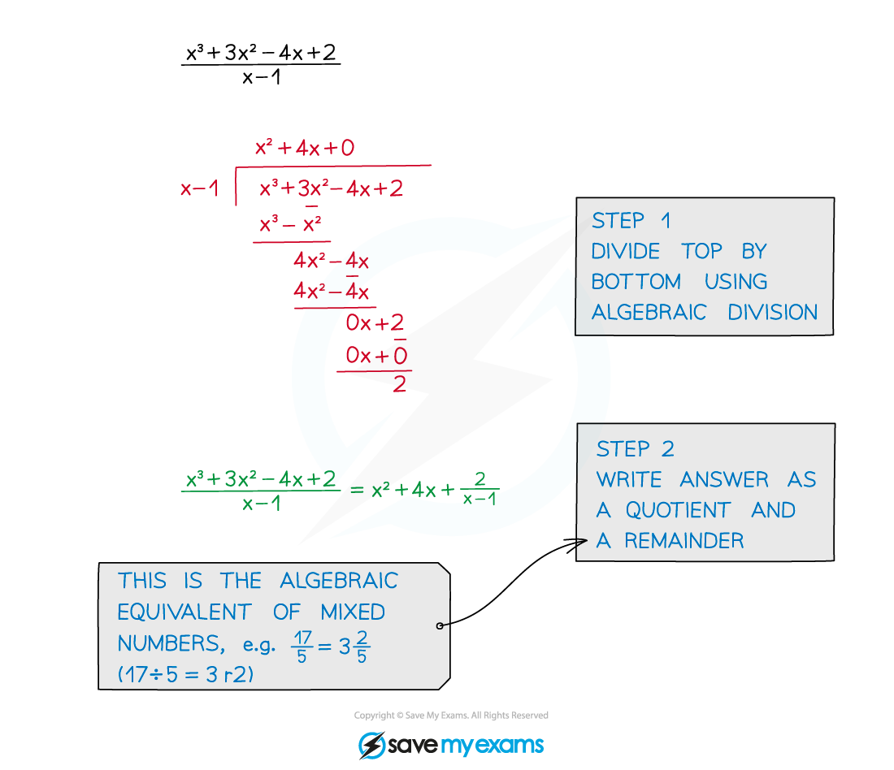

# Improper Algebraic Fractions

## Improper Algebraic Fractions

> **Spec point** — `spcpt_pZCqxtxD7ChHtGWk`

## Improper algebraic fractions

### What are improper algebraic fractions?

- The **degree** of the numerator is **greater than** or **equal** to the degree of the denominator

### How do I simplify improper algebraic fractions?

- Write as a **quotient** and a **remainder**
- The algebraic equivalent of changing a top-heavy fraction to a mixed number

> **Exam Hint**
> Remember that simple cases are sometimes the hardest to spot!
> 
> 

> **Worked Example**
> 

## Quadratic Divisor

> **Spec point** — `spcpt_F6r4Hkfs3S3tZM7H`

## Quadratic divisor

### What is a quadratic divisor?

- A polynomial f(x) of ***degree*** $n$ divided by a **quadratic divisor** takes the form

  - `fraction numerator straight f open parentheses x close parentheses over denominator a x squared plus b x plus c end fraction equals straight q open parentheses x close parentheses plus fraction numerator straight r open parentheses x close parentheses over denominator a x squared plus b x plus c end fraction`
- The **quotient** *q* will have degree $n-2$
- The degree of the **remainder** *r* will be less than $2$

  - It could be degree 1 (linear)
  - Or it could be degree 0 (constant)

### How do I divide a polynomial by a quadratic divisor?

- You still use **polynomial division!**
- **Step 1**
Divide the ***leading term*** of the **polynomial** by the **squared term** of the **divisor**

  - This gives the **leading term** of the **quotient**
- **Step 2**
**Multiply** this term by the **divisor**
- **Step 3**
**Subtract** this from the polynomial to get a **new polynomial** with a **lower degree**
- **Continue** these steps until you have an expression with a degree lower than 2
