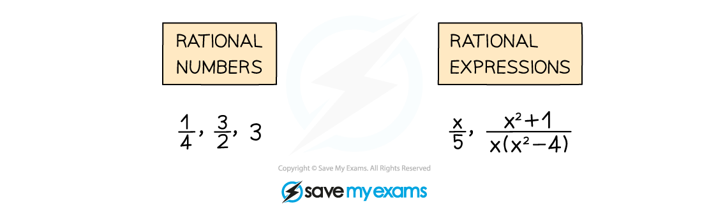
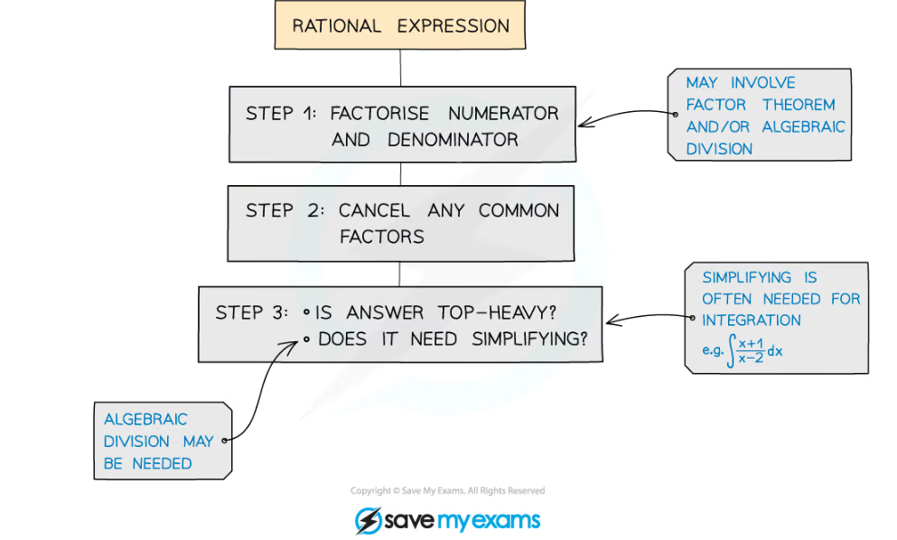
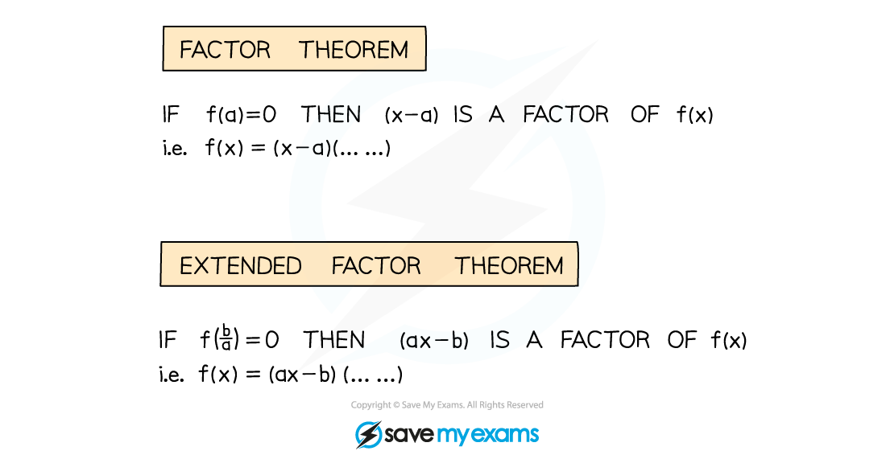
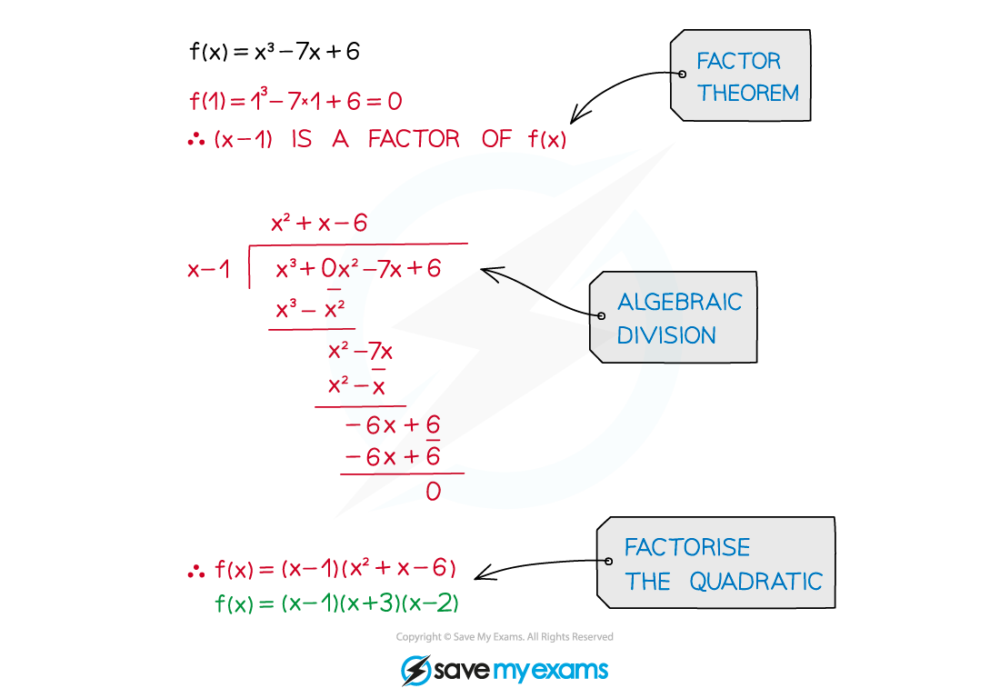

# Rational Expressions

## Rational Expressions (Algebraic Fractions)

> **Spec point** — `spcpt_7RMHfwr3M4rzNVzP`

## Rational expressions

### What are rational expressions?

- **Rational** numbers are numbers that can be written as a fraction (**quotient**) Rational comes from **ratio** – a number is rational if it can be written as a ratio of two integers – ie a fraction!
- A **rational** **expression** is an **algebraic** **fraction** The ratio between two algebraic expressions (usually polynomials)

### How do I simplify rational expressions?

- You may need to recall the **factor theorem**

- Start by** factorising** polynomials using **factor** **theorem** or** algebraic** **division**

Simplify $\frac{x^{3}-7x+6}{x^{2}+2x-3}$

- **cancel** any common (linear) factors

** **

- **recognise** a ***top-heavy (improper)*** rational expression, simplify if needed

> **Worked Example**
> 
