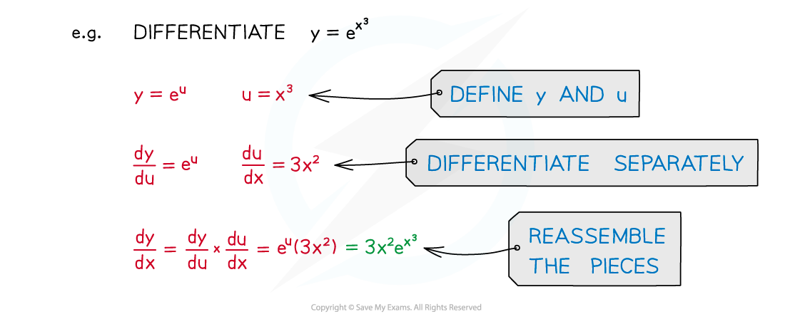
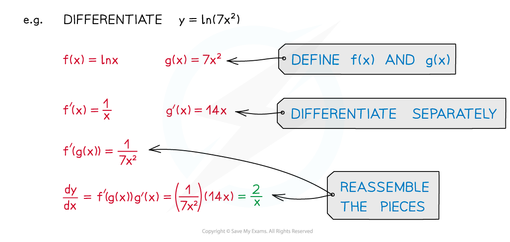
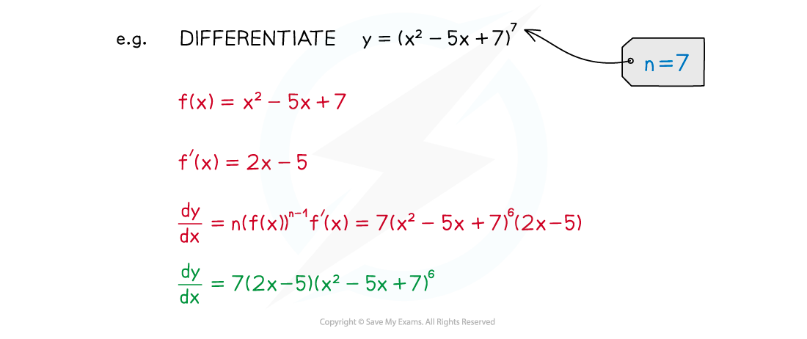
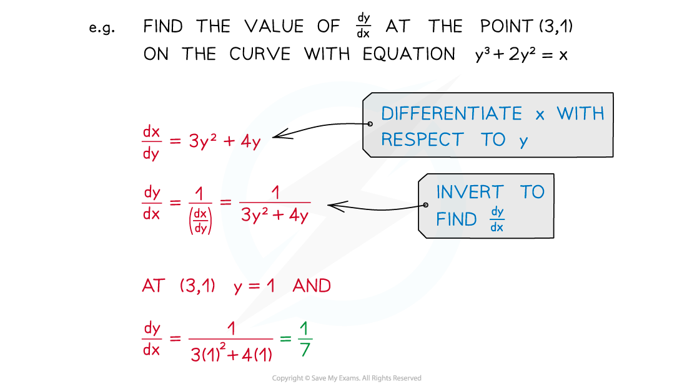

# Chain Rule

## Chain Rule

> **Spec point** — `spcpt_J6Fzys4Bj5SFqMnY`

## Chain rule

### What is the chain rule?

- The chain rule is a formula that allows you to differentiate **composite functions**
- If ***y*** is a function of ***u***, and ***u*** is a function of ***x***, then the **chain rule** tells us that:

$\frac{dy}{dx}=\frac{dy}{du}\times\frac{du}{dx}$

- Note that because ***u*** is a function of ***x***, ***y*** is also a function of ***x***
- In **function notation, **if $y=f(g(x))$ then the chain rule can be written as:

$\frac{dy}{dx}=f'(g(x))g'(x)$

This allows us to differentiate more complicated expressions:

### What are the special cases of the chain rule?

- It allows us to differentiate a function raised to a power:

  - $\frac{d}{dx}((f(x)^{n})=n(f(x))^{n-1}f'(x)$

- It allows us to differentiate functions that are not given in the form ***y*****= f(*****x*****):**

  - $\frac{dy}{dx}=\frac{1}{\frac{dx}{dy}}$** **

- There is a useful case which is used to integrate certain functions:

  - $\frac{d}{dx}(\mathrm{ln}(f(x))=\frac{f'(x)}{f(x)}$

> **Exam Hint**
> - The chain rule formulae are not in the exam formulae booklet – you have to know them.
> - When using the chain rule be sure to keep your functions straight (ie which function is ***y*** and which is ***u***, or which is ***f*** and which is ***g***).

> **Worked Example**
> 
