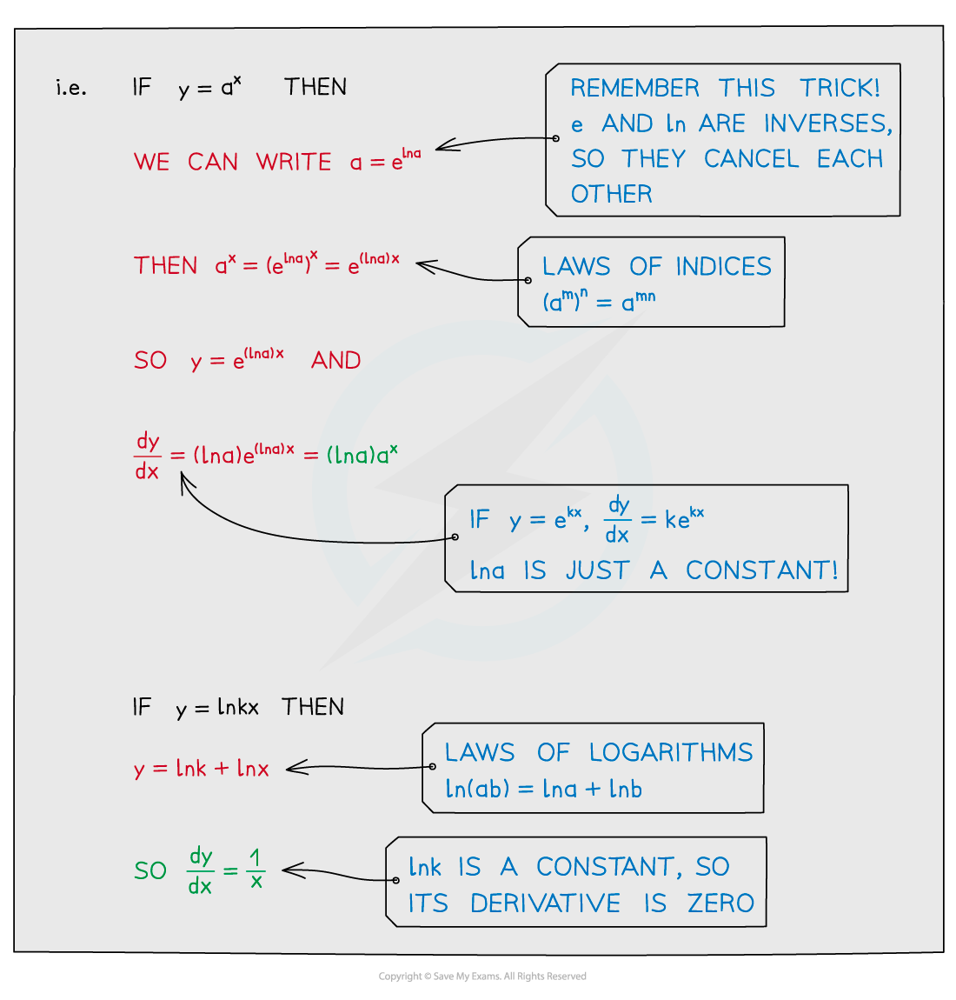

# Differentiating Other Functions

## Differentiating Other Functions (Trig, ln & e etc)

> **Spec point** — `spcpt_qMxPw37Fv75Pk8Ts`

## Differentiating other functions

### How do I differentiate common functions?

- These are the common results

  - $\frac{d}{dx}(x^{n})=nx^{n-1}$
  - $\frac{d}{dx}(e^{x})=e^{x}$
  - $\frac{d}{dx}(a^{x})=a^{x}\mathrm{ln}a$ for $a>0$
  - $\frac{d}{dx}(\mathrm{ln}x)=\frac{1}{x}$
  - $\frac{d}{dx}(\mathrm{sin}x)=\mathrm{cos}x$
  - $\frac{d}{dx}(\mathrm{cos}x)=-\mathrm{sin}x$
  - $\frac{d}{dx}(\mathrm{tan}x)=\mathrm{sec}^{2}x$
  - $\frac{d}{dx}(\mathrm{cot}x)=-\mathrm{cos} \mathrm{ec}^{2}x$
  - $\frac{d}{dx}(\mathrm{sec}x)=\mathrm{sec}x\mathrm{tan}x$
  - $\frac{d}{dx}(\mathrm{cos} \mathrm{ec}x)=-\mathrm{cos} \mathrm{ec}x\mathrm{cot}x$

#### How do I differentiate ekx, ax, ln(kx) and akx?

- And for akx:

- This last formula can be derived from Formula 3 by using the **chain rule**

> **Exam Hint**
> - The formulae for some of these derivatives are not given in the formulae booklet – you need to know them.
> - The formulae for ***e******kx*** and **ln *****x*** are the ones you absolutely do need to know .
> - The other formulae can be derived from those two as shown above, and remember – the derivative of **ln *****kx*** is $\frac{1}{x}$*, *NOT $\frac{k}{x}$ !

> **Worked Example**
> 
