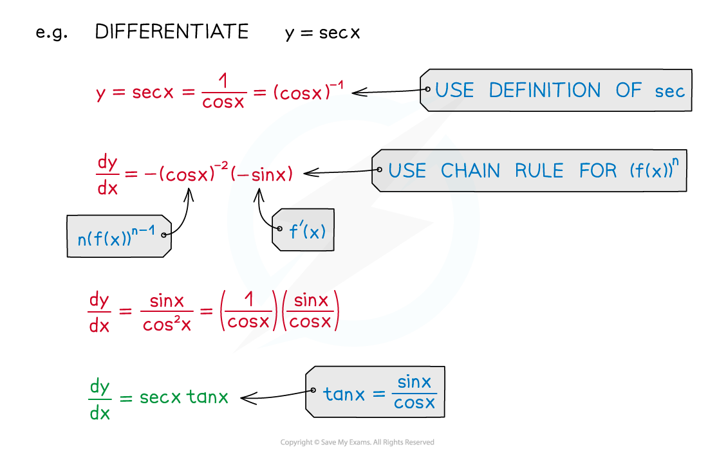

# Differentiating Reciprocal & Inverse Trig Functions

## Differentiating Reciprocal and Inverse Trig Functions

> **Spec point** — `spcpt_yM3rChg2z3sgcRPz`

## Differentiating reciprocal and inverse trig functions

### How do I differentiate reciprocal trigonometric functions?

- The formulae for the derivatives of the reciprocal trigonometric functions are:

$\frac{d}{dx}(\mathrm{sec}x)=\mathrm{sec}x\mathrm{tan}x$  
$\frac{d}{dx}(\mathrm{cosec}x)=-\mathrm{cosec}x\mathrm{cot}x$ 
$\frac{d}{dx}(\mathrm{cot}x)=-\mathrm{cosec}^{2}x$

- You can derive the derivatives for **sec**, **cosec**, and **cot** using the **chain rule** and the derivatives of the basic trigonometric functions

### How do I differentiate inverse trigonometric functions?

- The formulae for the derivatives of the inverse trigonometric functions are:

$\frac{d}{dx}(\mathrm{arcsin}x)=\frac{1}{\sqrt{1-x^{2}}}$ 
$\frac{d}{dx}(\mathrm{arc} \mathrm{cos}x)=-\frac{1}{\sqrt{1-x^{2}}}$ 
$\frac{d}{dx}(\mathrm{arc} \mathrm{tan}x)=\frac{1}{1+x^{2}}$

- You can derive the derivatives of **arcsin**, **arccos**, and **arctan** using the reciprocal form of the **chain rule** and the derivatives of the basic trigonometric functions 

> **Exam Hint**
> - The formulae for the derivatives of **sec *****x***, **cosec *****x***, and **cot *****x*** are in the formulae booklet – you don't need to memorise them
> 
>   - However, you should know how to derive the derivatives of **sec**, **cosec**, and **cot** using the chain rule
> - The formulae for the derivatives of **arcsin**, **arccos**, and **arctan** are not in the formulae booklet
> 
>   - You should know how to derive those derivatives using the reciprocal form of the chain rule

> **Worked Example**
> 
