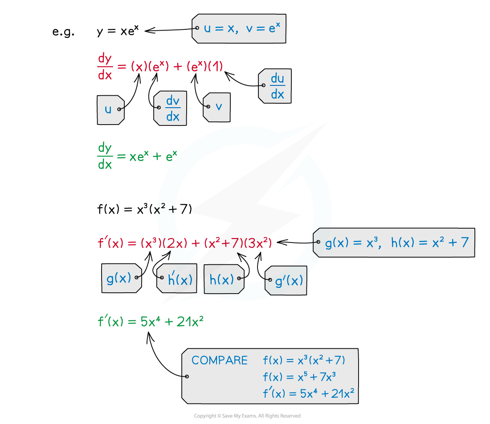

# Product Rule

## Product Rule

> **Spec point** — `spcpt_v8zhdj7wJHgNznpD`

## Product rule

### What is the product rule?

- The product rule is a formula that allows you to differentiate a **product of two functions**
- If $y=u\timesv$** **where ***u ***and ***v***** **are functions of** *****x*** then the product rule is:

$\frac{dy}{dx}=u\frac{dv}{dx}+v\frac{du}{dx}$

- In **function notation, **if $f(x)=g(x)\timesh(x)$ then the product rule can be written as:

$f'(x)=g(x)h'(x)+h(x)g'(x)$

- The easiest way to remember the product rule is, for** **$y=u\timesv$** **where ***u ***and ***v***** **are functions of** *****x:***

$y'=uv'+vu'$

> **Exam Hint**
> - The product rule formulae are NOT in the formulae booklet – you need to know them.
> - Don't confuse the **product** of two functions with a **composite** **function:**
> 
>   - The **product** of two functions is two functions **multiplied** together
>   - A **composite** function is a **function of a function**
> 
> 
> 
> - To differentiate composite functions you need to use the **chain rule**

> **Worked Example**
> 
